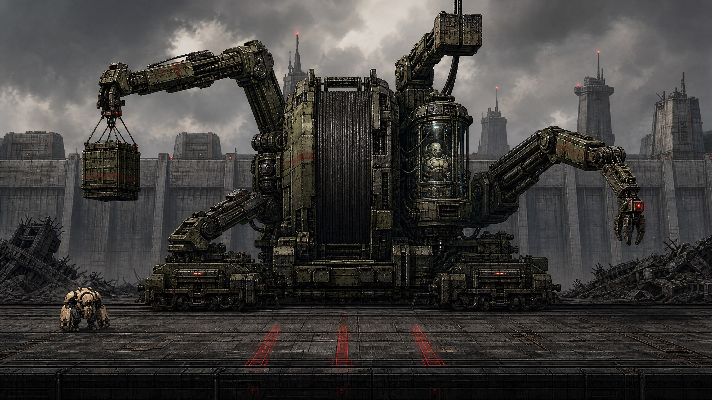

# Project CHOIR: Five District Bosses — Concept and Implementation Proposal

**Document status:** Proposal for creative and technical approval
**Engine baseline:** Godot 4.7.2-stable
**Campaign route:** The Ledger Spine → Ashwater Commons → The Afterglow Strip → The Iron Corridor → The Crownward
**Concept art:** GPT Image 2; five 2560×1440 production plates, generated 2026-08-26

## Executive recommendation

Approve the five-boss roster as the campaign spine, with one production adjustment: **all five encounters should run through one reusable, data-configured command-boss session and one prewarmed authoritative tank-family host**, while each boss supplies a unique presentation rig, attack controller, and bounded arena adapter. This preserves the tested `CommandBossSession` lifecycle, fixed actor counts, 330-armor/320-health tuning baseline, attack gate, pooled wreck, and ground-smash-only completion rule rather than creating five parallel boss frameworks.[1][2]

The proposed order produces a clear mechanical curriculum. **SETTLEMENT ENGINE S-04** teaches material reading and exact support failure. **SAMARITAN-15** adds protected payloads and utility-state reasoning. **MIMESIS-04** turns the player’s recorded history into delayed spatial threats. **CANTOR-31** combines one escort, artillery, and player-created rubble. **CHOIR Prime** remixes prior attack grammars and asks the player to make the campaign’s final act of selective destruction. The common armor and wreck rules become a learned campaign language; the environment, information problem, and player priority escalate at each district.

Bosses trigger at the east cap of logical chunks **7, 15, 23, 31, and 39**. These are spatial campaign triggers, not replacements for the six-act siege cadence. A new `BossCampaignDirector` should select and start the existing single session by logical chunk while a compatibility mode preserves the current `_on_arc_completed() → boss_session.start()` path for existing tests and non-campaign play. The arena locks before the player can cross into the next district, retains only already-resident streamed chunks, and releases the lock only after the pooled wreck’s valid ground-smash finisher.

The strongest production plan is to build the shared contract, arena lease, checkpoint, and HUD first, then ship S-04 as a vertical slice. Residential and Entertainment should follow as the systems-expansion pair; Military and Royal should be the synthesis pair. Full-roster approval should remain conditional on stable pool counts, portrait-safe lanes, deterministic retry restoration, and an incremental Web PCK cost no greater than **1.75 MiB**, leaving approximately **0.79 MiB** of the currently measured 16 MiB cap as contingency.[3][4]

> **Campaign promise:** Five authored bosses turn the city’s existing material, utility, structural, and streaming systems into a rising sequence of mastery tests without introducing new control verbs, dynamic physics destruction, long cutscenes, or unbounded runtime allocation.

## Design principles and resolved overlaps

The five source designs share several deliberate fundamentals: a four-second controllable entrance, precise charged `jab_cross` armor damage, exposed-body damage after armor break, short telegraphs, deterministic structural reactions, nonblocking rubble, a pooled wreck, and a required ground-smash finisher. These are not redundancies to remove. They are the **command-boss grammar** that players should learn in Business and trust through Royal.

What must differ is the decision layered over that grammar. Business asks **what material and support should be hit**. Residential asks **what must be protected while utilities change lane safety**. Entertainment asks **which image is history and which marker is live**. Military asks **which threat or rubble source should be removed first under combined-arms pressure**. Royal asks **which learned route and final outcome the player chooses**. Each boss therefore owns one dominant cognitive hook; secondary mechanics that duplicate a later boss are reduced or subordinated.

The following adjustments resolve conflicts among the original proposals and the current runtime:

1. **One host strategy replaces three competing actor strategies.** SAMARITAN-15 and MIMESIS-04 were proposed as new boss actors, while S-04, CANTOR-31, and CHOIR Prime reused a hidden tank host. Production should standardize all five on the already prewarmed tank-family command host. Bespoke hurt regions, local sockets, and presentation rigs provide unique silhouettes; the host remains authoritative for activation, damage, death, signals, pool release, and wreck handoff. This avoids a second boss pool and preserves the existing tank-count tests.
2. **The three-hit armor contract is universal, but environmental armor shortcuts are capped.** Every opening phase still requires three 110-damage charged connections in the normal route. Business glass/concrete exposes pins; Residential attacks expose couplings; Entertainment supports expose conductors; Military arm recovery exposes the collar; Royal faces nominate a brace. An environmental event may accelerate or extend an opening, but it must route through the same armor API and may never bypass the full armor state unpredictably.
3. **Only Entertainment records player history.** Royal replays catalog attack grammars, not player traces. Military records static rubble anchors, not motion. This keeps MIMESIS-04’s hook singular.
4. **Only Residential tracks protected human payload state during combat.** Business, Entertainment, and Military may preserve evidence for a score or campaign flag, but they do not create additional pod trackers or rescue scoring. Royal consumes the previously persisted evidence threshold.
5. **No boss-owned minion waves exist.** Boss definitions request existing family slots through the encounter runtime. Unavailable requests are skipped, never allocated. Business receives one Bulwark and one Sapper total in phase I; Residential deploys at most two Reclaimed Breachers, one at a time; Entertainment receives one Siren once; Military maintains one Aegis or Shrike; Royal has no live minions.
6. **Royal has two readable endings, not an accidental failure ending.** PURGE is always active. DISENTANGLE is damageable only when the dossier and evidence threshold is satisfied. An ineligible plinth remains visibly inert. The earlier ASCENSION FAILURE concept is excluded because it conflicts with the finale’s requirement that the player cannot accidentally commit an unreadable outcome.
7. **No encounter has a failure timer on its wreck.** The 45–75-second target is a tuning and test band for decisive combat, not a hard timeout. Once hostile actions stop, the player may approach the finisher safely.

## Campaign roster and escalation

| Order | District and trigger | Boss | Dominant hook | New mastery demand | Live support cap | Environmental answer |
|---:|---|---|---|---|---:|---|
| 1 | **Business**, chunk **7** | **SETTLEMENT ENGINE S-04, The Fiduciary Saint** | Read glass, concrete, and steel; sever exact reconciliation pins | Material-specific damage and one-shot support chains while moving through bracketed lanes | Two total in phase I; no replenishment | One slab interrupt and one foundation cascade |
| 2 | **Residential**, chunk **15** | **SAMARITAN-15, The Last Evacuation** | Protect life-sign pods while water and power change lane safety | Prioritize occupied versus empty cells, interrupt extraction, and read wet/electrified state | Two Breachers maximum, one at a time | Empty-cell extraction interrupt, valve extension, battery shortening |
| 3 | **Entertainment**, chunk **23** | **MIMESIS-04, The Afterimage Conductor** | Recorded positions become armed attacks after an explicit preview | Separate harmless history from live danger and reroute delayed show-control utilities | One Siren, deployed once | Marquee armor hit, cabinet backfire, rubble grounding |
| 4 | **Military**, chunk **31** | **CANTOR-31, The Last Quartermaster** | Logistics machine combines one escort, shells, and static rubble anchors | Maintain target priority under combined arms, then proactively clear freight lanes | One Aegis or Shrike | Counterweight cancel and up to three dispersible freight sources |
| 5 | **Royal**, chunk **39** | **CHOIR Prime, The Last Sovereign** | The palace replays prior district grammars and ends in a spatial finisher choice | Synthesize charged precision, route control, prior telegraphs, and selective destruction | None; projections only | Lower kneel or upper crownfall, then PURGE or eligible DISENTANGLE |

The escalation intentionally changes both **information density** and **consequence**. S-04 presents one bright structural target at a time and treats all collateral as optional. SAMARITAN introduces a protected-state consequence, but failed rescues affect score and dossier wording rather than progression. MIMESIS increases temporal reasoning without adding physical actors. CANTOR adds one real support threat after the player has learned to parse delayed cues. CHOIR Prime removes live minions so the finale can present a dense but serialized synthesis of the campaign’s visual language.

## Boss encounter briefs

### 1. SETTLEMENT ENGINE S-04 — The Fiduciary Saint

S-04 remains a broad, low disaster-clearance gantry shaped like an inverted balance scale. Its strongest hook is the literal accounting of structural load: finance glass hides concrete bearing blocks, which hide three amber steel reconciliation pins. The machine’s archive cassettes prove that the 04:17 victims were purchased and routed east as coherent neural maps. The entrance line, “Grief was the only collateral that retained value,” plays during the four-second SCREEN state without blocking input.

Phase I is the campaign’s command-boss tutorial. Autonomous fire may clear glass and ground smash may remove cracked concrete skirts, but only charged `jab_cross` damage severs each 110-point pin. Settlement Sweep and Double-Entry Barrage teach that boss lanes always preserve a dash-width answer. The sole Bulwark and Sapper pair tests priority without turning the arena into a wave fight; the Sapper may restore concrete cover but never pins or armor.

Phase II introduces the first optional boss-linked chain reaction. During Foreclosure Stamp, the currently valid lower steel cell flashes amber-white. A correct break drops one authored treasury slab, cancels the attack, and applies capped damage. Direct exposed-body damage remains sufficient if the support was destroyed early. Phase III combines the faster return sweep, Audit Beam, and Support Repossession. One remaining foundation rail can trigger a final cascade and punish window, but it is never required.

At zero body health, S-04 enters the shared wreck state. The archive cassette displays the invoice header; only a fresh ground smash on the ledger core scraps the wreck and emits completion. The boss awards “Consideration Paid,” the normal score/XP and upgrade choice, and the route to Ashwater Commons.

**Escalation guardrail:** Business may teach two structural reactions, but it must never present wet/electrical lane state, player-history replay, moving rubble, or multi-route finale logic. Its readable question is always **which material or support is currently load-bearing**.

### 2. SAMARITAN-15 — The Last Evacuation

SAMARITAN-15 remains a non-humanoid rescue crawler built around a transparent cradle, unequal cistern shoulders, and a heron-neck clinic crane. Its strongest hook is the inversion of rescue triage: four white life-sign pods are optional protected payloads, and the player must use the same destructive verbs to stop extraction without flattening occupied cells. The post-fight truth is immediate: some captives are still breathing.

Phase I applies the familiar three-hit armor rule through exposed hose couplings. Triage Sweep and Pressure Sentence leave deterministic openings. Blue valves only extend the next exposure; destroying them early cannot remove the boss’s fixed coupling cycle. This reinforces the command grammar while introducing utility colors.

Phase II makes protection consequential but never blocking. Red-Tag Requisition targets one pod for 2.6 seconds. The player may smash the ground-level clamp or collapse one of two clearly marked empty support cells through a fixed impact volume. A successful extraction lowers rescue score only. Reclaimed Breachers deploy one at a time and never overlap Live-Wire Deluge.

Phase III owns the campaign’s water-and-power state machine. Two of three lanes become visibly wet; only those lanes can receive the later amber electrical pulse. The third lane and shallow rubble beds remain dry. The battery mast can be smashed to end or shorten a discharge, and a fixed fallback always leaves one dry lane if the battery bay was destroyed before the phase. Damage never stuns, reverses input, or disables weapons.

The wreck finisher highlights the rear memory spine, not the captive glass. A ground smash severs CHOIR control, lowers the cradle onto rescue skids, turns surviving lamps green, and grants “ASHWATER INTAKE MANIFEST.” All four optional pods may be lost without withholding the dossier, next district, or central cradle rescue.

**Escalation guardrail:** Residential may use three lane states and a four-slot pod tracker, but it does not record player motion or run simultaneous projectile patterns. Its question is **what is occupied, what is wet, and what should be interrupted now**.

### 3. MIMESIS-04 — The Afterimage Conductor

MIMESIS-04 remains a stage crawler supporting a coffin-shaped memory-glass capsule inside a broken crescent proscenium. Its strongest hook is a fixed-capacity recorder that samples three seconds of horizontal history and the most recent dash or smash endpoint. Harmless cyan afterimages become stationary magenta danger markers only after a full arm interval; no damaging duplicate, copied projectile, or input manipulation exists.

Phase I preserves the armor grammar while shifting the optional structural answer. Dead-Air Sweep and slow Memory Blocking previews create space to charge-strike lit marquee supports. If a support is already destroyed, a conductor appears at the same location and supplies the same timed armor connection. At the first threshold, pending attacks cancel and the nonblocking pilot-death record establishes that P-01’s biological body terminated at 04:17 and its continuity echo booted three seconds later.

Phase II exposes the capsule and activates the signature recorder. Up to eight fixed markers play in chronological order. One CHOIR Siren may enter once; its ring may disrupt one autonomous weapon but never movement or direct actions. Phase III combines one recorded Encore Impact with one delayed utility cue. A cabinet charge-strike reroutes the next transformer arc or gas-rail flash to the boss’s current stage mark. A ground smash can instead ground the matching rubble bed. The core is always directly vulnerable, so the high-value backfire remains optional.

At zero vitality, the shared wreck retains the white-hot capsule. A ground smash drives it through the stage floor, triggers the authored crown accent, and repeats “P-01 IS A CONTINUITY COPY” in the quiet lab layer. Completion grants “04:17 / Continuity” and unlocks Military.

**Escalation guardrail:** Entertainment alone samples the player. Cyan is always safe information; magenta is always armed replay; amber is always physical/utility commitment; white is always the live core. Royal projections may echo enemy attacks, but they must never use afterimages or recorded player positions.

### 4. CANTOR-31 — The Last Quartermaster

CANTOR-31 remains a vertical transload organ with a huge cable drum, off-center porcelain capsule, rail bogies, and three unequal loading arms. Its strongest hook is logistics as combat: a single escort, ordered shell lanes, counterweights, empty cradles, and existing rubble become one bounded supply system.

Phase I is the strictest execution of the shared armor lesson. Crossbar Requisition and Redline Salvo end in explicit mechanical recoveries, and only charged `jab_cross` damage on the white collar reduces armor. Autonomous weapons and incidental collapse damage cannot advance this phase.

Phase II alternates a boss attack with Dispatch Cradle rather than overlapping them. One Aegis or Shrike may be active. If its family slot is unavailable, the deployment is skipped and the empty cradle becomes dressing. A correctly timed counterweight drop deals capped damage and cancels the next dispatch. Missing the timing creates a static freight anchor rather than a soft lock.

Phase III folds the arms into a tripod and stops all replenishment. Dead-Freight Sweep reads at most three existing static rubble anchors. Cyan tethers and arrows announce the resulting low damage bands; the rubble itself never moves. A player can ground-smash an outlined source, stand outside its path, or dash the band. Compression Psalm then tests a two-beat dash rhythm before a guaranteed capsule opening.

The wreck releases every projectile reservation and escort before waiting indefinitely for the ground smash. “EXPORT LITANY 31” and the Arsenal coordinate unlock the Crownward.

**Escalation guardrail:** Military may combine one live escort with boss actions, but it must serialize dispatch and salvo, cap rubble sources at three, and stop spawning in phase III. Its question is **which supply source or support threat must be removed before the fixed sequence closes space**.

### 5. CHOIR Prime — The Last Sovereign

CHOIR Prime remains an environmental memory engine embedded in the Palace of the Last Sovereign: an inverted black throne above a cyan aperture, five asymmetrical reliquary pylons, and three brass spinal braces. Its strongest hook is not “the largest vehicle,” but **the palace itself remembering the campaign**. Ledger, Nursery, Stage, Arsenal, and Crown contain composite neural maps and weaponized fragments of every district.

Phase I maps five voices onto the familiar three-hit armor contract. Only one brace is actionable at a time. A 110-point charged connection shears it and permanently silences one or two pylon voices. Crownline Verdict and short Fivefold Canon sequences are serialized through existing projectile reservations. The latter uses readable Longbow, Basilisk, and Shrike geometries as projections, not actors. A precise brace hit cancels remaining projected shots.

Phase II exposes the 320-health aperture. Sovereign Kneel marks one palace column and uses the existing six-cell support path. The player may open a slower lower-row kneel route or trigger a faster upper crownfall interrupt. Both routes retain a traversable floor corridor and converge on the same vulnerable core. Sibling Convergence presents one radial pulse with an explicit unfilled safe sector; breaking the lit support earns a full damage window.

Phase III is a wreck choice, not another damage phase. PURGE is always active at the central crimson core. DISENTANGLE unfolds at a separate cyan plinth only if at least twenty dossiers and all five district evidence nodes are already recorded. Both targets reject autonomous fire and charged strikes and require a fresh ground-smash event within their own receiver. The zones remain farther apart than one smash radius. The selected receiver reports its outcome through the same completion signal as the default wreck.

**Escalation guardrail:** Royal has no live minions, no player-history recorder, and no simultaneous “everything” attack. It remixes learned telegraph geometry one entry at a time, preserves one visible safe answer, and reserves its only new verb-level decision for the spatial wreck choice.

## Exact trigger and progression model

The existing spatial catalog maps Business to chunks 0–7, Residential to 8–15, Entertainment to 16–23, Military to 24–31, and Royal from 32 onward.[5][6] The campaign should cap the authored route with its finale at chunk 39, producing five equal eight-chunk districts.

| Trigger chunk | Gate placement | Required arena landmark(s) | Completion unlock | Campaign state committed |
|---:|---|---|---|---|
| **7** | East cap of chunk 7, before logical index can resolve to 8 | Crown Reserve Data Treasury loading court and paired buttress bindings | Chunk 8 / Ashwater Commons | Business complete; “Consideration Paid”; Business evidence result |
| **15** | East cap of chunk 15, before index 16 | Rainvault Cooperative and Nightglass Mutual Clinic bindings | Chunk 16 / Afterglow Strip | Residential complete; intake manifest; four-pod outcome |
| **23** | East cap of chunk 23, before index 24 | House of Static stage mouth | Chunk 24 / Iron Corridor | Entertainment complete; continuity dossier; Stage evidence result |
| **31** | East cap of chunk 31, before index 32 | Prefect War Keep loading apron | Chunk 32 / Crownward | Military complete; export litany; Arsenal evidence result |
| **39** | East cap of chunk 39; Royal does not continue to chunk 40 in campaign mode | Palace of the Last Sovereign | Finale summary / challenge replay | Royal complete; CHOIR dossier; selected ending |

“East cap” should be represented by an authored `BossGateMarker` in the final safe section of the chunk, not inferred from district-change events. The trigger fires when the robot crosses the marker moving forward and the definition is not already complete. This is important because `district_changed` is emitted only after the logical index has changed; starting a boss there would already have streamed the next district.[5]

On trigger, the coordinator performs the following deterministic order:

1. Capture the attempt snapshot and campaign eligibility inputs.
2. Acquire an arena lease over the current chunk and explicitly named resident neighbor chunks.
3. Set the maximum traversable logical boundary to the current trigger chunk; close authored, visible arena shutters inside resident bounds.
4. Withdraw transient directives without penalty, stop new normal encounter scheduling, release ordinary actors, cancel telegraphs/projectiles, and retain only definition-approved actor reservations.
5. Bind the existing streamed facades and cells by stable logical-chunk/object IDs; do not instantiate duplicate buildings.
6. Warm and reset the single boss rig and arena utility pool.
7. Start the four-second SCREEN state with player input enabled and hostile attacks gated.
8. On valid wreck completion, atomically award progression, release the arena lease, open the east shutter, and permit the next logical chunk.

Backtracking into a completed trigger chunk never restarts its boss. Crossing a locked trigger from the wrong side cannot occur in normal campaign flow; debug or restored states should place the robot on the entrance side and assert the definition’s expected district ID.

## Recommended runtime architecture

### Compatibility strategy

`CommandBossSession` should remain the public compatibility façade. Its class name, public state IDs (`IDLE`, `SCREEN`, `BARRAGE`, `EXPOSED`, `WRECK_FINISHER`, `COMPLETE`), four-second SCREEN duration, `armor_changed`, `state_changed`, `completed`, `start`, `advance`, `stop`, `reset_state`, `boss`, and `boss_wreck` behavior remain valid.[1] The existing legacy start with no definition continues to acquire one tank, configure 330 armor and 320 health, and pass the current test suite.[2]

Internally, the session gains `start_definition(definition, arena_context)` and delegates authored behavior to bounded components. `start()` becomes the legacy wrapper around a built-in command-tank definition. This is safer than replacing `CommandBossSession` or subclassing it five times because the HUD, CitySlice wreck routing, runtime budget, and tests currently hold direct references to the class and its `TankEnemy` field.[1][2][7]

### Component model

| Component | Responsibility | Allocation rule |
|---|---|---|
| **BossCampaignDirector** | Watches `window_changed`, matches chunk gate to definition, checks completion, owns campaign/legacy trigger mode | One node for the run |
| **CommandBossSession** | Owns the authoritative lifecycle, time, armor/body/wreck ordering, cancellation tokens, and compatibility signals | Existing single node, reused five times |
| **TankEnemy command host** | Owns activation, boss damage, death, attack gate, collision authority, and pool release | One of the existing two prewarmed tanks; no new family |
| **BossRig2D** | Configures boss-specific multipart sprites, sockets, pose states, and authored hurt-region proxies around the host | One reusable rig shell; boss textures swapped before SCREEN |
| **BossBehaviorController** | Interprets fixed phase/attack IDs, thresholds, recovery, and deterministic selection | One reusable controller with definition-selected strategy script |
| **BossArenaCoordinator** | Acquires/release lease, binds resident structures, creates visible bounds, handles orientation anchors, and restores retry state | One node; no duplicate streamed structures |
| **BossArenaAdapter** | Maps stable structure/utility callbacks to a small boss-specific state set | One adapter instance configured per encounter |
| **BossUtilityPool** | Supplies the union maximum: eight markers, three lanes, two beam areas, two collapse listeners, four pod lamps, three rubble anchors, one plinth | Prewarmed once; usage is capped by definition |
| **NarrativeDirector** | Observes boss signals and plays nonblocking lines/layers | Never owns combat or pauses input |
| **CampaignProgressStore** | Persists completed bosses, dossiers, evidence flags, ending, and resume checkpoint | One versioned save object; no combat nodes |

The hidden host must not be scaled to match a boss silhouette. Its normal rendering and locomotion are disabled in boss mode; one authoritative root collision remains fixed, while command-only hurt-region proxies forward accepted damage to that host. Every rig socket is local to the host and clamped to safe viewport anchors. This directly addresses collision, muzzle, and facing drift without changing the tested enemy pool.

### Lifecycle and transition rules

Threshold transitions must be **idempotent and generation-tokened**. When armor reaches zero or health crosses one or more thresholds in a single frame, the session computes the highest valid phase, exits the old phase once, cancels its delayed callbacks and reservations, applies all required phase-entry state in order, and begins only the resulting phase. If the same damage event is lethal, death and wreck handoff take precedence over selecting another attack.

Every state exit follows the same cleanup order: close the boss attack gate; invalidate behavior callback tokens; cancel host telegraphs; cancel outstanding projectile reservations; deactivate arena damage areas; resolve or cancel targeted payload state; release disallowed escorts; then change visuals and emit state/phase status. Wreck entry additionally requires a **fresh finisher input**: a smash already active during the lethal frame cannot commit the wreck.

Direct body damage remains valid in every exposed phase. Optional supports may deal capped damage, cancel an attack, extend an opening, or create an opening, but no phase depends on a surviving facade cell. Every arena adapter must define a destroyed-state fallback or omit the bonus.

## Canonical boss resource/data contract

All five bosses should use one canonical `BossEncounterDefinition` Resource contract. The resource is declarative; it may name a bounded strategy script, but it must not contain scene-owned mutable state or allocate pools. Validation runs at import/test time.

| Field group | Required fields | Contract |
|---|---|---|
| Identity | `boss_id`, `district_id`, `display_name_key`, `epithet_key`, `dossier_id` | IDs are globally unique; localization keys must exist in every supported catalog |
| Spatial trigger | `trigger_chunk`, `gate_marker_id`, `arena_chunk_offsets`, `landmark_binding_ids`, `next_unlock_chunk` | Trigger chunks must equal 7, 15, 23, 31, or 39; offsets must fit the six-slot resident window |
| Host | `host_kind`, `host_role`, `host_trait`, `rig_scene`, `hurt_region_specs` | Campaign definitions use `tank` / `ANCHOR_TANK` / `COMMAND`; one active host; normal sprite and locomotion disabled |
| Baseline combat | `armor_max`, `health_max`, `armor_damage_type`, `armor_hit_value`, `screen_seconds`, `target_seconds` | Initial tuning is 330, 320, `jab_cross`, 110, 4.0, 60.0 unless an approved balance change updates tests |
| Phases | `phase_ids`, `threshold_mode`, `threshold_values`, `attack_tables`, `min_recovery`, `transition_keys` | Ordered, deterministic, no duplicate thresholds; each attack ID resolves to a prewarmed implementation |
| Arena bindings | `structure_bindings`, `utility_bindings`, `fallback_policy`, `normalized_anchors`, `minimum_safe_gap` | Stable cell IDs only; all optional bindings have a direct-damage fallback; safe gap is at least one PROTOS dash width |
| Fixed budgets | `actor_requests`, `projectile_caps`, `telegraph_caps`, `area_caps`, `marker_caps`, `remains_caps` | Values may not exceed global capacities; acquisition failure must skip or degrade safely |
| Wreck | `wreck_kind`, `finisher_receiver_ids`, `finisher_damage_type`, `choice_policy` | One pooled wreck; `ground_smash` only; one default receiver always exists |
| Rewards | `score_key`, `xp_key`, `upgrade_draft`, `dossier_id`, `evidence_flag`, `unlock_chunk` | Awarded exactly once in the completion transaction; optional loss never blocks the next district |
| Checkpoint | `attempt_snapshot_keys`, `arena_reset_policy`, `payload_reset_policy` | No mid-phase save; retry restores pre-SCREEN attempt state and resets all boss-local mutable state |
| Presentation | `palette`, `title_card_key`, `phase_name_keys`, `voice_event_keys`, `portrait_pose_id`, `landscape_pose_id` | Narrative events are observational and nonblocking; cues must pair color with shape/audio |

A definition is invalid if its trigger lies outside its district, its arena bindings name a nonresident or unknown object, it requires more than one boss host or wreck, it asks for a new actor family, it defines a damaging attack without a telegraph and safe answer, or a phase lacks a direct-damage completion route. Validation should also calculate the **union runtime demand** and reject a campaign catalog whose maximum concurrent requirement exceeds `RuntimeBudget`.

## Arena locking, orientation, and retry

### Arena lease and streaming

The coordinator should not replace the six-slot stream or create “boss room” copies. At each gate, all required chunks are already resident within the current two-behind/three-ahead window.[5] An `ArenaLease` records the required logical indices and blocks their reassignment while active. The robot is constrained by authored blast doors inside those resident bounds, so normal play cannot advance the stream. The lease does not increase `CHUNK_CAPACITY`, allocate a seventh chunk, or duplicate a `StructuralBuilding2D`.

Floating-origin compensation remains active. The arena coordinator and rig must rebase cached world positions on the existing origin-shift signal, as other run systems do. Landmark references are stable IDs resolved after the current stream window is configured, never raw assumptions about slot index.

All arena lanes and stage marks use normalized safe bounds. Landscape may expose more architecture, but mechanics do not add lateral reach. Portrait folds or telescopes boss limbs inward and maintains the same timings. Each attack must preserve a safe region at least one PROTOS body width plus dash margin. Visible blast doors, not invisible walls, communicate the lock.

### Attempt retry behavior

Boss retry should be a **checkpoint restore**, not continuation from the damage phase and not a source of score farming. Immediately before SCREEN, the campaign captures a `BossAttemptSnapshot` containing the run seed, trigger ID, player build/loadout, score/XP and pending-score state, player resources, exact pre-fight streamed mutation states for leased objects, dossier/evidence state as of entry, and the robot’s entrance transform. Boss-local mutable state is not captured.

On defeat, “Retry Boss” restores that snapshot, then normalizes the player to the approved boss-entry health policy. The recommended policy is full base health plus the exact entry build, with consumable-like run resources restored to their entry values. All score, XP, optional rescue results, boss damage, supports broken during the failed attempt, payload extraction, projectiles, minions, wrecks, markers, callbacks, and utility states roll back. The retry counter may persist for analytics but has no combat effect.

The current scene-level retry remains available in legacy/endless mode. Campaign mode routes the same HUD signal to the checkpoint service when an active boss snapshot exists. If restoration validation fails, the safe fallback is to restart at that district’s first chunk with persistent campaign unlocks intact, not to synthesize a partial boss state.

## Save and checkpoint behavior

Persistence should be split into **campaign-stable state** and **attempt-local state**.

| Save layer | Persisted data | Commit point | Reset behavior |
|---|---|---|---|
| Campaign save | Schema version, completed boss IDs, highest unlocked chunk/district, dossiers, five evidence flags, best rescue score, finale eligibility, selected ending, challenge unlocks | Atomic write only after a valid wreck finisher and reward transaction | Survives chassis loss, app restart, and new run unless the player starts a new campaign |
| Boss resume checkpoint | Boss ID, definition version/hash, run seed, entry build/resources, pre-fight score/XP, leased structure snapshots, entrance transform | Written at gate before SCREEN; refreshed only by leaving and re-entering an uncompleted gate | Cleared after boss completion; reload always restarts at SCREEN, never mid-phase |
| Transient attempt | Boss armor/health, phase, attack timers, reservations, escort state, recorder history, pod targets, lane states, rubble selections | Memory only | Fully reset on death, stop, retry, or process restart |

Dossiers and evidence discovered during ordinary traversal may be transmitted immediately according to the broader Project CHOIR save model, but a boss’s guaranteed capstone dossier and optional boss evidence annotation commit only with its finisher. This prevents a player from dying after an optional phase outcome and retaining rewards that the restored arena no longer reflects.

Completion must be an idempotent transaction keyed by `boss_id`: mark completion, award score/XP once, record dossier/evidence and optional result, set the next unlock chunk, persist, emit completion, and only then clear the resume checkpoint. If a crash occurs between persistence and presentation, reload finds the boss complete and opens the gate without paying rewards again.

Royal eligibility is snapshotted before WRECK_FINISHER. Twenty dossiers plus all five evidence flags enable the plinth. No collection event during the wreck tableau can change eligibility, and no ineligible plinth can receive damage.

## Shared boss HUD

The current HUD exposes only state and armor percentage.[8] The campaign requires a richer but still shared surface. Boss mechanics themselves remain in-world; the HUD summarizes authoritative state and optional consequence.

| HUD element | Behavior | Notes |
|---|---|---|
| Boss title | Localized name and epithet during SCREEN, then compact label | Same component for all five; portrait wraps without covering play space |
| Defense track | Segmented armor track before break; health track after break | Preserve the existing `armor_changed` signal; add health/status snapshot without removing old API |
| Phase caption | Localized authored phase name and ordinal | Updates only on idempotent phase entry |
| Vulnerability status | `ARMORED`, `OPEN`, `COOLING`, or `WRECK` with icon/shape | Never rely on color alone; no scrolling tutorial text during attacks |
| Optional objective chip | Business support bonus, Residential pods saved, Entertainment evidence, Military evidence, or Royal eligibility | One reusable slot; absence never implies failure to progress |
| Finisher prompt | Ground-smash glyph bound to the active receiver | Royal shows two spatial labels only when both are valid; receivers also glow in-world |
| Boss time telemetry | Hidden in normal play; exposed in debug/QA | The 60-second target is not a player-facing countdown |

A read-only `BossHudSnapshot` should include boss ID, state, phase ID, armor/current maximum, health/current maximum, vulnerability key, optional-progress key/value, and active finisher receiver IDs. The session emits one consolidated update after state changes while retaining the existing compatibility signals. Directive cards and upgrade overlays are withdrawn before SCREEN so the boss HUD does not compete with them.

Every cue uses redundant encoding. Cyan safe/history cues use open brackets or hollow fills; amber commitment uses striped or counted fills; crimson imminent damage uses solid footprints; white indicates a live weak point; protected life signs use steady white/green lamps. Audio counts and floor geometry remain authoritative under color-vision filters.

## Fixed-pool and package budget strategy

### Runtime pool strategy

The campaign must pay the **maximum simultaneous requirement**, not the sum of five encounters. The existing runtime prewarms two tanks, four shells, four rockets, 16 hostile bullets, four wrecks, six streamed buildings, 24 structural-debris slots, 12 telegraph records, and procedural family pools.[7][9] The boss layer adds one fixed utility pool sized to MIMESIS-04’s worst case, then reconfigures it between districts.

| Shared boss utility | Global prewarm | Maximum user |
|---|---:|---|
| Replay/target markers | 8 | MIMESIS-04 Memory Blocking |
| Normalized lane areas | 3 | SAMARITAN-15 or CANTOR-31 |
| Beam/line damage areas | 2 | MIMESIS-04; S-04 uses one |
| One-shot collapse listeners | 2 | S-04 or SAMARITAN-15 |
| Pod lamp/state visuals | 4 | SAMARITAN-15 |
| Static rubble anchor records | 3 | CANTOR-31 |
| Choice receiver extension | 1 optional plinth plus default wreck receiver | CHOIR Prime |
| Boss rig shell | 1 | Reconfigured before each SCREEN |
| Boss session/behavior/arena adapter | 1 each | Reused for every fight |

Attack selection must reserve projectiles before telegraph start. If a requested reservation cannot be obtained, the controller cancels that attack before presenting its cue and selects a non-projectile fallback. It may never show a damaging telegraph and silently omit or recycle another attack’s projectile. Escort requests follow the same rule: skip the deployment when the existing family pool is exhausted.

No boss may instantiate particles, markers, Area2Ds, rubble, pods, projections, projectiles, or enemy actors after SCREEN begins. All repeated callbacks use generation tokens rather than one-shot Timer nodes. Rubble remains visual and nonblocking; freight movement and collapse damage are represented by pooled bands/areas rather than live rigid bodies.

### Web package budget

The most recent verified combined baseline reports a **14,109,168-byte** PCK under the **16,777,216-byte** hard cap, leaving **2,668,048 bytes** (approximately 2.54 MiB).[3][4] The five-boss campaign should target no more than **1.75 MiB** of incremental PCK growth and preserve approximately **0.79 MiB** as release contingency.

| Incremental content | Target ceiling |
|---|---:|
| Five trimmed boss part atlases, wreck overlays, and compact phase variants | 1.00 MiB |
| Shared marker/beam/line/choice visuals | 0.15 MiB |
| Short compressed entrance, transition, and finisher voice/audio cues | 0.25 MiB |
| Black-lab layers and boss-specific arena accent masks | 0.15 MiB |
| Definitions, scripts, localization, tests excluded from export where possible | 0.10 MiB |
| Content contingency inside the feature allocation | 0.10 MiB |
| **Total feature target** | **1.75 MiB** |

Boss art should use trimmed transparent bounds, a shared palette where practical, no mipmaps, no packaged concept sheets, and no duplicate full-frame landscape/portrait images. Portrait is a rig pose using the same parts. Existing facade sprites, rubble atlas, shaders, warning lines, hit effects, and audio families should be parameterized rather than copied. A size manifest must attribute PCK growth per work package, and any package that pushes the release beyond 15.75 MiB should trigger an art/audio compression review before further content lands.

## Phased implementation plan

### Phase 0 — Contract and legacy parity

Introduce `BossEncounterDefinition`, validation, consolidated status snapshots, generation-token cancellation, and `start_definition()` behind the current `CommandBossSession`. Preserve the no-argument legacy path and make the existing command-boss tests pass unchanged. Add explicit tests for threshold overshoot, lethal damage during every countdown frame, reservation cleanup, and fresh finisher input.

**Exit criterion:** Existing command boss behavior, tank count, armor filtering, one wreck, 45–75-second test, and completion ordering remain unchanged; the runtime budget still reports one boss session and no post-warm actor growth.

### Phase 1 — Spatial gates, arena lease, retry, and shared HUD

Add `BossCampaignDirector`, the exact five trigger records, authored gate markers, campaign/legacy trigger modes, arena leases, visible bounds, structure binding, the attempt snapshot, campaign save transaction, and the reusable HUD. Use a diagnostic boss definition before final art.

**Exit criterion:** Each trigger fires exactly once at chunks 7/15/23/31/39, cannot stream across while locked, restores after app restart at SCREEN, rolls back failed attempts without duplicating score, and releases every lease on stop/reset/death/completion.

### Phase 2 — Business vertical slice

Implement S-04, its gantry rig, three material shutters/pins, Settlement Sweep, Double-Entry Barrage, one line/beam visual, and the two support reactions. Integrate “Consideration Paid” and the first black-lab reveal.

**Exit criterion:** Both orientations preserve equivalent supports and dash gaps; autonomous weapons cannot damage armor; all early-destruction facade states remain completable; the boss finishes in the target band; feature PCK growth is at or below 0.45 MiB.

### Phase 3 — Residential and Entertainment systems expansion

Implement the three-lane utility state and four-slot `ProtectedPodTracker` for SAMARITAN-15, then the eight-sample fixed `MotionEchoRecorder` and cabinet/rubble routing for MIMESIS-04. These bosses validate consequence tracking and temporal telegraphs before combined-arms synthesis.

**Exit criterion:** All utility-destroyed and tagged-cell states have deterministic fallbacks; cyan previews never damage; payload outcomes reset on retry; minion caps and projectile headroom hold; localized story overlays do not seize input.

### Phase 4 — Military synthesis and Royal finale

Implement CANTOR-31’s one-escort cadence, three static freight anchors, and counterweights. Then implement CHOIR Prime’s five-face presentation, three-brace mapping, serialized memory patterns, palace routes, eligibility check, and two-receiver choice wreck.

**Exit criterion:** Military never overlaps dispatch with salvo; Royal retains one safe answer and no live minions; every palace destruction mask leaves a traversable corridor; PURGE always works; DISENTANGLE works only when eligible; completion remains tied to ground smash.

### Phase 5 — Balance, accessibility, content, and release certification

Tune representative decisive clears to 45–75 seconds, complete audio/localization/dossiers, perform color-vision and mobile readability passes, capture landscape/portrait galleries for every attack and phase, profile Web CPU/memory, export, enforce the PCK gate, and run Chromium smoke.

**Exit criterion:** The complete verification matrix passes, the PCK remains below 16 MiB and within the approved feature allocation, no post-warm node/physics-body growth occurs across five bosses and repeated retries, and the finale summary reflects the persisted ending exactly once.

## Verification matrix

| Layer | Required scenarios | Pass criteria |
|---|---|---|
| Data contract | Load all five definitions; invalid IDs, triggers, thresholds, bindings, and budgets | Valid catalog has exactly five unique bosses and triggers 7/15/23/31/39; every invalid fixture reports a deterministic error |
| Legacy compatibility | Run the existing `test_command_boss.gd` unchanged | One tank reused; SCREEN→BARRAGE; only `jab_cross` breaks armor; one wreck; only ground smash completes; 45–75-second assertion passes |
| Spatial triggers | Approach every east cap, backtrack, reload, and revisit after completion | Boss starts once before district crossing; completed gate stays open; no duplicate rewards or boss instance |
| Arena lease | Force window refresh and floating-origin shift during every boss | Required chunks never reassign; cached positions rebase; six chunk/building slots remain constant; lease releases on every exit path |
| Pool stability | Start/stop/retry each boss 25 times and loop every phase | Constant actor, projectile, wreck, Area2D, marker, debris, and node totals; zero post-warm creations; all reservations return to zero |
| Damage contract | Apply every damage type during armor, exposed, death, and wreck states | Armor accepts only charged `jab_cross`; exposed body accepts normal approved damage; dead boss attacks stop; wreck accepts only fresh ground smash |
| Threshold safety | Cross each threshold by exact, overshoot, and lethal damage on every countdown frame | Phase entry side effects occur once; no old hazard damages after transition/death; wreck ordering is preserved |
| Structural fallback | Enumerate all 64 masks for each single six-cell bound facade and targeted two-facade combinations | Every phase has a direct route; destroyed bindings choose mirrored fallback or omit bonus; no mask traps the player or hides the required receiver |
| S-04 | Glass/concrete/pin order; Sapper repair; early slab/rail loss; both approaches | Repair never restores armor/pins; exactly three armor connections; optional reactions are one-shot; safe lanes remain dash-width |
| SAMARITAN-15 | Four pod outcomes; extraction at threshold; all valves/battery destroyed; wet-lane cycles | Occupied cells are never mandatory; transitions return TARGETED to INTACT; one dry lane always exists; shocks never stun or disable |
| MIMESIS-04 | Zero/history maximum samples; repeated X positions; no dash/smash event; transition during replay | At most eight markers; cyan preview never damages; magenta rectangles match hit areas; recorder clears on transitions/retry/death |
| CANTOR-31 | Escort pool available/exhausted; counterweight hit/miss; zero/three rubble anchors | Deployment skips safely; dispatch and salvo do not overlap; rubble bodies remain static; phase III has no replenishment |
| CHOIR Prime | All palace masks; every memory sequence; ineligible/eligible choice; simultaneous smash edge cases | One projectile sequence at a time; floor corridor survives; default receiver always works; zones cannot be hit by one smash; ending persists once |
| HUD/accessibility | Every phase in 1280×720 and 720×1280, reduced saturation, color-vision filters, mobile controls | No actionable target under HUD; labels wrap; cues remain distinguishable by shape/audio; finisher prompt matches active receiver |
| Retry/save | Die in every phase/attack, close app during SCREEN/combat/wreck/completion transaction | Resume restarts at SCREEN from entry snapshot; no mid-phase state survives; completed transaction never pays twice; corrupt snapshot falls back safely |
| Narrative | Trigger every line, dossier, lab reveal, and phase record | Input remains live; no line owns combat; immutable facts repeat in dossier; all localization keys exist |
| Timing/balance | Baseline build, low autonomous damage, high autonomous damage, direct-only fallback | Representative decisive clears are 45–75 seconds; no optional interaction is mandatory; wreck approach has no timer |
| Web/runtime | Full Godot gate, Xvfb galleries, release export, package manifest, Chromium playthrough | Clean parse/runtime logs; stable frame/readability profile; non-threaded Web build; PCK ≤16 MiB and incremental feature allocation ≤1.75 MiB |

## Principal risks and mitigations

| Risk | Consequence | Mitigation and release gate |
|---|---|---|
| Hidden tank host leaks collision, movement, or muzzle assumptions | Unique rig appears detached or accepts incorrect hits | Disable normal locomotion/rendering, retain one fixed root collision, forward through authored proxies, define local sockets, and test both approach directions |
| Structural state removes intended counterplay | Soft lock or invisible required weak point | Bind stable IDs, validate every legal mask, provide same-location conductor/mirrored fallback, and keep direct body damage sufficient |
| Portrait compresses safe lanes and weak-point readability | Mechanically harder mobile encounter | Normalize anchors, fold/telescope rigs, clamp sockets, enforce body-plus-dash safe gap, and capture every attack in both orientations |
| Transition overshoot leaves stale hazards or reservations | Damage after death, duplicate phase events, pool leak | Generation tokens, idempotent phase entry, common cleanup order, lethal/countdown-frame tests, and zero-reservation assertions |
| Color systems conflict across CHOIR, utilities, and life signs | Players cannot distinguish safe information from danger | Campaign-wide color semantics plus unique shapes, floor patterns, luminance, and audio counts; suppress decorative background intensity during armed windows |
| Boss and escort exceed fixed family/projectile caps | Recycling steals a live attack or runtime allocates | Reserve before telegraph, serialize boss/escort actions, skip unavailable deployment, keep one active escort, and validate union budgets at definition load |
| Retry duplicates score/evidence or restores an impossible arena | Progress exploit or corrupted save | Snapshot pre-fight state, keep attempt state memory-only, commit rewards atomically by boss ID, hash definition version, and fall back to district start on validation failure |
| Five art-heavy rigs exceed the Web PCK cap | Release cannot ship | 1.75 MiB incremental feature ceiling, shared effects, trimmed/mipmap-free atlases, compressed short audio, per-phase size manifests, and a 0.79 MiB reserve |
| Royal becomes an unreadable compilation | Finale feels unfair rather than cumulative | No live minions, serialized prior grammars, one bright brace/hazard at a time, no player-history replay, and one visible safe answer per sequence |
| Protected people or memory glass become spectacle gore | Tone undermines tragedy | Keep anatomy contained behind clinic/finance glass and surgical harnesses; use silhouettes and cyan memory light; prohibit exposed organs and comic mutation |

## Scope exclusions

This proposal deliberately excludes systems that would compromise the existing control, pool, streaming, or pacing model:

- No dynamic fluid simulation, rigid-body building collapse, live magnetic rubble, persistent damaging debris, or navigation changes.
- No civilian actors, escort AI, pathfinding, rescue carrying, or fail-state campaign lock tied to optional pods.
- No full replay simulation, copied player actor, copied weapon fire, input inversion, movement disable, unavoidable stun, or hidden collision.
- No new combat verb, new currency, boss inventory, dialogue tree, branching conversation, long cinematic, or camera-lock finisher.
- No five simultaneous boss sessions, boss-owned global pools, runtime-created enemy family, unbounded spawner, or random boss/escort affix.
- No separate portrait encounter logic; portrait and landscape share timing, normalized anchors, state, and definitions.
- No mid-boss save or phase checkpoint. Resume and retry always begin at SCREEN from the pre-fight snapshot.
- No mandatory environmental damage. Supports and utilities create faster or safer answers, while direct damage always completes exposed phases.
- No damaging story projection with actor identity. Royal faces and MIMESIS afterimages are presentation elements with exact separate damage markers.
- No ASCENSION FAILURE ending in this release. Ineligible DISENTANGLE remains locked; PURGE remains unambiguous and always valid.
- No packaging of concept sheets, high-resolution marketing art, or duplicate full-frame orientation assets in the game PCK.

## Final recommendation

Proceed with the five-boss campaign and preserve the roster exactly: **SETTLEMENT ENGINE S-04**, **SAMARITAN-15**, **MIMESIS-04**, **CANTOR-31**, and **CHOIR Prime**. Their hooks are complementary, narratively cumulative, and compatible with the current game when built as configurations of one command-boss runtime rather than as five bespoke frameworks.

Authorize **Phases 0–2** as the first production commitment. That work establishes the reusable definition, spatial gate at chunk 7, arena lease, checkpoint, HUD, and S-04 vertical slice. It should be treated as the go/no-go gate for the remaining roster. Continue to Residential and Entertainment only after S-04 proves four conditions: unchanged legacy boss tests, zero post-warm growth, equivalent landscape/portrait counterplay, and measured package growth within its allocation.

If the vertical slice passes, implement Residential and Entertainment together because their bounded state systems—protected pods and the eight-marker recorder—exercise the generalized architecture more meaningfully than another artillery boss would. Implement Military and Royal last, after pool cancellation, retry, and structural fallback are already mature. This sequence preserves the strongest creative ideas while putting the most expensive synthesis and ending logic behind demonstrated technical confidence.

> **Decision:** Approve the roster and architecture; fund the compatibility foundation and Business vertical slice first; require measured gates before expanding content.

## References

[1]: ../game/scripts/siege/command_boss_session.gd "Current CommandBossSession state, armor, health, timing, attack gate, wreck, and completion contract"
[2]: ../game/test/test_command_boss.gd "Current command-boss compatibility tests"
[3]: DISTRICT_MISSIONS_AND_BALANCE_PLAN.md "Most recent verified combined source and 14,109,168-byte Web PCK baseline"
[4]: ../game/scripts/quality/runtime_budget.gd "Fixed runtime capacities and 16 MiB Web PCK ceiling"
[5]: ../game/scripts/world/city_world_stream.gd "Six-slot streaming window, logical chunk transitions, and district-change ordering"
[6]: DISTRICT_DESTRUCTION_DESIGN.md "Five spatial district ranges, 25 facades, material language, and nonblocking destruction model"
[7]: ../game/scripts/encounter/encounter_runtime.gd "Prewarmed actor families, acquisition failure, command trait, and fixed pool behavior"
[8]: ../game/scripts/ui/gameplay_hud.gd "Current boss status HUD surface"
[9]: ../game/scripts/combat/projectile_pool.gd "Projectile partitions, reservations, cancellation, and fixed capacities"
[10]: ../game/scripts/destruction/structural_building_2d.gd "Six-cell state, support transfer, deterministic chain callbacks, and stream-state capture"
[11]: PROJECT_CHOIR_STORY_PROPOSAL.md "Campaign narrative, dossier/evidence threshold, retry fiction, and scope guardrails"
