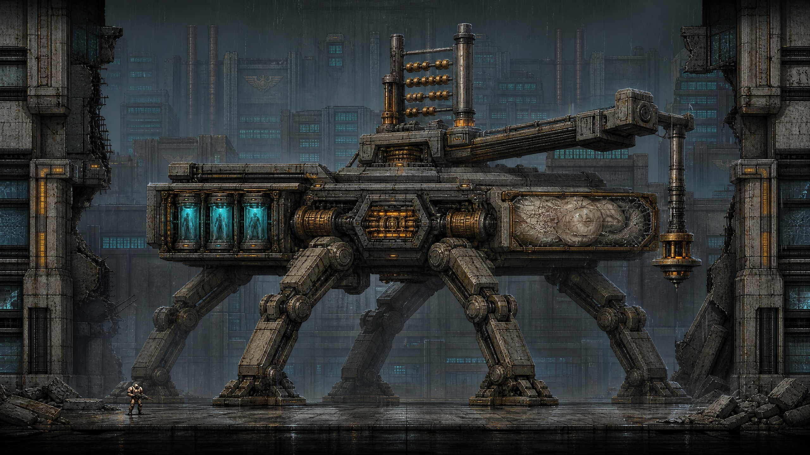
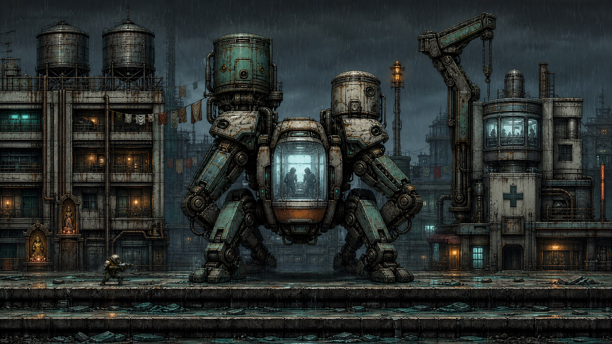
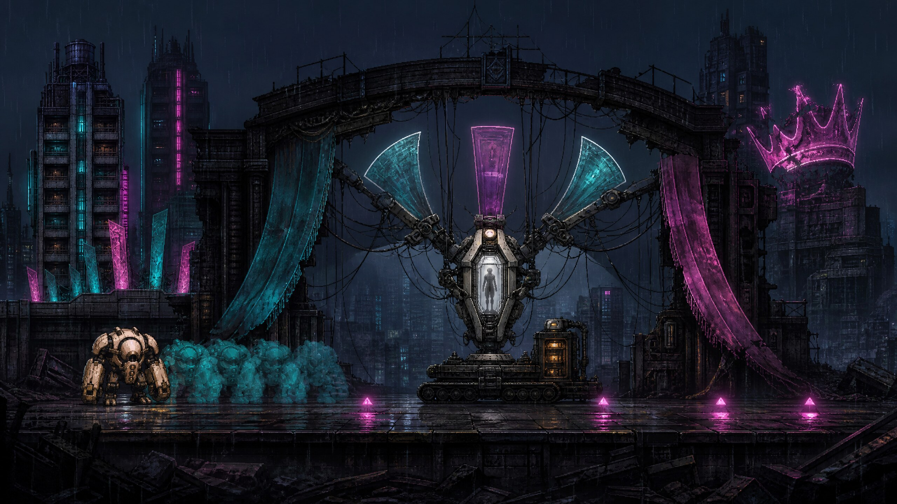
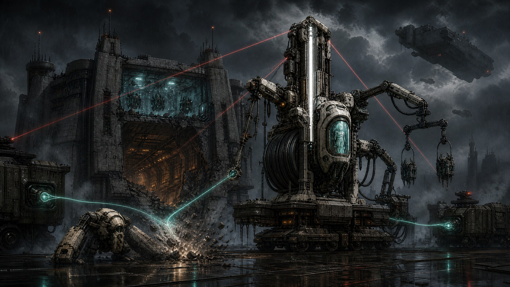
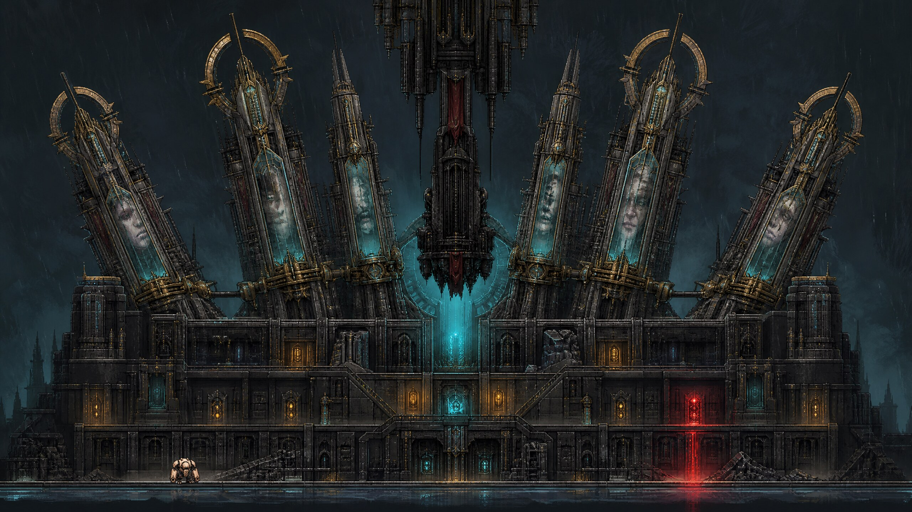

# Project CHOIR: Five District Bosses — Revised Canon Proposal

**Author:** Manus AI

**Status:** Revised proposal for creative and technical approval

**Engine baseline:** Godot 4.7.2-stable

**Canonical narrative:** `docs/PROJECT_CHOIR_STORY_PROPOSAL.md`

**Campaign route:** The Ledger Spine → Ashwater Commons → The Afterglow Strip → The Iron Corridor → The Crownward

**Concept art:** GPT Image 2; five newly regenerated 2560×1440 plates, 2026-08-26

## Executive recommendation

Approve a five-encounter campaign spine in which each five-building district ends with a unique boss at logical chunks **4, 9, 14, 19, and 24**. The encounters should not function as unrelated spectacle fights. Together they must convert the campaign from revenge into investigation, investigation into rescue, rescue into an identity crisis, and that crisis into a final decision about whether copied memories can be owned, weaponized, preserved, or destroyed.[1]

The approved roster is **SETTLEMENT ENGINE S-04**, **SAMARITAN-15**, **MIMESIS-04**, **CANTOR-31 / PALE ENGINE**, and **CHOIR Prime**. Their mechanical questions escalate in the same order as the narrative horror. Business asks what material and transaction record is carrying value. Residential asks what remains alive and what the player is willing to preserve. Entertainment asks whether a memory is harmless history or an armed reconstruction. Military asks which part of an export-scale production system must be denied first. Royal asks whether destroying a weapon, preserving an archive, and attempting liberation are morally or mechanically equivalent. They are not.

The strongest production strategy is to preserve the tested `CommandBossSession` as a compatibility façade and run all five encounters through one data-configured, prewarmed boss framework. One existing command tank remains the hidden authoritative combat host, while a reusable multipart rig, bounded behavior controller, arena adapter, fixed utility pool, and campaign coordinator provide unique silhouettes and mechanics.[2] [3] This approach retains the current 330-armor, 320-health, three-hit charged `jab_cross`, pooled wreck, and ground-smash completion language while avoiding five competing boss architectures.

> **Campaign promise:** *Tear through the city that murdered your family, discover what it made from their memories, and decide whether vengeance is worth destroying the last traces of them.*[1]

## Canon reconciliation

The attached Project CHOIR document is authoritative and supersedes conflicting assumptions in the earlier boss proposal. The revised campaign therefore preserves the following facts and rules.[1]

| Canon requirement | Revised boss-campaign rule |
|---|---|
| Revenge becomes investigation and rescue | Every boss exposes one immutable district truth and commits one capstone dossier or evidence result without interrupting movement. |
| Horror escalates gradually | Business remains conventional and mechanical; living subjects and engineered warforms first become explicit in Residential; Military reveals industrialized bio-mechanical export. |
| PROTOS carries PILOT ECHO P-01 | Entertainment proves the biological pilot died at 04:17 and the active pilot is a continuity reconstruction using CHOIR substrate. |
| Twenty-five facades are twenty-five case files | The campaign stores one dossier per authored facade, with one boss capstone dossier in each district. |
| Five evidence nodes affect the finale | LEDGER, NURSERY, STAGE, ARSENAL, and CROWN are independent persistent flags; optional loss never blocks forward progress and may use the canonical elite-drop recovery rule. |
| PURGE, DISENTANGLE, and ASCENSION FAILURE are canon | PURGE is always available. DISENTANGLE requires at least twenty dossiers and all five evidence nodes. Attempting disentanglement without those conditions commits a clearly warned ASCENSION FAILURE. |
| Story never stops the rampage | Veyr, ECHO-7, dossier, and identity fragments play during safe recovery windows; they never own input, camera, combat state, or encounter timing. |
| Biological horror is tragic and engineered | Containment glass, rescue harnesses, synthetic membrane, memory light, recognizable silhouettes, and clinical machinery replace gore, spectacle mutation, and fantasy imagery. |

The prior proposal’s **two-ending restriction**, inert ineligible plinth, and exclusion of ASCENSION FAILURE are removed. The former Military identity, **The Last Quartermaster**, is also replaced. The Military capstone is now **CANTOR-31 / PALE ENGINE — The Export Surgeon**, explicitly expressing the surgical assembly and off-city export of CHOIR-guided organisms.

## Campaign roster and escalation

| Order | District and gate | Boss | District truth | Dominant mastery test | Bounded support |
|---:|---|---|---|---|---|
| 1 | **Business**, chunk **4** | **SETTLEMENT ENGINE S-04 — The Fiduciary Saint** | The victims’ neural maps were invoiced and transported east. | Read glass, concrete, and steel; sever exact reconciliation pins; preserve an optional archive. | One Bulwark and one Sapper total. |
| 2 | **Residential**, chunk **9** | **SAMARITAN-15 — The Last Evacuation** | The 04:17 blackout harvested a controlled population; living captives remain. | Protect occupied glass, interrupt extraction, and read wet versus energized lanes. | One Reclaimed Breacher; up to two sequential Graft Runners. |
| 3 | **Entertainment**, chunk **14** | **MIMESIS-04 — The Afterimage Conductor** | P-01’s biological body died; the pilot is a copied continuity process. | Distinguish safe memory traces from delayed armed footprints. | One CHOIR Siren, deployed once. |
| 4 | **Military**, chunk **19** | **CANTOR-31 / PALE ENGINE — The Export Surgeon** | The city is a demonstration range for an exportable adaptive army. | Deny production anchors, survive serialized artillery, and break the guidance spine. | One Graft Runner maximum; Seraph scale remains environmental. |
| 5 | **Royal**, chunk **24** | **CHOIR Prime — The Last Sovereign** | The family’s originals are dead, but coherent copied echoes remain trapped inside the weapon. | Synthesize five learned grammars, destroy the command core, or choose a severance outcome. | No live minions; projections and pooled telegraphs only. |

The escalation is deliberately asymmetric. Actor count does not continuously rise. Instead, the campaign increases **information density, consequence, and moral specificity**. Business uses readable mechanical layers. Residential adds occupied payload state. Entertainment adds temporal information. Military combines one support threat with bounded environmental reclamation. Royal removes live support actors so the finale can serialize five learned grammars and preserve a readable three-outcome decision.

## Boss encounter concepts

### 1. Business — SETTLEMENT ENGINE S-04, The Fiduciary Saint

S-04 is a disaster-clearance and settlement gantry shaped like an inverted balance scale. It remains wholly conventional machinery: crawler shoes, coffer-concrete armor, finance-glass shutters, three steel reconciliation pins, an archive rail, and a stamping platen. Behind the breached Crown Reserve Data Treasury, refrigerated eastbound transfer lines and empty human-scale rescue harnesses establish clinical wrongdoing without prematurely revealing a living hybrid.

The shipped opening encounter is deliberately more accessible than the later shared-connection grammar: every accepted player damage type chips S-04 armor by its actual damage. S-04 now owns only **Core Shockwave**. Cyan-blue photons converge from every direction into a massive electric-blue sphere at the rig's visible core, directly reusing the player's charged-melee visual language. A carrier-derived electrical rise compresses the warning to 1.45 seconds; the release boundary stops that cue, starts a one-second pressure transient, applies one restrained camera impulse, and emits one cyan-white circular shockwave. Only contact with its moving ring is dangerous. Four pooled foot soldiers arrive during recoveries until eight are active.

Armor failure opens the command body but does not introduce another attack symbol or cadence. The same charge-and-release cycle repeats throughout the fight, leaving support pressure and recovery opportunities—not warning ornamentation—to carry escalation. The archive bracket, optional foundation cascade, bounded support cap, corpse finisher, and evidence outcome remain intact. The exact charge and release system is specified in [`SETTLEMENT_ENGINE_SHOCKWAVE_DESIGN.md`](SETTLEMENT_ENGINE_SHOCKWAVE_DESIGN.md).

The wreck reveals **B-05: EASTBOUND CONSIDERATION**. The dossier always proves that the 04:17 neural maps were purchased, classified, and shipped east. Preserving the upper archive cassette commits the **LEDGER** evidence flag; destroying it never blocks the district and permits the later elite-drop recovery route. ECHO-7 contributes only a brief, uncertain fragment: “Eastbound… I remember the cold between stations.” Director Cael Veyr answers: “Your dead were not hidden. They were invoiced.”

**Design boundary:** Business contains no living warform, rescue tracker, motion recorder, Seraph, Pale Engine, or biological combatant. Its horror is documentary and industrial.

### 2. Residential — SAMARITAN-15, The Last Evacuation

SAMARITAN-15 is a corrupted civil-defense rescue crawler built around a transparent triage cradle, four side pods, unequal cistern shoulders, six stabilizer legs, and a heron-neck clinic crane. Its municipal teal, white rescue shell, blankets, respirators, and evacuation skids make its original purpose unmistakable. Damage exposes contained surgical harnesses and synthetic membrane rather than spectacle anatomy.

During **False Evacuation**, Triage Sweep and Pressure Sentence expose three white hose couplings. Exactly three charged `jab_cross` connections break armor; blue valves only extend openings. Frosted pod glass first shows ambiguous breath and life lamps, allowing the horror to arrive as suspicion. Armor break opens the shutters and proves the captives are alive.

**Red-Tag Requisition** selects one occupied pod for a 2.6-second extraction. The player can smash the ground clamp, attack the exposed chassis, or collapse one explicitly empty support cell through a fixed impact volume. Pod loss changes rescue score and dossier wording but never blocks completion or the central cradle rescue. One Reclaimed Breacher may deploy without overlapping extraction. Its responder silhouette and engineered impact arm establish the first explicit human warform.

The final **Blackout Harvest** recreates 04:17 in three beats: housing lights die, the harnesses draw cyan memory light, and the clinic battery energizes only visibly wet lanes. At least one dry raised lane always remains. The battery mast can shorten the pulse. Up to two Graft Runners may appear sequentially, never during an electrical discharge or extraction. At zero health, the cradle lowers onto rescue skids and only a fresh ground smash on the rear CHOIR spine completes the fight without striking captive glass.

The capstone is **ASHWATER INTAKE MANIFEST**, linked to the **NURSERY** evidence flag. Its immutable fact is that exits were deliberately locked and residents were sorted by neural coherence. ECHO-7 warns, “White lamps mean breathing. Break the clamp, not the glass.” Veyr states, “At 04:17, Ashwater was not evacuated. It was sampled.”

**Design boundary:** Residential owns living-payload consequence, wet/electrical lanes, and the first explicit warforms. It does not record the player’s movement or demand escort AI.

### 3. Entertainment — MIMESIS-04, The Afterimage Conductor

MIMESIS-04 is a low stage crawler carrying a coffin-shaped memory-glass capsule inside a broken crescent proscenium. Folded rescue outriggers and audience harnesses connect it to the city’s disaster infrastructure; marquee arms, show-control cables, and a separate porcelain CHOIR Siren connect it to the Afterglow Strip’s broadcast system. The boss turns the player’s recent motion into an explicit temporal language.

The opening phase uses **Dead-Air Sweep** and **Memory Blocking**. A fixed recorder displays the last three seconds of horizontal movement as hollow cyan afterimages. These traces are always harmless. Three sequential white marquee conductors preserve the shared charged-strike armor lesson. Destroyed marquee cells receive same-location conductor fallbacks.

On armor break, the identity record plays during live control: P-01’s biological termination at 04:17, followed three seconds later by the continuity reconstruction boot. In the second phase, up to eight quantized cyan markers are presented chronologically. A selected marker must separately arm through an amber count and become a solid magenta damage footprint before it can hurt the player. Repeated positions merge instead of stacking.

One CHOIR Siren may deploy once. Its closing resonator ring briefly suspends exactly one autonomous weapon but never movement, smash, dash, aiming, or direct attacks. The player can enter the hollow center, destroy the fragile Siren, or simply continue through the short interruption. The final phase combines one **Encore Impact** with one later show-control utility cue. A cabinet strike can reroute the next line into the boss; a rubble-bed smash can ground it. These are optional accelerants and never replace direct body damage.

The capstone dossier is **Audience of One / 04:17 Continuity**, linked to the **STAGE** evidence flag. It establishes that P-01 was reconstructed rather than revived. ECHO-7 says, “Cyan is memory. Magenta is what they make it do.” Veyr replies, “P-01, your body ended at 04:17. Grief made the reconstruction obey.”

**Design boundary:** Entertainment alone samples player history. Royal may replay authored attack grammars but cannot use cyan afterimages, copied positions, or a physical duplicate of PROTOS.

### 4. Military — CANTOR-31 / PALE ENGINE, The Export Surgeon

CANTOR-31 is no longer a generic quartermaster. It is a rail-mounted surgical transload engine built around a vertical artillery spine, a telemetry cable drum, three unequal loading arms, folded Seraph transport fins, and an off-center porcelain containment capsule. Its imagery—sealed guidance cradles, surgical clamps, vehicle armor, human silhouettes behind fogged glass, and outbound carrier forms—proves that the city is validating an army for export.

**Calibration Theatre** is the strictest version of the armor lesson. Crossbar Biopsy and Redline Proof end in long recoveries that expose the white collar. Only three 110-point charged `jab_cross` hits remove the 330 armor. A counterweight can cancel one committed test, but environmental damage cannot bypass the phase.

**Assembly Run** alternates a boss attack with one Dispatch Harness. At most one Graft Runner may be requested; no replacement begins while it lives, and pool denial simply turns the crossing cradle into dressing. Suture Salvo always leaves one safe lane. Destroying the descending cradle creates a static freight anchor and cancels dispatch; missing it creates the same anchor without trapping the player.

During **Pale Reclamation**, no new actors spawn. Up to three existing rubble or wreck sources receive hollow cyan tethers. Smashing an outlined source denies it; leaving it intact grants one capped ablative plate rather than restoring body health. Sources are consumed once. Reclamation is followed by **Compression Psalm**, a long spinal charge and a two-beat lane test before a guaranteed vulnerability window. Direct damage always remains valid.

The wreck yields **EXPORT LITANY 31**, linked to the **ARSENAL** evidence flag. It records off-city destinations for Pale Engine frames and their human guidance maps. ECHO-7 advises, “Those lights are memories. Break the spine—not the glass.” Veyr states, “They are guidance packages, and you are completing their export certification.”

**Design boundary:** Military owns industrial fusion and export scale. It has one live auxiliary maximum, three static anchors, no dynamic debris physics, and no Residential-style captive scoring.

### 5. Royal — CHOIR Prime, The Last Sovereign

CHOIR Prime is the Palace of the Last Sovereign itself: an inverted black throne above a cyan memory aperture, three brass spinal braces, and five distinct reliquary pylons. **Ledger** is an archive stack, **Nursery** a rescue cradle, **Stage** a broken resonator, **Arsenal** a surgical ordnance rack, and **Crown** a forked command reliquary. Behind fogged glass, coherent adult- and child-scale silhouettes remain secured in rescue webbing. The presentation acknowledges authentic memory without calling archival persistence resurrection.

**Fivefold Testimony** maps five pylons onto the familiar three-hit armor budget. Each charged 110-point connection sends a severance pulse through a fixed pair or final pylon: Ledger plus Nursery, Stage plus Arsenal, then Crown. Before each opening, one pylon serializes both a learned district mechanic and an enemy-composition echo. Ledger combines a settlement sweep with projected Bulwark and Sapper lanes. Nursery combines a braced shock footprint with Reclaimed Breacher and Graft Runner approach silhouettes. Stage combines the separately armed ring with a Siren halo and harmless decoy formation. Arsenal serializes Longbow, Basilisk, Shrike, and distant Seraph geometries. Crown combines a radial verdict with projected Goliath and Nemesis pressure silhouettes. These composition echoes are prewarmed presentation silhouettes and exact pooled telegraph areas, not live actors; they cannot be damaged, collide, or create hidden attacks. Royal therefore fulfills the canon’s composition replay without adding minions, copying player history, or stacking multiple grammars.

**Sibling Process** exposes the 320-health aperture and binds one palace column. The player may create the dependable lower kneeling route or time an upper crownfall interrupt. Both preserve the ground corridor and direct core damage. During a short midpoint overlay, the five harness silhouettes align with PROTOS while ECHO-7 identifies both systems as sibling copies. Control remains live.

At zero health, CHOIR Prime enters **The Last Consent**, a player-controlled three-outcome wreck phase:

| Outcome | Eligibility and action | Canon result |
|---|---|---|
| **PURGE** | Always available; fresh ground smash on the central crimson core. | The weapon and coherent victim echoes are destroyed. Evidence is transmitted. “NO HOSTILES DETECTED. NO VOICES DETECTED.” |
| **DISENTANGLE** | At least twenty dossiers and all five evidence flags, snapshotted before the wreck; fresh smash on the complete cyan plinth starts five repeating severance windows. CHOIR continues one serialized pylon mechanic and composition echo during each window; a successful severance cancels the current sequence, while a missed window loops without an overall wreck timeout. | Military command authority is destroyed while a silent, non-weaponized archive remains. “ARCHIVE STABLE. CONSENT UNKNOWN. AWAITING YOUR DECISION.” |
| **ASCENSION FAILURE** | The player intentionally smashes the fractured cyan-crimson plinth while the evidence threshold is incomplete. A broken five-part bracket, low warning cadence, and risk status make the choice explicit. | CHOIR uses P-01 as an exit path and leaves the city through PROTOS while multiple voices speak in unison. |

The receivers remain farther apart than one smash radius, reject autonomous fire and charged punches, and require distinct fresh ground-smash events. PURGE remains visible beside the unstable ineligible route. ASCENSION FAILURE is therefore a warned act of insufficiently informed liberation, not an accidental failure or hidden trap.

The capstone record is **CROWN-05: CONSENT EXCISION ORDER**, linked to the **CROWN** evidence flag. The third armor connection necessarily severs the Crown pylon and transmits this record before exposed-body combat and before the finale eligibility snapshot. The idempotent pylon transaction persists the CROWN flag immediately, so a run entering the wreck can legitimately hold all five flags. It proves that Veyr ordered refusal markers removed and used grief as P-01’s obedience anchor. If the twenty-dossier threshold has also been met, the record resolves ECHO-7 as a coherent cross-pylon victim-memory cluster; otherwise the signal remains an unresolved chorus. ECHO-7 asks, “If you remember us, do not mistake possession for rescue.” Veyr answers, “Revenge was the checksum that kept your copy obedient.”

## Narrative delivery contract

Boss narrative must remain observational. The `NarrativeDirector` may listen to gate, armor-break, threshold, evidence, wreck, and completion signals, but it cannot advance boss state, pause the tree, capture focus, disable attacks, or move the camera. Veyr and ECHO-7 lines should normally last **two to five seconds**. The live Entertainment identity record may last **six to eight seconds** because its two timestamps require separation, but player control remains available throughout.[1]

Each boss delivers one immutable fact during combat and repeats it in the resulting capstone dossier. ECHO-7 remains uncertain until the twenty-dossier threshold is met. Crown evidence corroborates cross-pylon coherence only after that threshold; without it, ECHO-7 remains an unresolved chorus even during the finale. Resolution never promises biological survival or perfect resurrection.

## Campaign gates and persistent evidence

The authored route uses four bounded five-building districts followed by the open-ended Royal district, which begins at chunk 20. Each geographic exit first requires all five unique district facades to be cleared. Boss gates retain their independent campaign authority at chunks 4, 9, 14, 19, and 24, while Royal geography remains valid beyond the finale for post-campaign or endless routing. A `BossGateMarker` at each campaign cap fires before the next route can stream. This is safer than relying on `district_changed`, which occurs only after the logical index changes.[4]

| Trigger | Arena landmark | Unlock | Capstone dossier | Evidence flag |
|---:|---|---:|---|---|
| 4 | Crown Reserve Data Treasury | 5 | B-05: Eastbound Consideration | LEDGER |
| 9 | Rainvault Cooperative / Nightglass Mutual Clinic | 10 | Ashwater Intake Manifest | NURSERY |
| 14 | House of Static stage mouth | 15 | Audience of One / 04:17 Continuity | STAGE |
| 19 | Prefect War Keep loading apron | 20 | Export Litany 31 | ARSENAL |
| 24 | Palace of the Last Sovereign | Campaign finale | CROWN-05: Consent Excision Order | CROWN |

The campaign contains **twenty-five dossiers**, one per authored facade, and **five evidence flags**, one per district. Bosses supply the capstone dossier and associated evidence opportunity; the other twenty records remain embedded in district buildings. Dossiers persist when transmitted. Evidence destroyed during optional play never blocks the district and may enter the canonical elite-drop recovery path later in the run.[1]

The Crown pylon transaction commits CROWN-05 and its evidence flag before the exposed phase completes. Immediately before Royal wreck entry, the finale snapshots dossier count and all five evidence flags. Events during the wreck cannot change eligibility. Completion is an idempotent transaction keyed by boss ID and outcome: mark the boss complete, reference the already committed Crown record, award score and experience once, persist the selected ending, open the proper route, and only then clear the attempt checkpoint.

## Shared combat and presentation contract

All five encounters inherit the existing **four-second controllable entrance**, **330 armor**, **320 health**, `jab_cross`-only armor damage, exposed-body damage, one pooled wreck, and ground-smash-only completion.[2] [3] Environmental interactions can interrupt attacks, extend openings, or apply capped damage, but no phase depends on a surviving facade cell and no environmental route may bypass the full combat state unpredictably.

The cue language remains campaign-wide. Hollow cyan brackets communicate safe memory or information. Amber stripes and counted audio communicate commitment. Solid crimson footprints communicate damage. White pulse and a sharp chime identify a live weak point. Protected life signs use steady white-green lamps plus breathing silhouettes and a two-beat monitor sound. Shape, motion, luminance, and sound always duplicate color.

Landscape and portrait share definitions, timings, health, lane count, hit volumes, target order, and minimum safe gaps. Portrait rigs telescope or fold visually; they do not change mechanical reach or create a separate encounter. No target may sit under the HUD or mobile controls.

## Production recommendation

Authorize the shared compatibility foundation and the **Business + Residential narrative vertical slice** first. This matches the canon document’s recommended proof of concept: Business proves that destruction can reveal a conspiracy without sacrificing momentum; Residential proves that the same destruction system can support optional rescue consequences without an escort mission.[1]

Continue to Entertainment and Military only after the first slice proves deterministic arena leases, fixed pool counts, all six-cell destruction fallbacks, retry restoration, nonblocking narrative delivery, portrait/landscape equivalence, and package growth within allocation. Royal should remain the final production package because the five-pylon synthesis and three-outcome transaction depend on every earlier system.

> **Decision requested:** Approve the revised roster, canon corrections, regenerated visual direction, and phased engineering plan. Begin implementation with the shared foundation and Business + Residential vertical slice.

## References

[1]: PROJECT_CHOIR_STORY_PROPOSAL.md "Canonical Project CHOIR narrative and campaign direction"
[2]: ../game/scripts/siege/command_boss_session.gd "Existing command-boss state, armor, health, timing, attack-gate, wreck, and completion contract"
[3]: ../game/test/test_command_boss.gd "Existing command-boss compatibility and timing regressions"
[4]: ../game/scripts/world/city_world_stream.gd "Six-slot streaming window, logical chunk transitions, and district-change ordering"
[5]: DISTRICT_DESTRUCTION_DESIGN.md "Five district ranges, twenty-five facades, material language, and nonblocking destruction model"
[6]: ../game/scripts/encounter/encounter_runtime.gd "Prewarmed actor families, acquisition failure, and fixed pool behavior"
[7]: ../game/scripts/quality/runtime_budget.gd "Fixed runtime capacities and 16 MiB Web PCK ceiling"
[8]: DISTRICT_MISSIONS_AND_BALANCE_PLAN.md "District missions, pressure curve, and latest verified release evidence"
