# District Chimera Projectile and Attack VFX Proposal

**Project:** Proto Scroller  
**Feature:** Custom projectile, impact, explosion, and attack presentation for twenty district CHOIR variants  
**Engine:** Godot 4.7.2  
**Author:** Manus AI  
**Status:** Production proposal

## Executive Proposal

The twenty district CHOIR variants should no longer inherit anonymous legacy projectile art. Every variant will receive a **three-part visual identity**: a bespoke delivery payload, a bespoke impact or completion burst, and a bespoke anticipation or attack channel. Nine variants fire damaging projectiles through the existing bullet, shell, or rocket partitions. Eleven support or melee variants receive a projectile-like payload motif that remains presentation-only and therefore does not invent a physics projectile where the approved combat contract has none.

The implementation changes presentation, not balance. Damage, attack interval, anticipation time, target selection, movement, range, projectile speed, collision radius, reservation behavior, support values, melee timing, and district encounter costs remain unchanged. The visual system continues to use the existing prewarmed procedural shells, five actor-owned presentation sprites, thirty-two pooled projectiles, and fixed telegraph budget. The only new bounded presentation capacity is a hostile-impact cohort inside the existing projectile pool; it can degrade cosmetically under saturation but can never deny damage delivery.

> **Design rule:** CHOIR attacks should look as if a rescue, clinical, civic, or ceremonial tool has been forced to remember violence. They must never read as fantasy spells, comic mutation, or gore spectacle.

## Visual Language

Each attack combines **containment glass**, **synthetic membrane**, and **cyan memory light** with the source district's material culture. Business attacks are geometric and administrative. Residential attacks expose corrupted rescue systems. Entertainment attacks synchronize identity and timing. Military attacks look export-standardized and clinically severe. Royal attacks become ornate command instruments without becoming supernatural.

| Visual phase | Gameplay purpose | Runtime rule |
|---|---|---|
| **Delivery payload** | Makes the incoming projectile or support/melee intent identifiable in motion. | Ranged payloads render on an existing pooled projectile. Support and melee payloads render only on the owning enemy's fixed presentation sprites. |
| **Impact / completion** | Confirms where the attack resolved and which identity produced it. | Ranged impacts use bounded cosmetic slots in the existing projectile pool. Support and melee completions use the enemy's fixed presentation sprites and create no damage area. |
| **Anticipation / attack channel** | Gives the player a unique readable warning before the unchanged attack resolves. | Uses the existing telegraph duration and actor-owned sprites. It does not add telegraph records, delay, targeting, or collision. |

## Delivery Classification

| Class | Count | Variants | Mechanical preservation |
|---|---:|---|---|
| **Ranged projectile** | 9 | Covenant Warden, Mercy Recovery Cart, Rainvault Pressure Ward, Glassback Double, Marquee Anesthetist, Mercy Raker, Revetment Ward, Triage Kite, Regency Conservator | Existing bullet/shell/rocket partition, speed, radius, damage, target mask, and reservation count. |
| **Presentation-only support or melee payload** | 11 | Testament Kite, Receivership Ambulance, Intake Shepherd, Evacuation Litter, Balcony Recall Beacon, Memorial Usher, Recall Lantern, Suture Marshal, Privy Chirurgeon, Laureate Courser, Ninefold Witness | Existing scan, repair, choir-ring, shock-brace, and drop-lunge semantics; zero physics projectile reservations. |

## The Ledger Spine — Administrative Violence

Business variants retain conventional geometry. Their attack VFX expose the administrative record inside the weapon rather than revealing mature living warforms too early.

### 01. Covenant Warden

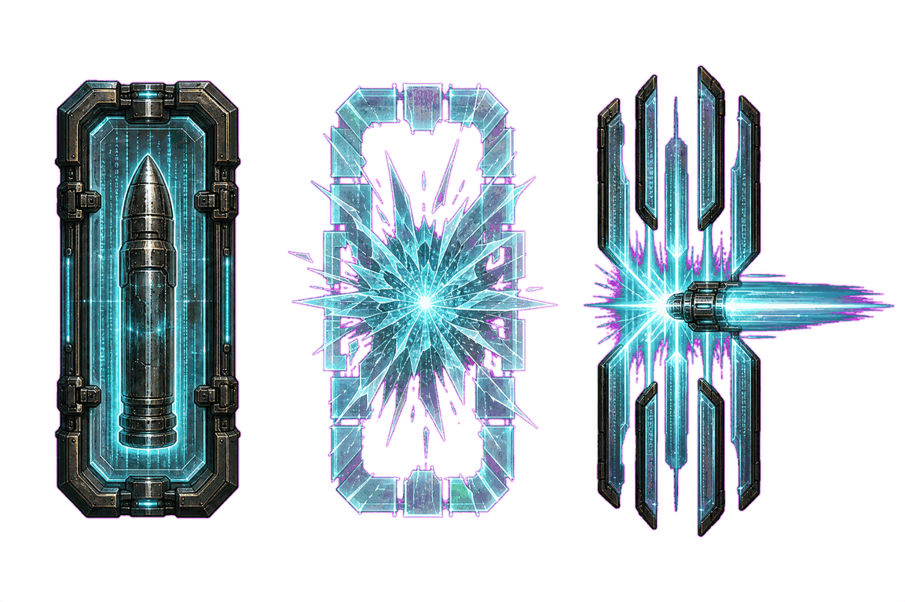

| Phase | Concept |
|---|---|
| Payload | A dense synthetic-resin baton slug sealed inside angular containment glass, dragging a thin cyan archival wake. |
| Impact | A sharp geometric glass burst with a rectangular ledger-tab halo and cold cyan prismatic fragments. |
| Anticipation | Rigid memory-light columns converge across the shield into one bright horizontal muzzle line. |

The Warden keeps `shield_burst`, an ordinary bullet reservation, 690-pixel speed, seven damage, and the five-pixel bullet radius. The player still answers by crossing the visible firing line or closing during recovery; the new art makes the source unmistakable without making the attack stronger.

### 02. Mercy Recovery Cart

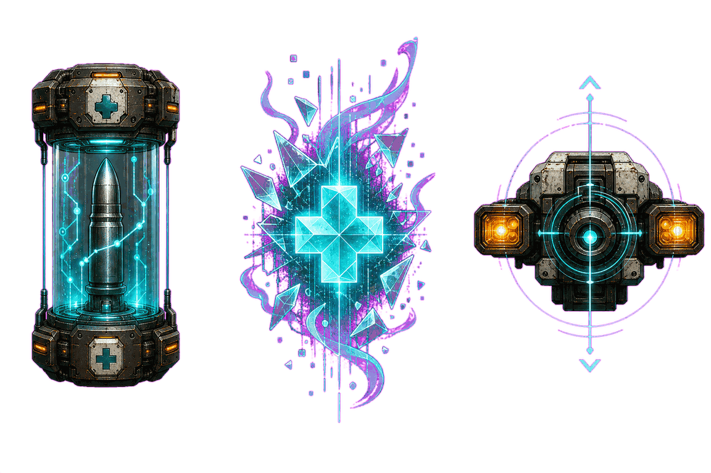

| Phase | Concept |
|---|---|
| Payload | A compact turret round in cylindrical ambulance glass, sealed by membrane end caps and threaded with cyan route vectors. |
| Impact | A clean cyan memory flash with geometric rescue-glass shards and rapidly fading membrane wisps. |
| Anticipation | Twin amber rescue lamps sweep to cyan around the pivoting turret aperture. |

The cart keeps `turret_burst`, the existing bullet pool, tenable lateral passes, and its original collision and cadence. Its custom light sweep reinforces the existing pass lane rather than adding tracking after commitment.

### 03. Testament Kite

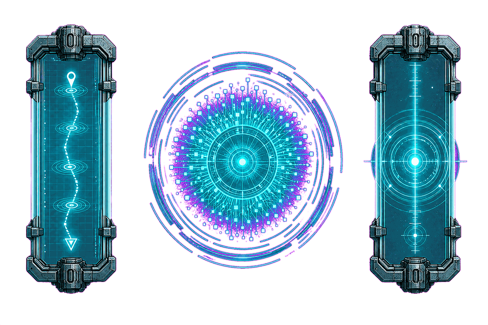

| Phase | Concept |
|---|---|
| Payload | A presentation-only witness wafer containing cyan evacuation waypoints in thin civil-rescue glass. |
| Completion | A harmless bloom of memory nodes and closing membrane iris rings when the scan resolves. |
| Anticipation | An administrative glass iris projects the existing razor-thin cyan scan line and calibration rings. |

The Kite still fires no damage projectile. Its scan applies the existing three-second mark and consumes no projectile reservation. The wafer is an actor-owned visual metaphor, not an independently simulated object.

### 04. Receivership Ambulance

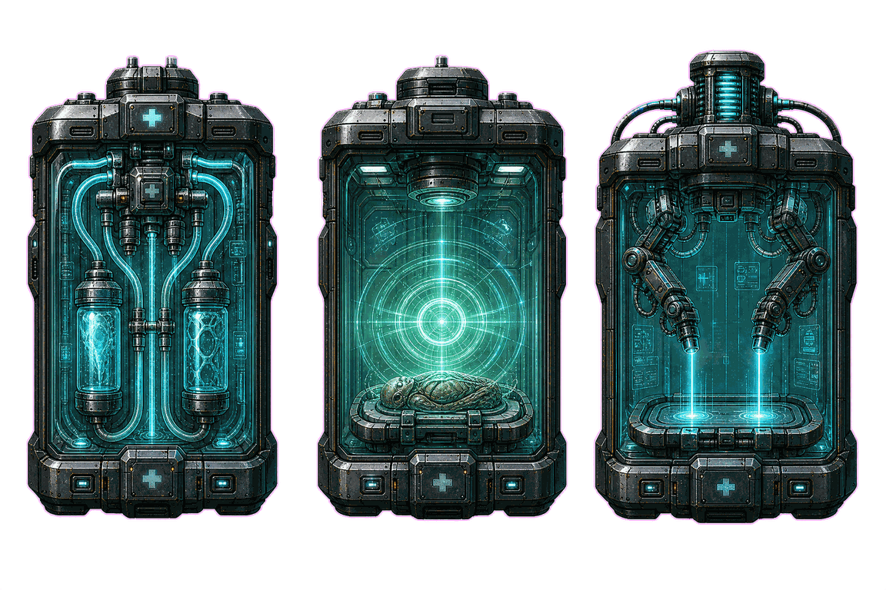

| Phase | Concept |
|---|---|
| Payload | A presentation-only dual-infusion manifold with containment-glass ampoules, membrane tubes, and cyan memory streams. |
| Completion | A gentle green-cyan repair pulse with microscopic glass resonance rings rather than a destructive explosion. |
| Anticipation | The elevated service spine opens and focuses twin manipulator telemetry beams. |

Repair remains one nearest damaged non-self ally within 520 pixels for exactly 22 health. The ambulance acquires no projectile; the clinical payload and completion remain attached to its prewarmed presentation sprites.

## Ashwater Commons — Corrupted Rescue Systems

Residential effects show the first unmistakable living intake technology. The visuals remain clean enough for combat readability and never turn clinical tragedy into viscera.

### 05. Intake Shepherd

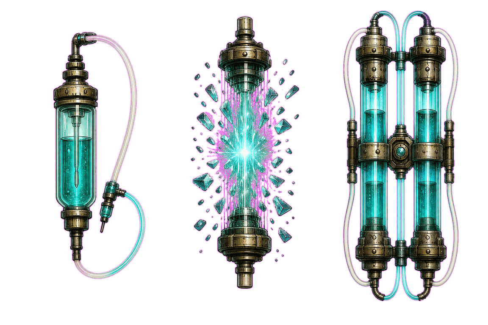

| Phase | Concept |
|---|---|
| Payload | A presentation-only clinic IV ampoule with pale membrane tubing and a taut cyan memory tether. |
| Completion | An emerald-cyan treatment flash with dissolving micro-glass motes. |
| Anticipation | Twin Nightglass lantern columns fill from bottom to top above planted triage braces. |

The 22-health bounded repair and 520-pixel selection radius do not change. The visible tether improves target priority without introducing a beam entity, status object, or heal-over-time effect.

### 06. Evacuation Litter

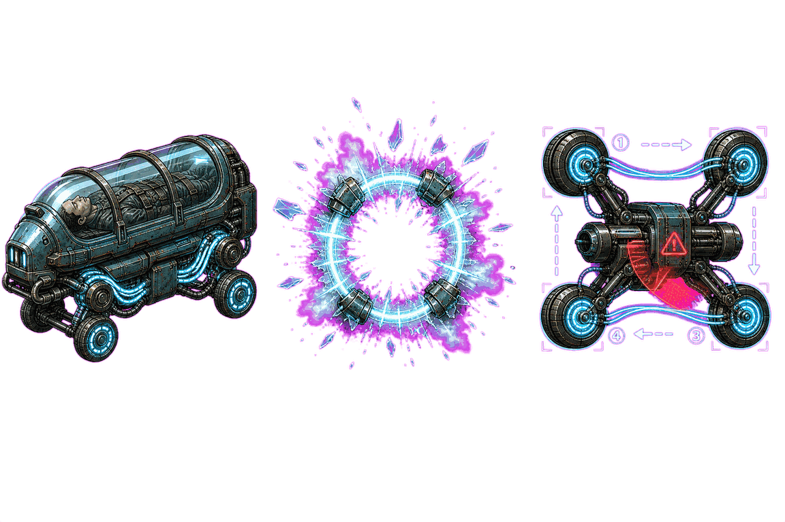

| Phase | Concept |
|---|---|
| Payload | A presentation-only gurney shock crest made from curved glass, wheel-memory filaments, and Bluewire restraint fittings. |
| Impact | A localized cyan-white brace ring with sterile mist and clinical splinters that vanish immediately. |
| Anticipation | Four wheel hubs light sequentially while the chassis compresses behind a horizontal warning sweep. |

`shock_brace` remains a single bounded melee completion with zero projectile speed and no projectile reservation. The custom contact confirms the existing hit only; it creates no radial damage, terrain effect, or lingering collision.

### 07. Rainvault Pressure Ward

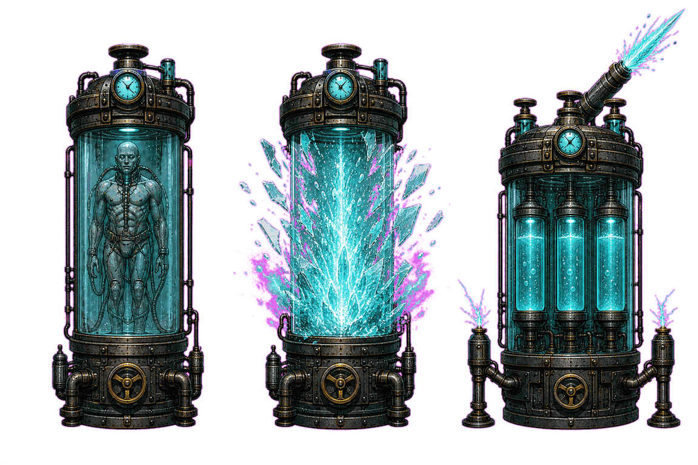

| Phase | Concept |
|---|---|
| Payload | A civic water-pressure shell: a sealed containment cylinder with a membrane valve collar and cyan gauge core. |
| Impact | A momentary high-pressure cyan fluid burst with clean glass shards and no puddle or slow field. |
| Anticipation | Three pressure chambers fill as outrigger valves strike and a cyan mortar trajectory brightens. |

The Ward keeps the Basilisk shell partition, nine-pixel shell radius, current ballistic speed, one damage event, and minimum-range answer. The water language is visual only.

### 08. Balcony Recall Beacon

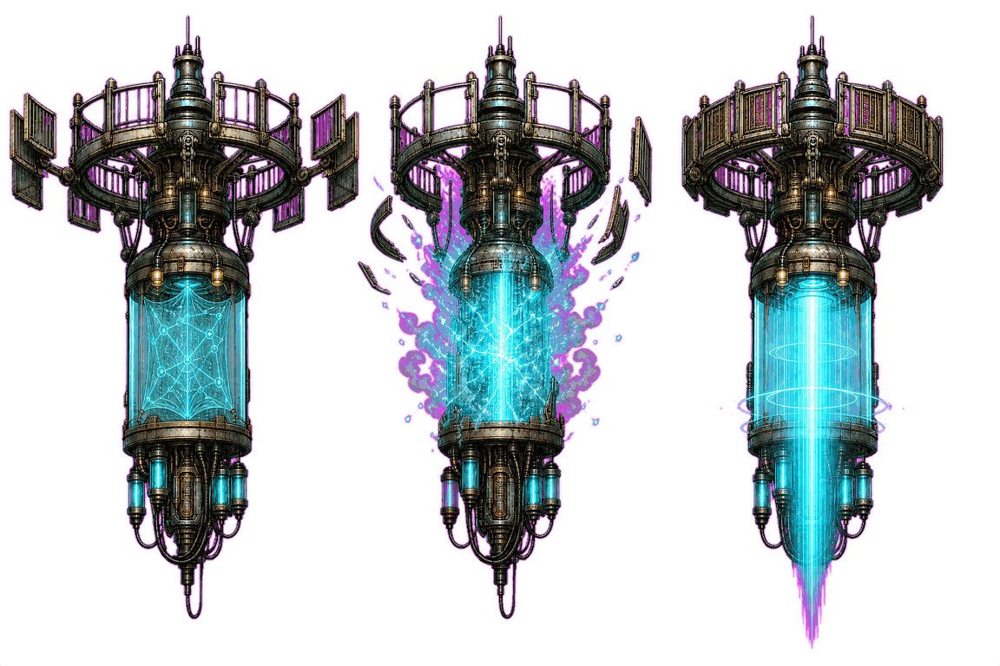

| Phase | Concept |
|---|---|
| Payload | A presentation-only emergency call cylinder suspended in glass and threaded with cyan address-map wires. |
| Completion | A harmless dispatch burst of rescue sparks, dissolving membrane vapor, and ring fragments. |
| Anticipation | Folding balcony vanes frame the existing downward scan beam and calibration halo. |

The Beacon still applies the ordinary three-second mark with zero direct damage and zero projectile reservations. Its stationary scan remains the player's interruption window.

## The Afterglow Strip — Conditioned Identity

Entertainment attacks use stage timing, copied identity, and audience guidance. Every deceptive-looking element remains cosmetic and points back to a single real attacker.

### 09. Memorial Usher

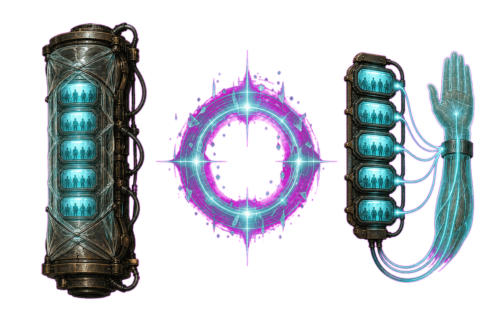

| Phase | Concept |
|---|---|
| Payload | A presentation-only memory-glass dossier capsule wrapped in membrane and divided into six cyan house-light panes. |
| Completion | A quiet treatment resonance halo with clinical glass sparkles. |
| Anticipation | Six rib panes illuminate in order behind an open-palm guidance tether. |

The Usher retains the same one-target, 22-health repair as every other repair derivative. No audience silhouette becomes targetable, and no completion pulse damages the player.

### 10. Glassback Double

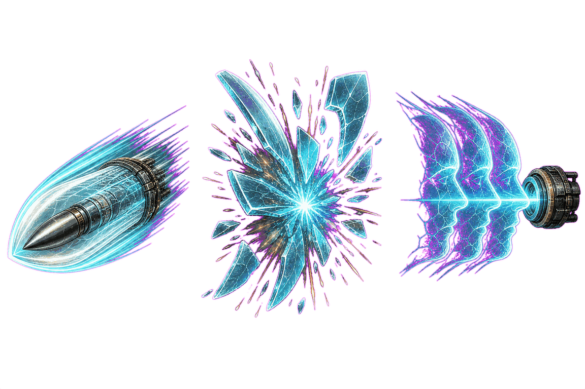

| Phase | Concept |
|---|---|
| Payload | A tungsten round inside casino-canopy containment glass with a pale membrane sleeve and sharp cyan trail. |
| Impact | A cyan identity-collapse flash with structured amber sparks and clean glass facets. |
| Anticipation | Three face-outline echoes snap into one optical aperture and a single cyan muzzle line. |

The Double keeps the existing bullet partition and `turret_burst` pass behavior. The face echoes are a sprite effect on the real sled; they never become decoys, hitboxes, or alternative damage origins.

### 11. Recall Lantern

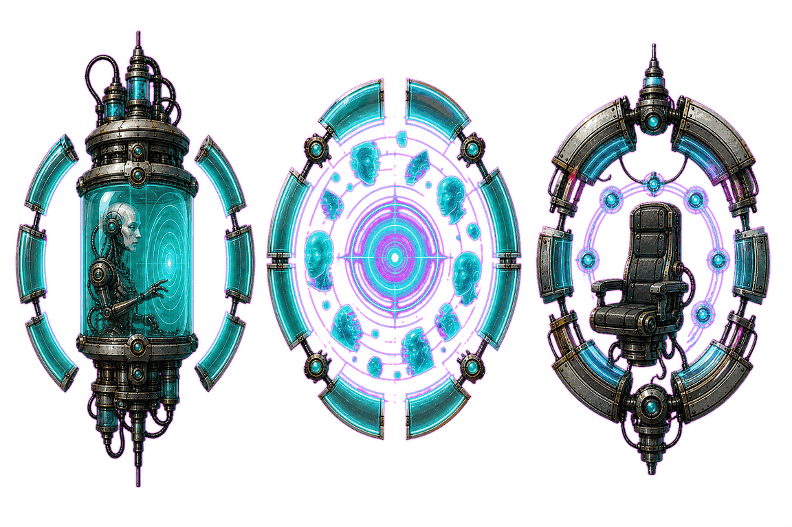

| Phase | Concept |
|---|---|
| Payload | A presentation-only memory projector core suspended in curved glass and segmented membrane. |
| Completion | A four-beat cyan choir ring expands with copied-memory fragments and no direct damage. |
| Anticipation | Four halo segments contract inward around the clinical aperture while visible nodes tick. |

The Lantern preserves the existing four-second target mark and hybrid-event presentation. It creates no false damaging bodies, input effects, or projectile reservations.

### 12. Marquee Anesthetist

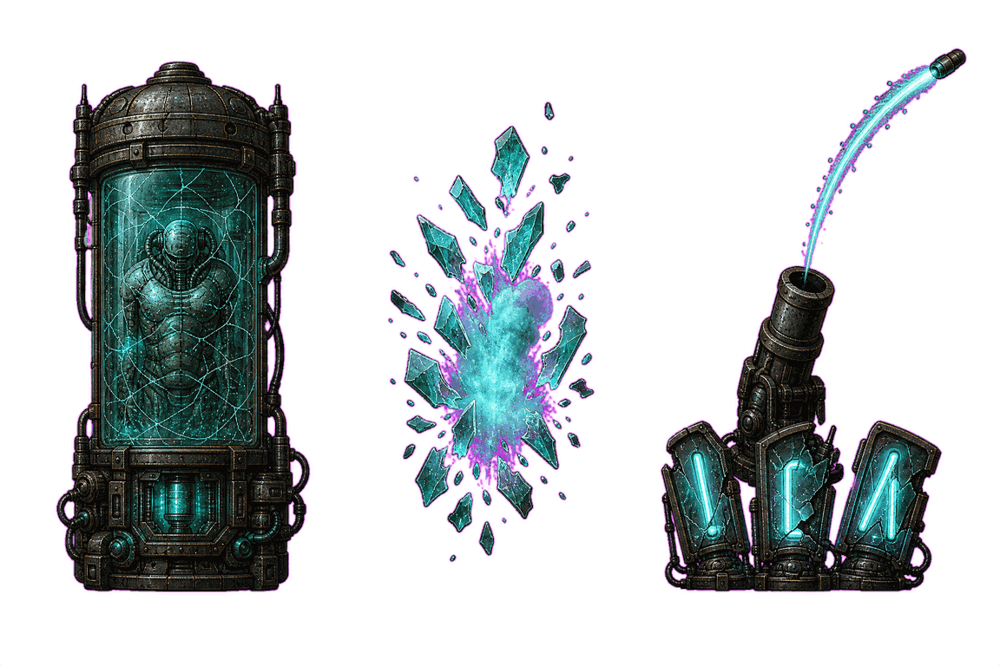

| Phase | Concept |
|---|---|
| Payload | A heavy conditioning capsule in containment glass with a reactive membrane sheath and cyan vaporizer core. |
| Impact | A clean glass shatter and brief anesthetic mist flash that leaves no cloud or status field. |
| Anticipation | Three broken marquee lamps illuminate beside the rising mortar and traced shell arc. |

The Anesthetist remains a single ordinary pooled shell with 24 damage and the existing long warning. Its mist never persists or alters controls.

## The Iron Corridor — Export-Line Fusion

Military effects are standardized, hard-edged, and deliberately repeatable. Rescue technology is no longer merely corrupted; it has become a product line.

### 13. Suture Marshal

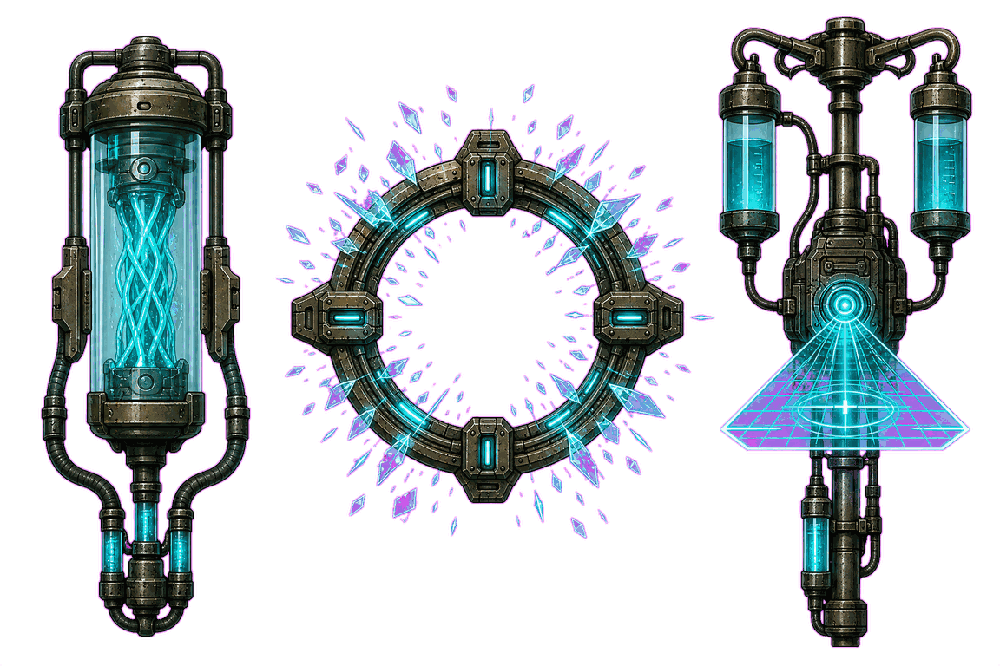

| Phase | Concept |
|---|---|
| Payload | A presentation-only armored triage ampoule with taut membrane tubes and cyan suturing filaments. |
| Completion | A precise armor-repair ring with dissolving microshards and clinical sparks. |
| Anticipation | A military IV mast rises while a structured treatment grid converges on the selected ally. |

Repair remains bounded to one ally, 22 health, and 520 pixels. The grid is a readable channel, not a shield, cleanse, or damage reduction effect.

### 14. Mercy Raker

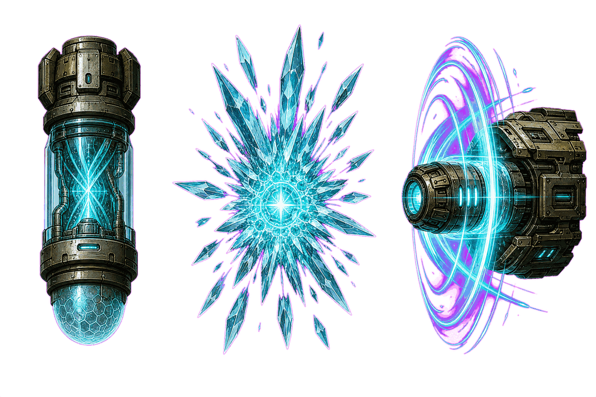

| Phase | Concept |
|---|---|
| Payload | A compact military glass round containing stabilized cyan memory filaments behind a pneumatic membrane tip. |
| Impact | A crystalline cyan triage sparkburst with sharp silicate fragments. |
| Anticipation | Swept optic bands converge around a hard-edged turret aperture with pressure pulses. |

The Raker keeps its standard bullet partition, five-pixel radius, 820-pixel speed, ten damage, and committed lateral pass. The brighter military signature adds recognition rather than lethality.

### 15. Revetment Ward

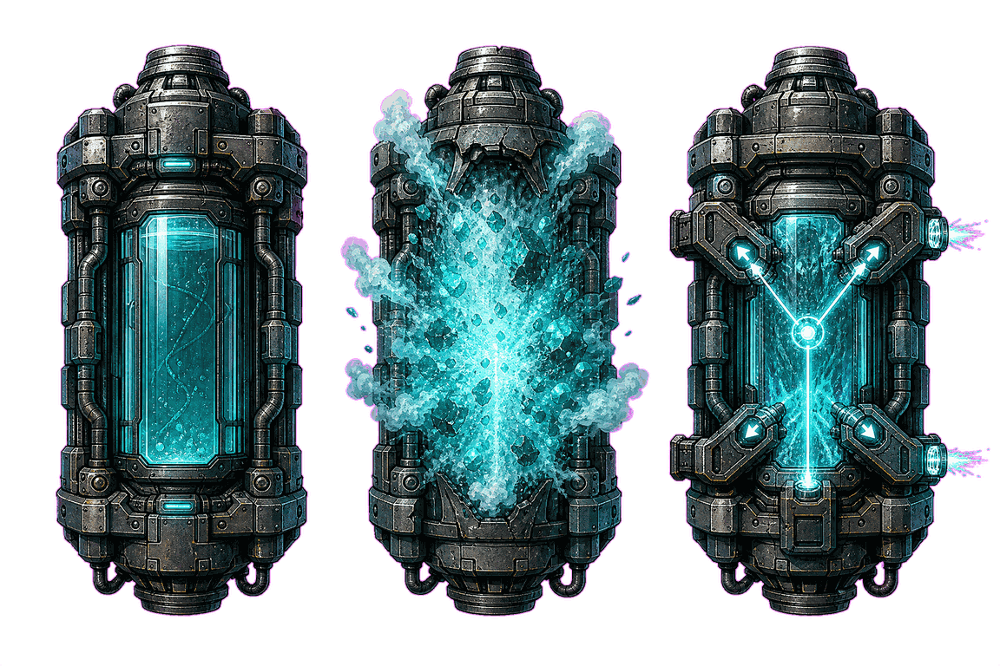

| Phase | Concept |
|---|---|
| Payload | A reinforced thermal-dissolution ampoule shell with a crimped membrane rupture cap and supercritical cyan solution. |
| Impact | A dense coolant-pressure rupture with cyan memory-light slag that vanishes immediately. |
| Anticipation | Restraint clamps lock while three calibration vectors converge through glowing vent manifolds. |

`flame_blast` remains the current close-range shell delivery with its existing nine-pixel radius and one hit. The new effect specifically avoids lingering fire, embers, damage-over-time, or an area hazard.

### 16. Triage Kite

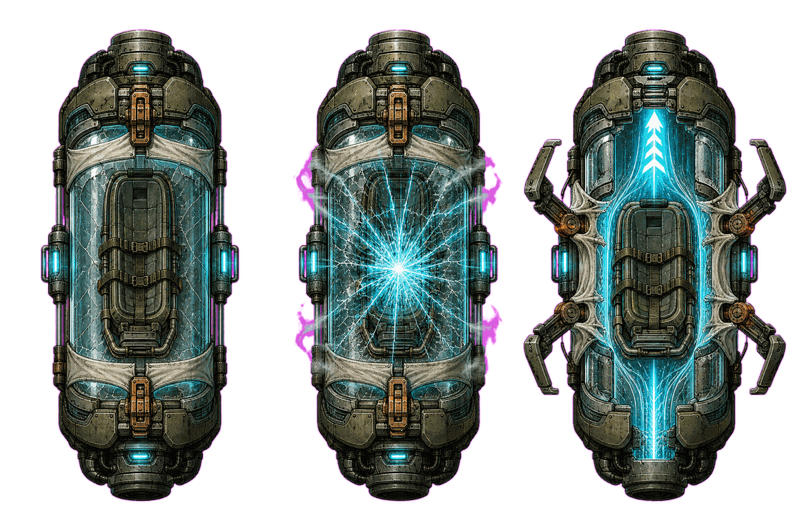

| Phase | Concept |
|---|---|
| Payload | A scored-glass evacuation-stretcher rocket pod bound by pressure membrane and cyan memory stabilizers. |
| Impact | A controlled cyan pressure detonation with starburst glass and brief membrane scorch wisps. |
| Anticipation | Trauma-pod clamps snap open as amber warning light and a cyan lead trajectory appear. |

The Kite retains the Kestrel rocket partition, seven-pixel radius, current bomb-drop lead calculation, and one damage event. The impact adds no persistent fire or secondary blast.

## The Crownward — Ceremonial Command Ecology

Royal effects combine preservation technology, civic memory, and ritualized command. Their symmetry and ornament signal maturity, but the system remains materially engineered and mechanically legible.

### 17. Privy Chirurgeon

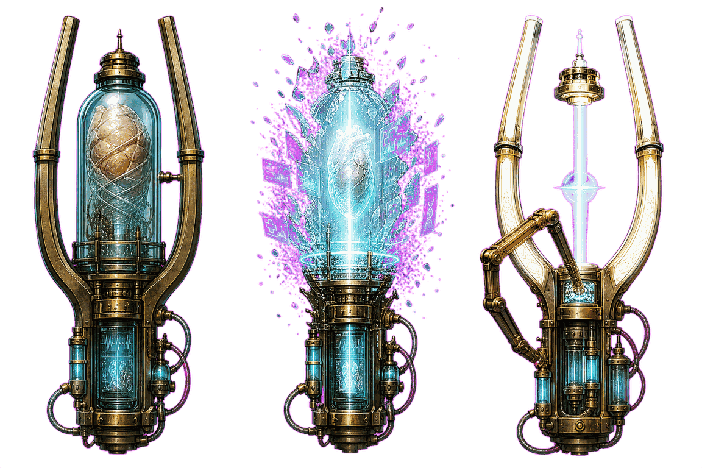

| Phase | Concept |
|---|---|
| Payload | A presentation-only crown-grade rescue cartridge in leaded glass with synthetic pericardial membrane. |
| Completion | A silent cyan-white repair cascade of dissolving glass and medical data sparks. |
| Anticipation | A forked brass clinical crown brightens to white above a folding treatment arm and consent beam. |

The Chirurgeon keeps the shared repair mechanic and ordinary infantry reservation. The ceremonial apparatus produces no revive, cleanse, barrier, or projectile.

### 18. Laureate Courser

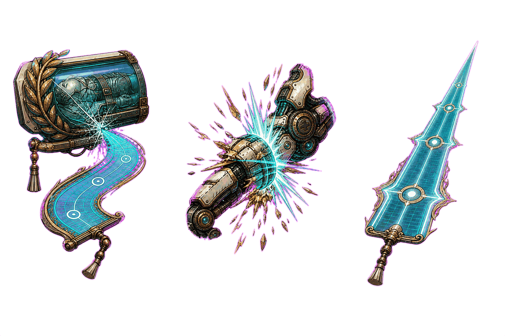

| Phase | Concept |
|---|---|
| Payload | A presentation-only processional shock crest of containment glass, hospital restraints, brass, and cyan route memory. |
| Impact | A focused melee contact flash with brass shavings and a cyan restraint pulse. |
| Anticipation | The procession route contracts into a razor-straight lunge line as four crouch nodes illuminate. |

`drop_lunge` remains one existing close-range damage event with zero projectile reservation. The route ribbon is a warning, not a tracking rail or traversal blocker.

### 19. Ninefold Witness

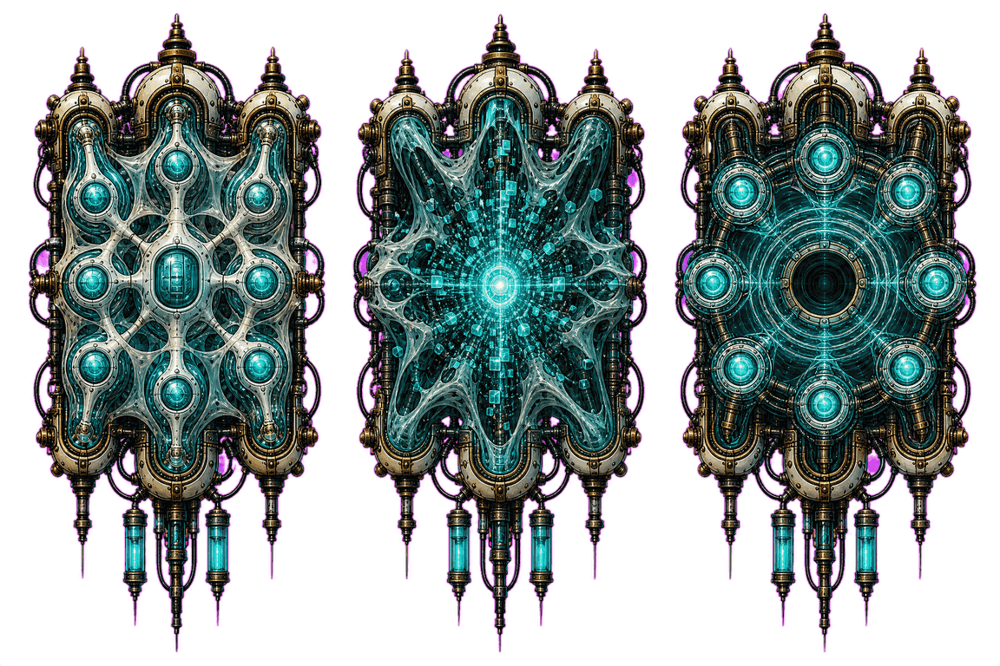

| Phase | Concept |
|---|---|
| Payload | A presentation-only nine-segment resonance array bound by cultured membrane inside reinforced glass. |
| Completion | An inward glass-resonance collapse releases a non-damaging cyan telemetry bloom. |
| Anticipation | Nine focal nodes align around a central aperture while concentric membrane ripples contract. |

The Witness preserves the Siren's four-second target mark and zero-damage support completion. Its nine nodes are visual layers within one actor, never child attackers or independent targets.

### 20. Regency Conservator

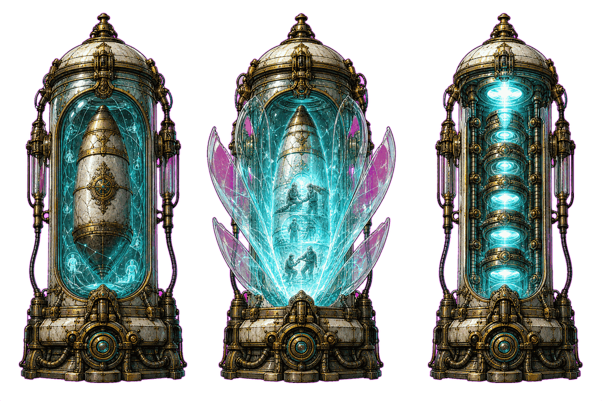

| Phase | Concept |
|---|---|
| Payload | Crown-grade mortar ordinance in ornate containment glass, filled with membrane gel and archival rescue telemetry. |
| Impact | A pressurized cyan saline-memory detonation with clean glass petals and fleeting rescue-image light. |
| Anticipation | Ceremonial breech tubes illuminate in ascending rings as telemetry focuses into a cyan-white muzzle. |

The Conservator retains one pooled shell, its existing speed, 30 damage, nine-pixel radius, one-second anticipation, and close-range dead zone. The rescue imagery exists only inside the brief cosmetic impact.

## Runtime Art Package

GPT Image 2 generated one standalone 2304×1536 master triptych for every enemy. Full-resolution masters remain under `docs/story-concepts/production-sources/choir-attack-vfx/`, and lightweight proposal plates remain under `docs/concepts/choir-attack-vfx/`. Deterministic processing extracts the three visual phases and packs them into three 360×288 WebP atlases, each arranged as a five-column by four-row grid matching `DISTRICT_VARIANT_IDS` order.

| Runtime atlas | Purpose | Source bytes |
|---|---|---:|
| `district-projectile-vfx.webp` | Nine physical projectile skins and eleven actor payload motifs | 21,998 |
| `district-impact-vfx.webp` | Nine projectile impacts and eleven support/melee completions | 51,784 |
| `district-attack-vfx.webp` | Twenty anticipation, muzzle, brace, scan, or channel cues | 34,342 |
| **Total** | Sixty unique atlas regions | **108,124** |

The first fresh export exposed that 960×768 imported atlases exceeded the 16 MiB PCK cap despite their compact source encoding. The final package therefore uses 72-pixel cells in 360×288 atlases, retaining all sixty designs while reducing imported texture area by approximately 86 percent. Only these three cosmetic atlases use Godot lossy import mode at quality 0.3; gameplay and enemy-body textures are untouched. The authoritative Godot 4.7.2 export measured 16,773,552 bytes, leaving 3,664 bytes below the hard cap.

## Production Acceptance Criteria

The feature is complete when all twenty concrete district IDs resolve to unique attack VFX specs; all nine ranged variants carry unique projectile and impact keys without changing their physical contracts; all eleven support/melee variants show unique anticipation, payload, and completion layers while reserving zero projectiles; cancellation, death, release, and cross-archetype reuse clear every visual; existing family, projectile, telegraph, body, and wreck capacities remain unchanged; and the final PCK remains at or below 16 MiB.

## References

[District Chimera Enemy Proposal](DISTRICT_CHIMERA_ENEMY_PROPOSAL.md)  
[Project CHOIR Story Proposal](PROJECT_CHOIR_STORY_PROPOSAL.md)  
[Project CHOIR Implementation Plan](PROJECT_CHOIR_IMPLEMENTATION_PLAN.md)  
[District Chimera Variant Asset Provenance](story-concepts/production-sources/chimera-variants/README.md)
