# District Chimera Enemy Proposal

**Project:** Proto Scroller  
**Feature:** Twenty additional Project CHOIR enemy variants  
**Engine:** Godot 4.7.2  
**Status:** Approved production proposal

## Executive Proposal

Project CHOIR should expand the ordinary encounter roster through **twenty district-specific derivatives**, four per spatial district. These enemies are not a parallel bestiary and do not introduce a second combat economy. They are engineered overlays on the existing procedural archetypes, reusing the fixed infantry, light, heavy, air, projectile, telegraph, body, and wreck pools while changing silhouette, statistics, tactical emphasis, and narrative meaning.

The horror remains **tragic, clinical, and legible**. Every design preserves a recognizable rescue, medical, or civic origin. Containment glass, synthetic membrane, and cyan memory light expose what the Directorate preserved and repurposed. No unit relies on comedy-zombie movement, exposed-organ spectacle, fantasy mutation, hidden attacks, input inversion, weapon disable, targetable decoys, persistent hazards, or route-blocking kill gates.

## Canon Escalation

| District | Stage | Narrative Function |
|---|---|---|
| **The Ledger Spine** (`BUSINESS`) | Administrative ambiguity | Corporate security still reads as conventional hardware; human origins survive as records, posture, and occupants rather than explicit warforms. |
| **Ashwater Commons** (`RESIDENTIAL`) | First conscious captives | The player first sees living responders and residents trapped inside corrupted intake and rescue systems. |
| **The Afterglow Strip** (`ENTERTAINMENT`) | Identity conditioning | Broadcast infrastructure turns copied faces, memories, and performance timing into battlefield support without deceptive hitboxes. |
| **The Iron Corridor** (`MILITARY`) | Export-line fusion | Clinical and military systems are deliberately fused into repeatable combined-arms products. |
| **The Crownward** (`ROYAL`) | Mature command ecology | Royal ceremony, medical preservation, and civic memory become composite command organs and predictive councils. |

## Production Architecture Contract

The current twenty-six procedural archetypes remain the immutable baseline. The feature adds **twenty concrete district variants** and exposes a forty-six-entry all-spawnable view. Every variant declares a canonical `base_archetype_id`, resolves to an existing family reservation key, and consumes an already-prewarmed shell. Authored six-act decks remain unchanged; deterministic runtime substitution applies the existing Project CHOIR hybrid pass first and the district-variant pass second.

The roster deliberately reuses five combat verbs: bounded repair, short target marking, ground-pass attacks, single-shell artillery, and standard close/pass attacks. Cosmetic tethers, faces, memory routes, occupants, rings, countdown lights, and afterimages remain actor-owned presentation with no collision, health, targetability, navigation, reservation, or independent lifetime.

## Roster at a Glance

| # | District | Enemy | Base | Family | Role | Threat |
|---:|---|---|---|---|---|---:|
| 1 | The Ledger Spine | **COVENANT WARDEN** | `bulwark` | `infantry` | Low-cost lane anchor that screens ordinary rifle units and adds a deliberate mid-range burst without becoming a durability wall. | 1 |
| 2 | The Ledger Spine | **MERCY RECOVERY CART** | `jackal` | `light` | Fast ground flanker that briefly crosses the player's lane, fires a modest conventional burst, and exits rather than body-blocking the route. | 2 |
| 3 | The Ledger Spine | **TESTAMENT KITE** | `needle` | `air` | Fragile aerial spotter that marks the player for existing mark-aware pressure units but deals no direct damage, creating priority without disabling movement or weapons. | 1 |
| 4 | The Ledger Spine | **RECEIVERSHIP AMBULANCE** | `aegis` | `heavy` | Slow, conspicuous sustain support that restores a small amount of health to one nearby damaged ally, encouraging a quick priority kill without creating invulnerability or a prolonged heal check. | 3 |
| 5 | Ashwater Commons | **INTAKE SHEPHERD** | `sapper` | `infantry` | Low-durability sustain support that extends a mixed street formation without stopping the player or shielding itself. | 2 |
| 6 | Ashwater Commons | **EVACUATION LITTER** | `jackal` | `light` | Fast pass-through flanker and formation splitter whose low horizontal silhouette contrasts with upright infantry and heavy platforms. | 2 |
| 7 | Ashwater Commons | **RAINVAULT PRESSURE WARD** | `basilisk` | `heavy` | Slow midrange artillery that dislodges static play while remaining substantially lighter and less durable than late-district siege machines. | 3 |
| 8 | Ashwater Commons | **BALCONY RECALL BEACON** | `needle` | `air` | Fragile aerial spotter that creates short focus-fire synergies, especially with existing Graft Runners, without directly damaging or disabling the player. | 1 |
| 9 | The Afterglow Strip | **MEMORIAL USHER** | `sapper` | `infantry` | Fragile ground sustain support that extends a mixed formation's lifespan but contributes no direct damage; it creates a quick target-priority decision without halting forward movement. | 2 |
| 10 | The Afterglow Strip | **GLASSBACK DOUBLE** | `jackal` | `light` | Fast lateral skirmisher that crosses the player's lane, briefly attacks, and runs through to reset; its repeated passes add tracking pressure while leaving the route open. | 3 |
| 11 | The Afterglow Strip | **RECALL LANTERN** | `choir_siren` | `air` | Airborne marking and hallucination support: a completed pulse applies the existing short target mark and requests harmless memory-decoy presentation, empowering mark-sensitive formations without damaging or disabling PROTOS. | 4 |
| 12 | The Afterglow Strip | **MARQUEE ANESTHETIST** | `basilisk` | `heavy` | Slow temporal artillery that announces a high-damage arcing shot far in advance, pressures a destination rather than the player's controls, and gives the player a clean window to close distance or change lane. | 4 |
| 13 | The Iron Corridor | **SUTURE MARSHAL** | `sapper` | `infantry` | Fragile sustain support that prolongs a mixed formation without stopping or disabling the player. | 3 |
| 14 | The Iron Corridor | **MERCY RAKER** | `jackal` | `light` | Fast lateral skirmisher that crosses the player’s space and adds readable bullet pressure without pinning movement. | 4 |
| 15 | The Iron Corridor | **REVETMENT WARD** | `cinder` | `heavy` | Broad close-range brawler that pushes the player out of passive standoff while leaving a clear lane to dash through. | 5 |
| 16 | The Iron Corridor | **TRIAGE KITE** | `kestrel` | `air` | Mobile overhead lane-check that punishes standing still while remaining vulnerable during a predictable bombing approach. | 4 |
| 17 | The Crownward | **PRIVY CHIRURGEON** | `sapper` | `infantry` | Fragile formation sustainment support that encourages a quick target-priority decision without creating invulnerability or a long attrition phase. | 2 |
| 18 | The Crownward | **LAUREATE COURSER** | `ossuary_crawler` | `light` | Low-profile crossing flanker that breaks static firing comfort, passes the player, and returns for clearly announced close lunges. | 4 |
| 19 | The Crownward | **NINEFOLD WITNESS** | `choir_siren` | `air` | Airborne target-designation support that briefly strengthens existing marked-attack synergies, especially Graft Runners, while dealing no direct damage and never altering player input. | 5 |
| 20 | The Crownward | **REGENCY CONSERVATOR** | `basilisk` | `heavy` | Broad long-range artillery anchor that creates a readable shell threat while leaving a close-range dead zone for aggressive play. | 5 |

## The Ledger Spine — Administrative ambiguity

Mostly conventional corporate security whose silhouettes still read as riot officer, rescue cart, survey drone, and ambulance, while containment glass, cultured synthetic membrane, and cyan memory light reveal that the Directorate has made administration physically inhabit its former responders. All four variants reuse existing procedural families, behaviors, movement styles, attack styles, projectile pools, support effects, and family reservation keys; they add no living warform, bespoke runtime pool, hidden attack, input disruption, or traversal-stopping mechanic.

### 01. COVENANT WARDEN

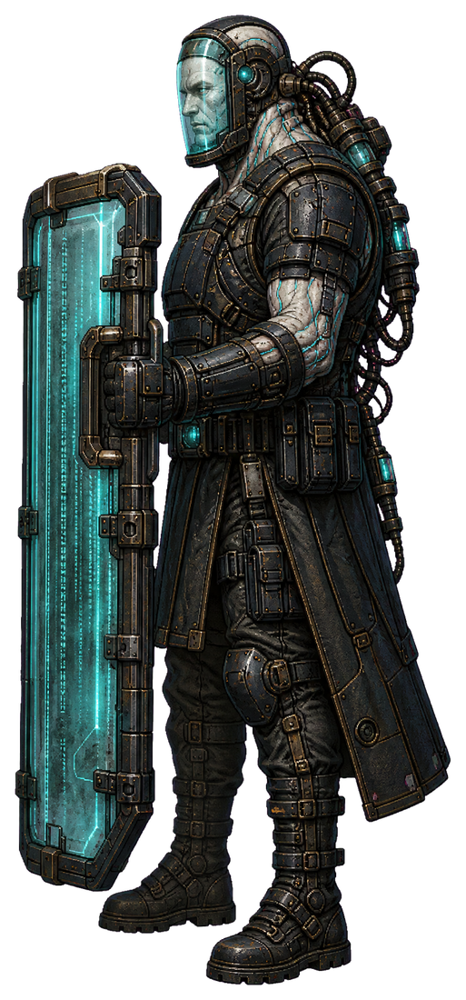

> **The signature still moves.**

| Attribute | Production Value |
|---|---|
| Concrete ID | `covenant_warden` |
| District | `BUSINESS` |
| Canonical base | `bulwark` |
| Family / health / threat | `infantry` / 125 / 1 |
| Runtime behavior | `ground_standoff` + `shield_march` + `shield_burst` |
| Projectile contract | `bullet` |
| District weight | 8 |

**Origin and tragedy.** These were disaster-corridor marshals trained to hold evacuation routes. After the 04:17 purge, injured responders were placed in administrative rehabilitation braces that now translate liability rulings into involuntary posture and fire commands; their archived route memories still illuminate the shield.

**Silhouette and visual language.** A tall corporate riot officer with a narrow cyan containment-glass shield shaped like a ledger tab. A recognizably human face remains visible behind the visor; cultured synthetic membrane seals the neck and wrists to a spinal compliance brace, while tiny memory-light columns scroll across the shield. Its squared shoulders echo the buttresses and ticker fin of Mercy Exchange Annex.

**Combat function.** Low-cost lane anchor that screens ordinary rifle units and adds a deliberate mid-range burst without becoming a durability wall.

**Telegraph and player answer.** The shield's cyan columns converge into one bright horizontal signature line during the standard anticipation window, and the weapon arm rises fully into view before firing. Dash across the visible firing line, close during recovery, or use a ground smash to clear the Warden and the conventional infantry sheltering near it.

**Spawn use.** Spend one procedural_infantry reservation and mix single Wardens, rarely a pair, into ordinary Business security beats near tribunal doors, evidence nodes, and lower facade supports; never make their defeat a route gate.

**Reuse boundary.** Use the existing ground_standoff range logic, shield_march presentation, shield_burst telegraph, bullet pool, infantry remains, and procedural_infantry family cap. Do not grant Bulwark-only frontal damage reduction unless that rule is explicitly generalized; the shield is readable silhouette and fiction, not a new defense subsystem.

### 02. MERCY RECOVERY CART

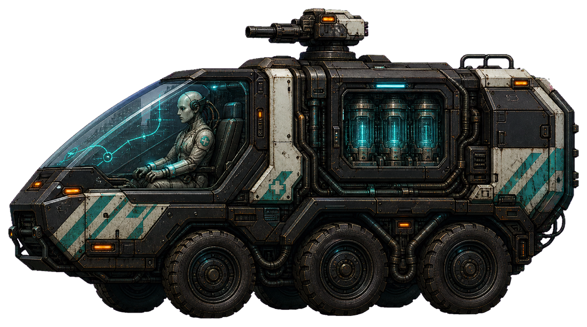

> **Evacuation was converted to collection.**

| Attribute | Production Value |
|---|---|
| Concrete ID | `mercy_recovery_cart` |
| District | `BUSINESS` |
| Canonical base | `jackal` |
| Family / health / threat | `light` / 100 / 2 |
| Runtime behavior | `ground_pass` + `wheel_sprint` + `turret_burst` |
| Projectile contract | `bullet` |
| District weight | 6 |

**Origin and tragedy.** Originally used to carry medics through rubble and ferry casualties to triage, these carts were repossessed with their injured crews still clinically secured inside. Directorate software replaced destination calls with asset-recovery orders, leaving the responder's practiced evacuation reflexes to drive the attack passes.

**Silhouette and visual language.** A low, fast three-axle rescue cart with faded municipal chevrons beneath black corporate plating. Its paramedic operator is clearly visible in a shallow containment-glass canopy, held upright by pale synthetic-membrane cuffs; a cyan memory strip repeatedly maps a nonexistent safe corridor. The wedge nose and exposed service trunk resemble a mobile shard of the Helix Clearinghouse Spine.

**Combat function.** Fast ground flanker that briefly crosses the player's lane, fires a modest conventional burst, and exits rather than body-blocking the route.

**Telegraph and player answer.** Both rescue lamps change from tired amber to cyan and sweep forward as the roof turret pivots through the standard anticipation; the cart never fires from outside the visible pass lane. Let the readable pass cross, dash through it, then punish the cart during its break-and-turn interval; a timely smash also catches its broad low silhouette.

**Spawn use.** Spend one procedural_light reservation and sprinkle one cart into open stretches between facade cells, with a second only in broad Orison Custody Vault arenas; use normal beat spawning rather than breach events or bespoke waves.

**Reuse boundary.** Reuse Jackal-compatible ground_pass state transitions, wheel_sprint animation, turret_burst completion, bullet projectiles, vehicle remains, and the procedural_light cap. Keep standard collision and pass timing; do not add ramming damage, grabs, passenger release, or a new ambulance pool.

### 03. TESTAMENT KITE

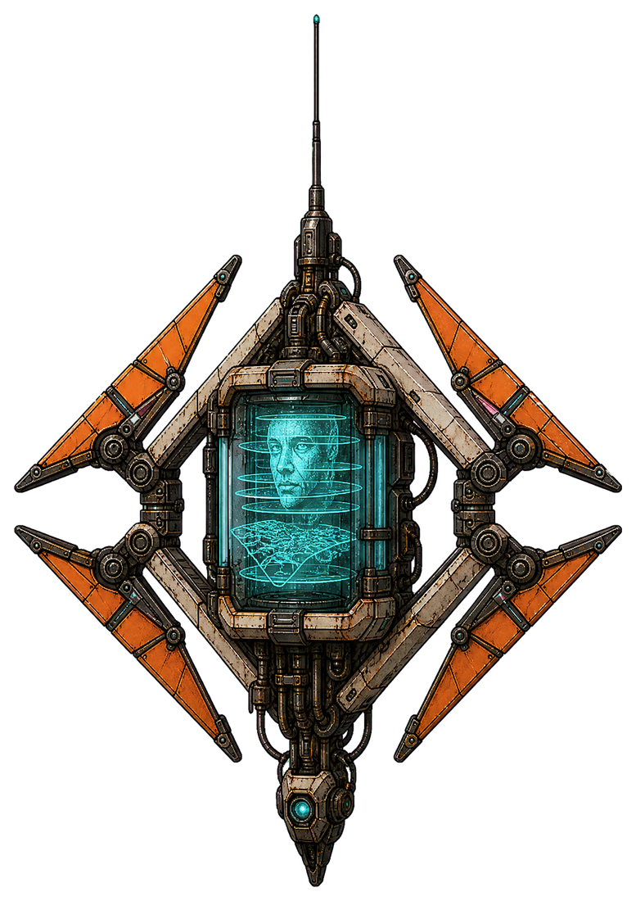

> **Every witness became a targeting record.**

| Attribute | Production Value |
|---|---|
| Concrete ID | `testament_kite` |
| District | `BUSINESS` |
| Canonical base | `needle` |
| Family / health / threat | `air` / 45 / 1 |
| Runtime behavior | `air_standoff` + `drone_hover` + `scan` |
| Projectile contract | `bullet` |
| District weight | 5 |

**Origin and tragedy.** Rescue dispatchers once lent recorded spatial memories to these drones so they could find survivors in smoke. The Directorate retained the donor maps after death, redacted every destination except PROTOS, and relabeled the resulting witness process as a security asset.

**Silhouette and visual language.** A thin diamond-shaped civil-rescue survey drone with folding orange locator vanes, now orbiting a small containment-glass black box. Inside, cyan memory light sketches fragments of a dispatcher's face and evacuation map across stacked translucent wafers; a taut synthetic membrane suspends the archive without suggesting a living organism. Its vertical antenna mirrors the Crown Reserve Data Treasury's pipe chimneys.

**Combat function.** Fragile aerial spotter that marks the player for existing mark-aware pressure units but deals no direct damage, creating priority without disabling movement or weapons.

**Telegraph and player answer.** The glass black box opens like an iris and projects the existing long cyan scan line for the full anticipation window; the entire drone brightens, and no attack originates off-screen or without that cue. Destroy the fragile hovering silhouette before the scan completes, or keep moving through the short mark duration and clear its escorts rather than surrendering momentum.

**Spawn use.** Spend one procedural_air reservation and add a single Kite behind conventional guards from the middle of the district onward; avoid stacking Kites, and let normal family-cap scarcity naturally replace rather than supplement other air threats.

**Reuse boundary.** Reuse Needle's air_standoff and drone_hover semantics plus the existing scan support telegraph and three-second target-mark effect; projectile_kind remains bullet only for profile compatibility because scan fires no projectile. Add no decoys, lock-on inversion, weapon disable, special status pool, or independent mark implementation.

### 04. RECEIVERSHIP AMBULANCE

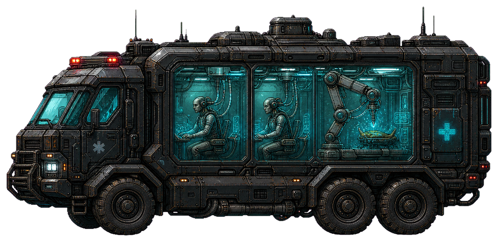

> **Care continues after consent is closed.**

| Attribute | Production Value |
|---|---|
| Concrete ID | `receivership_ambulance` |
| District | `BUSINESS` |
| Canonical base | `aegis` |
| Family / health / threat | `heavy` / 230 / 3 |
| Runtime behavior | `support` + `apc_roll` + `repair` |
| Projectile contract | `bullet` |
| District weight | 3 |

**Origin and tragedy.** Mobile triage units sheltered wounded clinicians during the blackout. The Directorate sealed the cabins, classified the occupants as continuity equipment, and redirected their procedural memories from stabilizing patients to maintaining security hardware; the crew still performs the motions of care against the glass.

**Silhouette and visual language.** A broad armored ambulance with the slab profile of Orison Custody Vault, segmented containment-glass side panels, and an elevated clinical service spine. Two human triage workers remain recognizable behind the glass, seated rather than fused, their synthetic-membrane sleeves plugged into repair manipulators; cyan memory light moves between their hands and the vehicle being serviced.

**Combat function.** Slow, conspicuous sustain support that restores a small amount of health to one nearby damaged ally, encouraging a quick priority kill without creating invulnerability or a prolonged heal check.

**Telegraph and player answer.** The roof service spine rises, every glass panel washes cyan, and the standard support telegraph remains visible for the full wind-up; on completion the single repaired ally gives the existing brief green confirmation flash. Focus the large ambulance during its stationary wind-up, separate it from damaged elites by advancing, or simply out-damage the bounded repair while continuing through the street.

**Spawn use.** Spend one procedural_heavy reservation and use at most one in a mixed Business beat, preferentially beside damaged-looking archive defenses at the Orison Vault or Data Treasury; omit it from the district's opening beat and never spawn reinforcements from it.

**Reuse boundary.** Reuse support positioning, apc_roll presentation, the existing repair action, procedural_heavy family cap, heavy collision/remains, and current projectile infrastructure; repair must stay at the implemented 22 health, 520-unit radius, one nearest injured ally per completion, with no revive, shield, cleanse, self-heal exception, beam entity, or new runtime pool.

## Ashwater Commons — First conscious captives

Ashwater Commons reveals the program's first unmistakably living captives: responders, clinic patients, and evacuation staff kept conscious inside corrupted intake equipment and engineered into compact warforms. Each variant turns a familiar residential rescue system into a readable combat function, using containment glass, synthetic membrane, cyan memory light, and the district's cistern, laundry, balcony, and clinic architecture. All four reuse existing procedural families and behavior semantics, require no new runtime pools, and preserve fast answers through conspicuous telegraphs rather than control denial.

### 05. INTAKE SHEPHERD

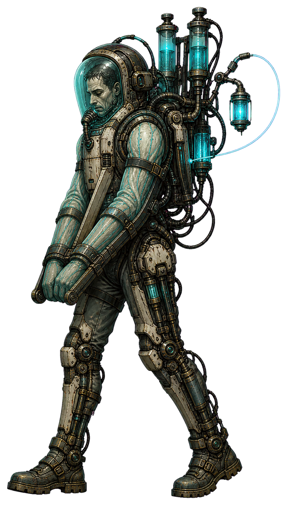

> **The Nurse Still Making Rounds**

| Attribute | Production Value |
|---|---|
| Concrete ID | `intake_shepherd` |
| District | `RESIDENTIAL` |
| Canonical base | `sapper` |
| Family / health / threat | `infantry` / 145 / 2 |
| Runtime behavior | `support` + `utility_march` + `repair` |
| Projectile contract | `bullet` |
| District weight | 13 |

**Origin and tragedy.** Nightglass Mutual Clinic's automated intake harnesses were meant to let exhausted staff stabilize several evacuees at once. Directorate surgeons locked surviving orderlies into the frames, removed voluntary motor authority, and repurposed their practiced triage memories as target-priority logic; the person remains awake behind the visor and mouths old intake questions during acquisition.

**Silhouette and visual language.** A recognizable clinic orderly stands upright inside a slim teal rescue exoskeleton, face visible and breathing behind a clear intake visor. Synthetic membrane sleeves bind the arms to a folding triage frame; IV bulbs and Nightglass clinic lanterns rise behind the shoulders, while a cyan memory-light line visibly runs from the captive's collar to whichever ally is being treated.

**Combat function.** Low-durability sustain support that extends a mixed street formation without stopping the player or shielding itself.

**Telegraph and player answer.** The Shepherd plants both clinical braces, its IV bulbs fill cyan from bottom to top, and a bright unbroken tether points to the wounded ally for the full anticipation window before the heal resolves. Break the fragile Shepherd first, interrupt it with direct damage during the visible brace, or burst the clearly tethered target before the modest heal lands; continuing forward remains viable.

**Spawn use.** Add singly to ordinary Ashwater infantry groups after Nightglass evidence first appears; draw from procedural_infantry and never require a bespoke wave, escort, or child spawn.

**Reuse boundary.** Reuse Sapper support pathing, the existing repair action and 22-health bounded heal, infantry collision/remains, and support telegraph reservation. The cyan tether is presentation only; do not add invulnerability, resurrection, player debuffs, or a new projectile allocation.

### 06. EVACUATION LITTER

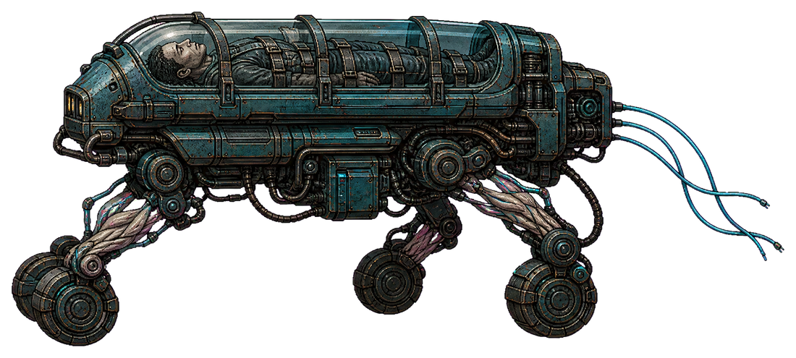

> **The Stretcher That Returns the Living**

| Attribute | Production Value |
|---|---|
| Concrete ID | `evacuation_litter` |
| District | `RESIDENTIAL` |
| Canonical base | `jackal` |
| Family / health / threat | `light` / 190 / 2 |
| Runtime behavior | `ground_pass` + `wheel_sprint` + `shock_brace` |
| Projectile contract | `bullet` |
| District weight | 11 |

**Origin and tragedy.** Bluewire's stair-capable rescue litters carried residents down during utility failures. The Directorate sealed selected evacuees into their own litters, used panic and route-memory as navigation data, and reversed the destination logic so the machines now return living intake stock to containment corridors.

**Silhouette and visual language.** A low, fast silhouette built from a municipal evacuation gurney and four folded stair-climbing wheels. A living tenant is enclosed lengthwise beneath curved containment glass, still strapped in the recovery position; synthetic membrane tendons pull the wheel arms while Bluewire laundry cables trail as bright cyan feelers rather than concealing its route.

**Combat function.** Fast pass-through flanker and formation splitter whose low horizontal silhouette contrasts with upright infantry and heavy platforms.

**Telegraph and player answer.** The litter swings broadside in full view, wheel hubs turn cyan in sequence, its glass canopy strobes once with the captive's memory trace, and the chassis compresses before the committed ram. Dash through or jump the plainly indicated pass, then punish it while it completes the existing break-and-return arc; a radial ground smash catches it cleanly without requiring pursuit.

**Spawn use.** Sprinkle one into broad Rainvault or Sixfold street beats, with two allowed only in high-response mixed waves; acquire directly from procedural_light and never spawn it as a carrier payload.

**Reuse boundary.** Reuse Jackal ground-pass movement and Reclaimed Breacher's fully telegraphed shock_brace melee completion with projectile speed zero. Do not grant frontal damage reduction, tracking after commitment, hidden collision damage, or any bespoke reinforcement pool.

### 07. RAINVAULT PRESSURE WARD

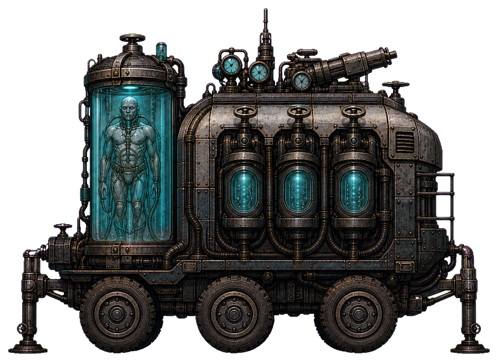

> **The Patient in the Water Glass**

| Attribute | Production Value |
|---|---|
| Concrete ID | `rainvault_pressure_ward` |
| District | `RESIDENTIAL` |
| Canonical base | `basilisk` |
| Family / health / threat | `heavy` / 255 / 3 |
| Runtime behavior | `ground_standoff` + `tracked_heavy` + `mortar_recoil` |
| Projectile contract | `shell` |
| District weight | 8 |

**Origin and tragedy.** Rainvault Cooperative volunteered its water-plant isolation tanks as emergency respiratory wards during the blackout. Intake engineers retained the patients as living predictive cores and rerouted the pressure pumps into a roof-clearing launcher, turning a neighborhood life-support cart into mobile indirect fire.

**Silhouette and visual language.** A broad six-wheel atmospheric-water service cart carries a vertical cistern of thick containment glass. Inside, a conscious cooperative resident floats upright in clear support gel, covered rather than exposed by a pale synthetic membrane respiratory mantle; municipal teal valves frame the tank, and a crown of cyan memory-light gauges makes the charging weapon readable above residential cover.

**Combat function.** Slow midrange artillery that dislodges static play while remaining substantially lighter and less durable than late-district siege machines.

**Telegraph and player answer.** The cart halts, outrigger valves strike the pavement, the cistern's waterline drops visibly into three illuminated pressure chambers, and a cyan arc from the roof launcher previews the shell lane throughout the long charge. Keep moving through the announced arc, close inside its minimum range to force a retreat, or use the long brace window to smash the exposed valve side; it neither traps a lane nor leaves a persistent hazard.

**Spawn use.** Use singly in Rainvault and Sixfold combined-arms beats, preferentially behind one infantry screen; acquire from procedural_heavy and omit whenever the family cap is occupied rather than reserving a special encounter slot.

**Reuse boundary.** Reuse Basilisk standoff ranges, shell pool, ballistic telegraph, and mortar_recoil animation semantics with Residential-tier damage tuning. The glass and fluid are visual dressing only: no shatter gore, flood slow, lingering zone, additional physics body, or new projectile kind.

### 08. BALCONY RECALL BEACON

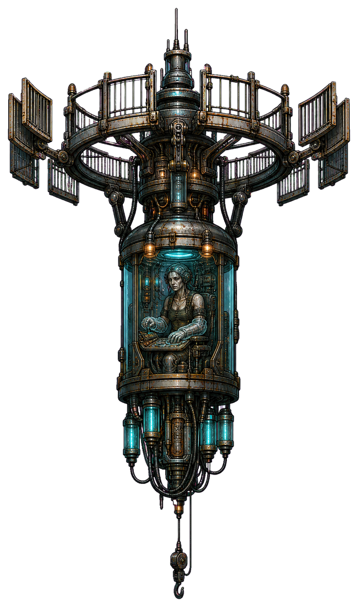

> **The Dispatcher Who Cannot Stop Calling**

| Attribute | Production Value |
|---|---|
| Concrete ID | `balcony_recall_beacon` |
| District | `RESIDENTIAL` |
| Canonical base | `needle` |
| Family / health / threat | `air` / 90 / 1 |
| Runtime behavior | `air_standoff` + `drone_hover` + `scan` |
| Projectile contract | `bullet` |
| District weight | 10 |

**Origin and tragedy.** These hoists once located residents stranded on upper balconies and relayed safe pickup routes. The Directorate grafted surviving dispatchers into the call loop, exploiting their memorized voices and address maps to designate targets for other units; every scan is assembled from genuine rescue calls the captive can still hear.

**Silhouette and visual language.** A narrow aerial rescue-hoist pod hangs beneath a ring of folding Sixfold balcony rails. Its living civil dispatcher is seated visibly inside a small rounded glass cabin, hands held to an old call console by translucent membrane gloves; warm evacuation lamps fade into cyan memory light as the rail ring opens, producing a tall lantern silhouette unlike attack VTOLs.

**Combat function.** Fragile aerial spotter that creates short focus-fire synergies, especially with existing Graft Runners, without directly damaging or disabling the player.

**Telegraph and player answer.** The beacon stops drifting, all balcony vanes unfold, and a visible cyan scan line sweeps inward across the ring for the entire anticipation period before the ordinary target mark is applied. Destroy the exposed low-health pod during its long stationary scan, move away from marked melee units until the brief mark expires, or immediately smash nearby Runners; movement, dash, direct attacks, and autonomous weapons remain available.

**Spawn use.** Introduce singly above Bluewire or Sixfold air-clear lanes and mix sparingly with one ground aggressor; acquire from procedural_air, never pair with another marking support, and skip cleanly when the air family is capped.

**Reuse boundary.** Reuse Needle air-standoff movement, support telegraph, existing three-second target mark, and zero-speed/no-damage scan resolution. Do not add decoys, weapon suspension, input inversion, off-screen marking, a unique projectile, or any new runtime node pool.

## The Afterglow Strip — Identity conditioning

Four readable derivatives of the Strip's rescue, clinical, and show-control infrastructure turn broadcast conditioning into temporal pressure and battlefield support without stealing control from the player: memory light always announces the attack, copied identities remain targetable bodies rather than deceptive hitboxes, and every unit reuses an existing infantry, light, air, or heavy family slot plus existing projectile and telegraph pools.

### 09. MEMORIAL USHER

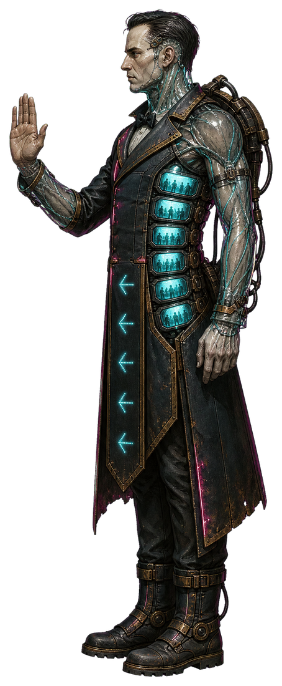

> **The one who keeps every seat occupied**

| Attribute | Production Value |
|---|---|
| Concrete ID | `memorial_usher` |
| District | `ENTERTAINMENT` |
| Canonical base | `sapper` |
| Family / health / threat | `infantry` / 135 / 2 |
| Runtime behavior | `support` + `utility_march` + `repair` |
| Projectile contract | `bullet` |
| District weight | 11 |

**Origin and tragedy.** The Directorate copied crowd-calming memories from fire wardens and emergency ushers, then grafted the maps into surviving evacuation staff so conditioned audiences would follow familiar voices back into danger. Each unit continuously rehearses a successful rescue that never happened, repairing nearby warforms because its treatment protocol mistakes them for evacuees.

**Silhouette and visual language.** An upright theater-evacuation marshal in a scorched usher coat, still identifiable by luminous aisle arrows and a folded rescue hood. A translucent synthetic membrane seals the body to a clinical back brace; six thumb-sized containment-glass panes along the ribs replay cyan silhouettes of patrons the marshal once guided from Orpheum Vanta. During support actions, those panes illuminate in an orderly row like house lights coming up.

**Combat function.** Fragile ground sustain support that extends a mixed formation's lifespan but contributes no direct damage; it creates a quick target-priority decision without halting forward movement.

**Telegraph and player answer.** The Usher stops, raises its still-human open palm, and lights its six glass panes from red to cyan over 0.60 seconds; a visible cyan line selects the wounded ally before the 22-health repair resolves. Break the short channel with any damage or destroy the exposed infantry body first; alternatively burst down the visibly selected ally before the modest heal lands. A ground smash can catch both when they cluster.

**Spawn use.** Sprinkle singly behind one or two ordinary ground attackers in standard Strip waves, especially beneath the Orpheum marquee or hotel awnings; reserve an existing procedural_infantry slot and never pair two Ushers in one beat.

**Reuse boundary.** Use the Sapper's existing support movement, support telegraph, 520-pixel nearest-wounded-ally search, and fixed 22-health repair exactly as implemented. The bullet kind is only the already-supported telegraph identifier; repair exits before projectile acquisition, so no new projectile, aura, VFX, status, or runtime pool is required.

### 10. GLASSBACK DOUBLE

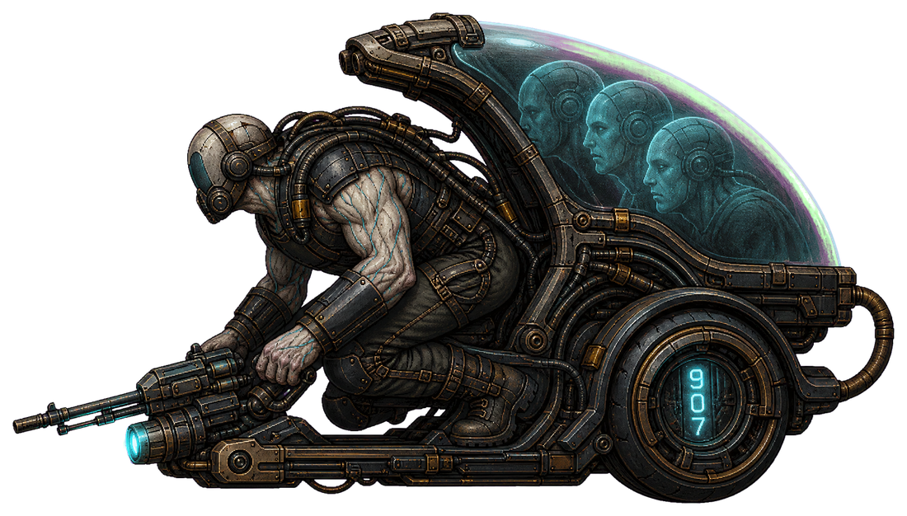

> **A replacement trained to remember your entrance**

| Attribute | Production Value |
|---|---|
| Concrete ID | `glassback_double` |
| District | `ENTERTAINMENT` |
| Canonical base | `jackal` |
| Family / health / threat | `light` / 185 / 3 |
| Runtime behavior | `ground_pass` + `wheel_sprint` + `turret_burst` |
| Projectile contract | `bullet` |
| District weight | 10 |

**Origin and tragedy.** Stunt doubles and hotel rescue runners donated reflex scans for safer live shows. The Strip's conditioning labs layered celebrity identity archives over those scans until each operator believed they were the person an audience expected to survive. The exosled now chases PROTOS while cycling through imperfect copies of the pilot's own posture.

**Silhouette and visual language.** A low, fast stunt-rescue exosled built around the recognizable crouch of a human safety performer. Its arched containment-glass back resembles a casino valet canopy; beneath it, a synthetic membrane prints three successive versions of the same face a handspan apart. Halcyon Stack room numbers flicker across wheel guards, and a forward clinical lamp makes its real muzzle and travel direction unmistakable.

**Combat function.** Fast lateral skirmisher that crosses the player's lane, briefly attacks, and runs through to reset; its repeated passes add tracking pressure while leaving the route open.

**Telegraph and player answer.** Before each burst, all three membrane faces snap into alignment, the clinical lamp turns solid cyan, and the exposed muzzle traces a visible line for 0.40 seconds. Only the solid glass-backed body has collision or can deal damage; the face trails are cosmetic. Meet the pass with autonomous fire, dash through its committed travel line, or smash as it enters minimum range. Do not chase the harmless face trails; punish the brightly lit physical sled on its next pass.

**Spawn use.** Use one at a time as a light-family accent in ordinary lateral beats, with at most one slow infantry companion; acquire it from the existing procedural_light reservation and favor the long frontage of Voltage Chapel or House of Static.

**Reuse boundary.** Reuse Jackal ground_pass state transitions, wheel_sprint animation, turret_burst cadence, bullet pool, and vehicle remains budget. The copied faces must be sprite trails attached to the actor, never spawned decoys, targetable clones, hidden attackers, or extra physics bodies; no new runtime pool or attack style is permitted.

### 11. RECALL LANTERN

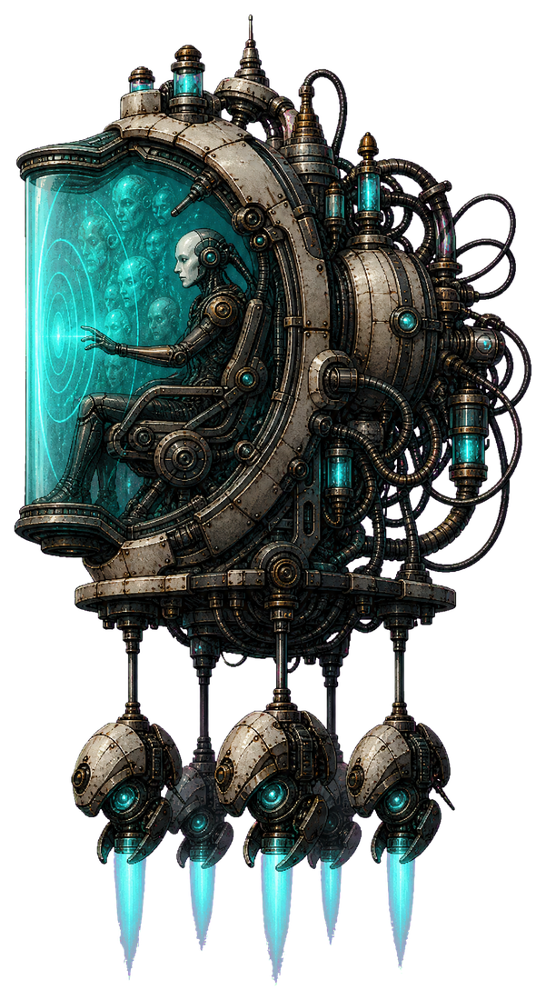

> **The light that tells the crowd what it saw**

| Attribute | Production Value |
|---|---|
| Concrete ID | `recall_lantern` |
| District | `ENTERTAINMENT` |
| Canonical base | `choir_siren` |
| Family / health / threat | `air` / 280 / 4 |
| Runtime behavior | `air_standoff` + `siren_hover` + `choir_ring` |
| Projectile contract | `bullet` |
| District weight | 8 |

**Origin and tragedy.** Mobile counselors once projected calming landmarks during mass evacuations. Show-control engineers replaced those landmarks with edited private memories and sealed the clinicians into their own broadcast rigs; the resulting Lanterns make every nearby weapon believe it has already found the correct target.

**Silhouette and visual language.** A tall suspended projection lantern whose narrow silhouette contains a seated clinical hypnotherapist behind curved containment glass. Synthetic membrane replaces the projection screen, stretching into a luminous halo patterned after Prism Crown's stage mouth. Cyan memory light reveals copied audience faces only inside the glass, while four hotel evacuation rotors keep the threat visibly aloft.

**Combat function.** Airborne marking and hallucination support: a completed pulse applies the existing short target mark and requests harmless memory-decoy presentation, empowering mark-sensitive formations without damaging or disabling PROTOS.

**Telegraph and player answer.** The halo contracts inward for 1.05 seconds while a bright cyan ring remains visible against the street; the clinician's glass chair rotates to face PROTOS and the ring audibly ticks through four evenly spaced light beats before release. Close the standoff distance and destroy the exposed glass lantern during its long channel, or keep moving through the clearly drawn ring and clear marked attackers. The pulse never inverts movement, stuns, conceals projectiles, or creates damaging false bodies.

**Spawn use.** Sprinkle singly into normal mixed waves after the district's first building, usually with one existing Graft Runner or conventional ranged unit; consume an existing procedural_air slot and suppress spawning when a CHOIR Siren already occupies the beat.

**Reuse boundary.** Reuse CHOIR Siren air_standoff movement, siren_hover animation, support telegraph, choir_ring completion, four-second target mark, and existing hybrid-event decoy presentation. Projectile speed and damage remain zero and completion consumes no projectile. Enforce mutual exclusion with Siren for readability; no new status, decoy actor, collision body, or pool.

### 12. MARQUEE ANESTHETIST

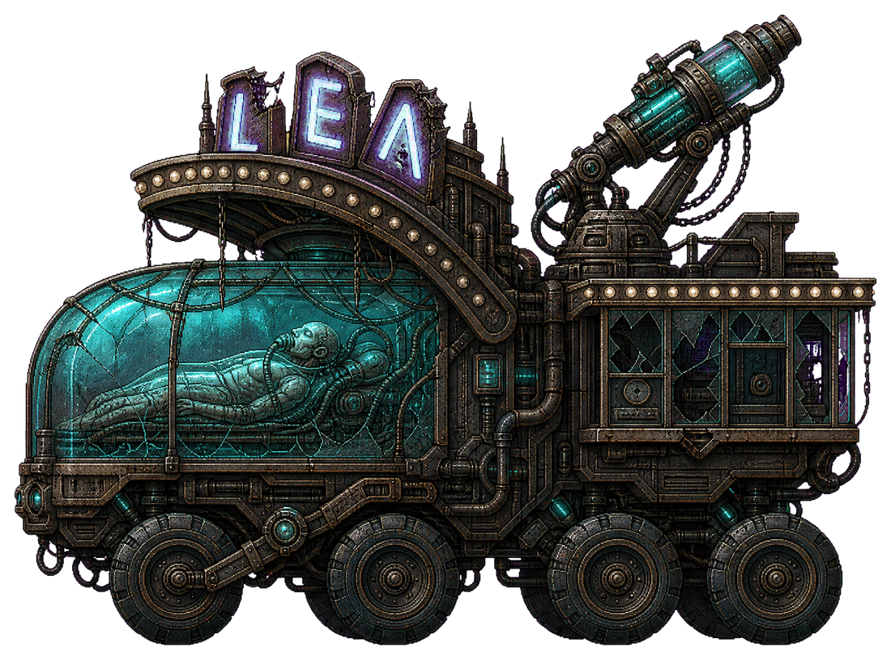

> **It schedules the pain between applause**

| Attribute | Production Value |
|---|---|
| Concrete ID | `marquee_anesthetist` |
| District | `ENTERTAINMENT` |
| Canonical base | `basilisk` |
| Family / health / threat | `heavy` / 275 / 4 |
| Runtime behavior | `ground_standoff` + `tracked_heavy` + `mortar_recoil` |
| Projectile contract | `shell` |
| District weight | 6 |

**Origin and tragedy.** Emergency anesthesia teams were deployed to arena crushes and hotel fires. CHOIR repurposed their timing expertise to synchronize memory-light exposure between advertising beats, while copied patient voices in the cradle continually ask the anesthetist to delay awakening. The cart now delivers luminous conditioning capsules according to that same clinical schedule.

**Silhouette and visual language.** A broad six-wheel mobile triage cart armored with sections of Orpheum marquee and casino cashier glass. A recognizable anesthetist lies in a sealed containment-glass cradle beneath a breathing synthetic membrane; the old vaporizer rack has become a single elevated projection mortar. Missing neon letters illuminate one by one along its roof, giving the squat silhouette a conspicuous visual countdown.

**Combat function.** Slow temporal artillery that announces a high-damage arcing shot far in advance, pressures a destination rather than the player's controls, and gives the player a clean window to close distance or change lane.

**Telegraph and player answer.** For 0.95 seconds the broken marquee spells a cyan three-light countdown, the mortar rises, and the ordinary shell trajectory is shown from the exposed tube toward the current target point. The projectile remains bright and visible for its entire slow arc. Advance inside its minimum range to force a retreat, dash out of the traced destination before impact, or smash the raised mortar during recoil. Its low speed and wide body make aggressive play faster than waiting.

**Spawn use.** Use as a single heavy-family punctuation unit in broad normal beats at Prism Crown Revue or House of Static, supported by no more than two low-threat enemies; reserve an existing procedural_heavy slot and avoid simultaneous Longbow, Rainmaker, or Pale Engine spawns.

**Reuse boundary.** Reuse Basilisk ground_standoff ranges, tracked_heavy animation, mortar_recoil presentation, support-free anticipation state, and the existing shell projectile pool. Its 'memory capsule' is fiction and tint only: no lingering field, delayed second blast, input effect, custom projectile behavior, hidden strike, new attack_style, or runtime pool.

## The Iron Corridor — Export-line fusion

Four export-line warforms turn the Corridor’s rescue and clinical infrastructure into a readable combined-arms roster: an upright medic-support silhouette, a low ambulance skirmisher, a broad mobile-ICU brawler, and a high medevac attacker. Human remnants remain recognizable behind containment glass and synthetic membrane, while cyan memory light makes every action explicit. All four use existing procedural families, behaviors, movement styles, attack styles, projectile pools, and family reservations, so they can enter ordinary chunks 15–19 without new runtime pools or momentum-breaking control effects.

### 13. SUTURE MARSHAL

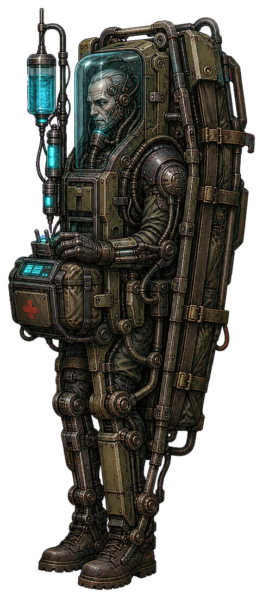

> **The Medic Who Cannot Discharge a Patient**

| Attribute | Production Value |
|---|---|
| Concrete ID | `suture_marshal` |
| District | `MILITARY` |
| Canonical base | `sapper` |
| Family / health / threat | `infantry` / 240 / 3 |
| Runtime behavior | `support` + `utility_march` + `repair` |
| Projectile contract | `bullet` |
| District weight | 8 |

**Origin and tragedy.** The Directorate copied decorated combat medics because their neural maps could prioritize hundreds of casualties under fire. The export process fused each surviving clinician to an automated stabilizer and removed the distinction between healing personnel and maintaining weapons; the Marshal now repeats obsolete discharge codes while repairing whatever the encounter system identifies as its patient.

**Silhouette and visual language.** An upright field-medic silhouette locked into a narrow armored surgical rack, with a folded rescue litter forming its backplate and one gloved human hand still resting on the triage controls. Translucent synthetic membrane seals the joints; a small containment-glass face shield preserves the medic’s exhausted profile. Cyan memory-light ticks climb its IV mast like the blackout casualty count, echoing the vertical ribs and dish crown of the Aegis Signal Citadel.

**Combat function.** Fragile sustain support that prolongs a mixed formation without stopping or disabling the player.

**Telegraph and player answer.** Before each repair, the IV mast rises, its cyan memory-light fills from bottom to top, and the existing support telegraph blooms for the full anticipation window; there is no hidden pulse or off-screen effect. Prioritize the exposed upright support, separate it from damaged heavies by advancing through the formation, or simply out-damage its small, bounded heal. A dash past the front line creates a clean punish window.

**Spawn use.** Add as a moderate-weight Iron Corridor infantry pick in ordinary mixed beats, especially beside one heavy or siege unit; obey the existing procedural_infantry family cap and do not spawn children.

**Reuse boundary.** Use the Sapper’s existing support movement and repair implementation, including the current 520-unit search radius and 22-health heal. projectile_kind remains bullet for profile compatibility, but repair completes without firing a projectile. Requires only a new catalog profile, texture, collision/display tuning, and family-pool capacity; no new status, beam logic, or runtime pool.

### 14. MERCY RAKER

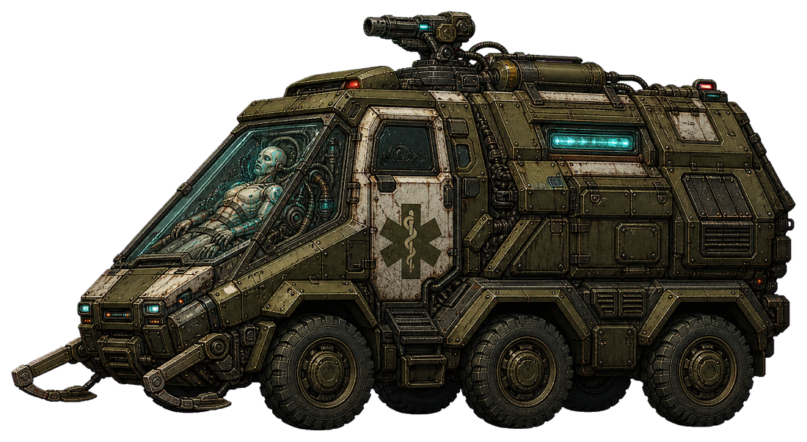

> **The Ambulance That Returns Everyone to Service**

| Attribute | Production Value |
|---|---|
| Concrete ID | `mercy_raker` |
| District | `MILITARY` |
| Canonical base | `jackal` |
| Family / health / threat | `light` / 285 / 4 |
| Runtime behavior | `ground_pass` + `wheel_sprint` + `turret_burst` |
| Projectile contract | `bullet` |
| District weight | 7 |

**Origin and tragedy.** These vehicles once pulled civilians from the 04:17 blackout. At the Transload Bastion, their crews and casualty-routing computers were combined into a single navigation organism, trained to find gaps in rubble and crowds, then repackaged as an export reconnaissance chassis. Its route memory still favors clinic entrances that no longer exist.

**Silhouette and visual language.** A low six-wheel rescue ambulance has been narrowed into a wedge, its white door panels buried under field-olive applique armor and requisition numerals. Behind the surviving containment-glass windscreen, a paramedic torso is suspended in pale membrane and wired directly to the steering yoke; folded stretcher rails form two lateral tusks. Cyan memory-light flickers through the old destination board as it races under the Ordnance Transload Bastion’s sawtooth roofline.

**Combat function.** Fast lateral skirmisher that crosses the player’s space and adds readable bullet pressure without pinning movement.

**Telegraph and player answer.** The destination board turns solid cyan, the embedded driver leans against the harness, and the roof weapon gives the standard visible bullet telegraph before the vehicle commits to its pass. Dash through or hop over the pass, let it overshoot, then punish during its turn-around. A ground smash catches the wide, low chassis cleanly; remaining mobile is always sufficient.

**Spawn use.** Sprinkle singly or as a spaced pair in open logistics lanes and repair-gantry beats; reserve only procedural_light slots, respect the existing light-family cap, and never carrier-spawn it.

**Reuse boundary.** Reuse Jackal ground-pass steering, wheel-sprint animation semantics, standard one-shot turret burst, bullet projectile pool, vehicle remains, and existing telegraph reservation. Do not add ramming damage, path traps, passenger deployment, or collision-based input disruption; the new silhouette must fit the current light-family display and collision envelope.

### 15. REVETMENT WARD

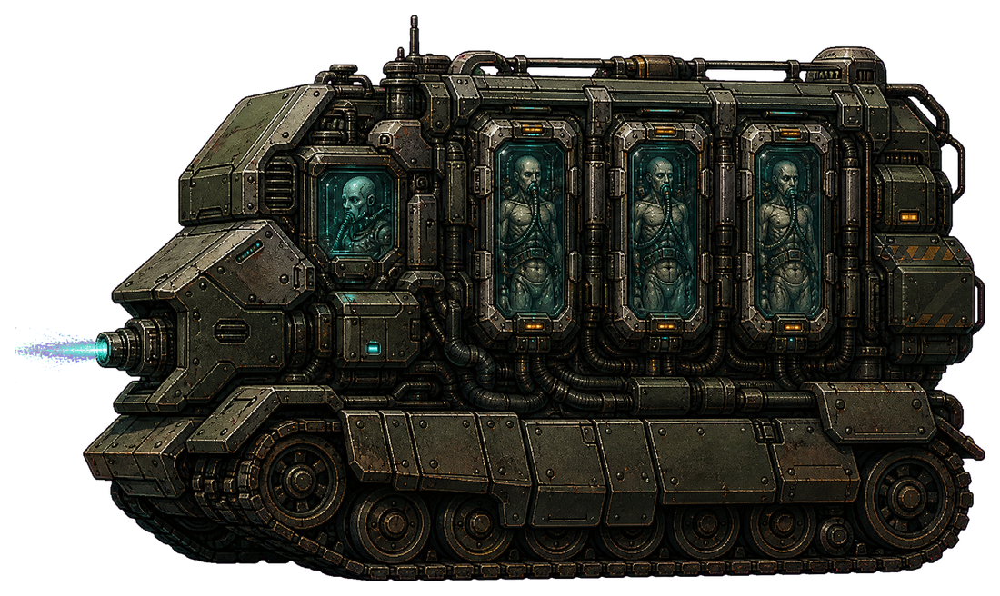

> **The Mobile ICU Built to Advance**

| Attribute | Production Value |
|---|---|
| Concrete ID | `revetment_ward` |
| District | `MILITARY` |
| Canonical base | `cinder` |
| Family / health / threat | `heavy` / 390 / 5 |
| Runtime behavior | `ground_close` + `flame_lurch` + `flame_blast` |
| Projectile contract | `shell` |
| District weight | 5 |

**Origin and tragedy.** The bays began as armored evacuation modules for soldiers too unstable to move. Manticore Gantry engineers discovered that three damaged nervous systems could jointly predict close-range threats, then fused the patients, life-support machine, and assault chassis into an adaptive breach demonstrator. The bays still display bed numbers, but Directorate manifests list the occupants as guidance components.

**Silhouette and visual language.** A broad tracked mobile intensive-care ward wears layered tank skirts like a moving blast wall. Three sealed patient bays remain visible as dark containment-glass rectangles along its flank; synthetic respiratory membrane inflates beneath the armor with every lurch, while a central clinician’s face appears only as a dim reflection in cyan memory-light. Its shoulders resemble the vault cassettes of the Revetment Armory Stack, making the unit read as a detached piece of district architecture.

**Combat function.** Broad close-range brawler that pushes the player out of passive standoff while leaving a clear lane to dash through.

**Telegraph and player answer.** Its membrane bellows visibly compress, the three bed-number lights turn from cyan to amber in sequence, and the forward sterilant projector brightens throughout the existing anticipation window before firing. Backstep to outrange the slow blast, dash behind the broad chassis during compression, or focus it before it closes. Its low speed and wide body make ground-smash punishment reliable.

**Spawn use.** Use singly in steel-heavy normal beats as an advancing anchor with light infantry, never as a mandatory gate; consume one procedural_heavy reservation and obey the established heavy-family cap.

**Reuse boundary.** Reuse Cinder’s ground-close pursuit, flame-lurch presentation, flame_blast timing, and existing shell projectile pool. The blast is visually re-skinned as a short, bright burst of heated clinical sealant but retains ordinary visible projectile damage: no lingering hazard, slow, grab, armor phase, or new pool. Keep dimensions within the current heavy vehicle envelope.

### 16. TRIAGE KITE

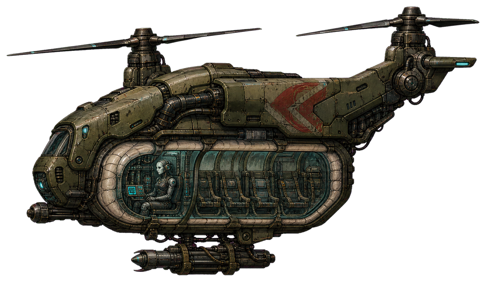

> **The Medevac That Delivers the Wound**

| Attribute | Production Value |
|---|---|
| Concrete ID | `triage_kite` |
| District | `MILITARY` |
| Canonical base | `kestrel` |
| Family / health / threat | `air` / 275 / 4 |
| Runtime behavior | `air_pass` + `bomber_bank` + `bomb_drop` |
| Projectile contract | `rocket` |
| District weight | 6 |

**Origin and tragedy.** Flight nurses supplied exceptional neural models for choosing safe approach vectors under artillery fire. The export line retained those instincts but reversed the mission: the nurse’s preserved route memory now guides ordnance into the evacuation corridors she once protected. Each completed attack prompts an automated request for a receiving hospital that was demolished during the blackout.

**Silhouette and visual language.** A high, unmistakable medevac silhouette with twin tilted rotor wings and a red rescue chevron partly hidden by olive flight armor. Its belly is a long containment-glass trauma pod containing a flight nurse seated among empty restraints; pale synthetic membrane has replaced the pod seals and flexes with each bank. Cyan memory-light scans the nurse’s old patient tags before release, visually rhyming with the Aegis Citadel’s blacked-out signal pylons.

**Combat function.** Mobile overhead lane-check that punishes standing still while remaining vulnerable during a predictable bombing approach.

**Telegraph and player answer.** The glass belly changes from cyan to hard amber, the trauma-pod clamps open in full view, and the standard rocket telegraph leads the player’s current motion for the existing bomb-drop anticipation period. Keep moving through the marked approach, reverse after the lead is committed, or use missiles and the anti-air laser while the Kite banks into release. The attack never arrives without its visible belly-light and telegraph.

**Spawn use.** Introduce singly in open-span Manticore Gantry and signal-citadel beats, occasionally paired with ground infantry but not another bomber; use an existing procedural_air reservation and the normal air-family cap, with no payload children.

**Reuse boundary.** Reuse Kestrel air-pass navigation, bomber-bank animation, motion-leading bomb_drop targeting, rocket telegraph, rocket projectile pool, and air remains. No dropship state, hidden ceiling spawn, persistent ground field, or additional projectiles; implementation is a catalog/profile and art variant within the established air pool.

## The Crownward — Mature command ecology

The Crownward's normal enemy mix reveals that royal ceremony, clinical rescue infrastructure, and civic memory systems were engineered into one mature command ecology. Each variant is a readable tragedy rather than a gore display: recognizable attendants, evacuation carriers, witness recorders, and medical conservators survive inside synthetic membrane, containment glass, cyan memory light, and the brass silhouettes of the district's gates, tribunal, ministry, conservatory, and palace. The set reuses existing infantry, light, air, and heavy pools and existing combat semantics, adding four contrasting silhouettes and roles without pausing forward destruction.

### 17. PRIVY CHIRURGEON

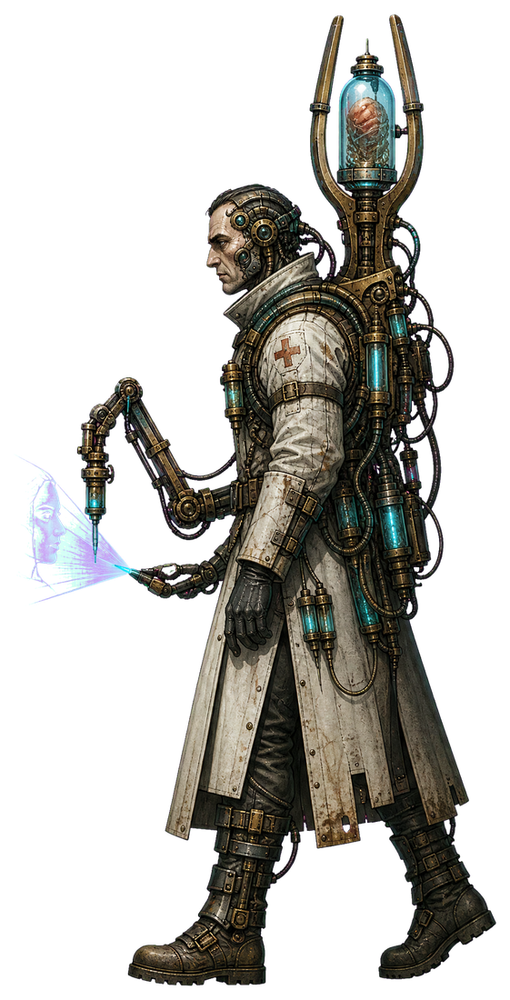

> **The Hand That Preserved the Crown**

| Attribute | Production Value |
|---|---|
| Concrete ID | `privy_chirurgeon` |
| District | `ROYAL` |
| Canonical base | `sapper` |
| Family / health / threat | `infantry` / 175 / 2 |
| Runtime behavior | `support` + `utility_march` + `repair` |
| Projectile contract | `bullet` |
| District weight | 8 |

**Origin and tragedy.** The Privy Chirurgeons were royal emergency physicians trained to stabilize casualties during palace evacuation. The Directorate copied their diagnostic memories, fused the mature operators to portable command organs, and reassigned their duty of care from patients to the Crownward's weapons. Their hands still perform correct triage motions, but the system now defines every nearby combat asset as the patient and PROTOS as the injury.

**Silhouette and visual language.** A tall, narrow clinician still identifiable by a white disaster-triage coat, rescue harness, and gloved human hands. A forked Ministry-of-Privilege brass frame has replaced the spine; between its prongs, a small containment-glass crown holds a pulsing command organ wrapped in translucent synthetic membrane. Cyan memory light travels down labeled clinical tubes to a folding treatment arm, while a dim projected face repeatedly mouths an old consent prompt.

**Combat function.** Fragile formation sustainment support that encourages a quick target-priority decision without creating invulnerability or a long attrition phase.

**Telegraph and player answer.** The glass crown brightens from cyan to white for 0.60 seconds, the treatment arm unfolds toward a visibly wounded ally, and a clean clinical tone sounds before the existing repair pulse resolves. The healer remains stationary throughout anticipation. Dash through the formation or use autonomous fire to remove the exposed Chirurgeon first; alternatively, burst down its intended patient before the modest heal resolves. A ground smash can catch both in the support radius.

**Spawn use.** Sprinkle singly into ordinary Crownward mixed ground beats from the existing procedural_infantry pool, preferably behind one heavy or siege unit; never pair more than two, and spawn no children.

**Reuse boundary.** Reuse the infantry family reservation, support movement, existing 520-pixel nearest-wounded-ally search, existing 22-health repair, support telegraph, and infantry remains. No new status, aura, projectile, runtime pool, or healing value is required; art must retain a clearly human clinical silhouette rather than become a robed fantasy caster.

### 18. LAUREATE COURSER

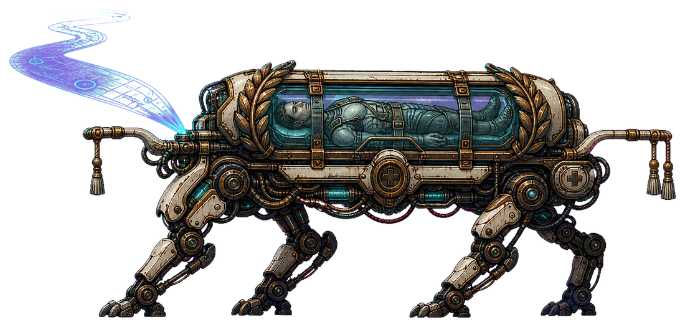

> **The Procession That Cannot Stop**

| Attribute | Production Value |
|---|---|
| Concrete ID | `laureate_courser` |
| District | `ROYAL` |
| Canonical base | `ossuary_crawler` |
| Family / health / threat | `light` / 285 / 4 |
| Runtime behavior | `ground_pass` + `crawler_climb` + `drop_lunge` |
| Projectile contract | `bullet` |
| District weight | 7 |

**Origin and tragedy.** These frames once carried injured dignitaries through collapsing ceremonial avenues while a marshal's route memory guided autonomous legs. The Directorate sealed the rescuers into their own litters and matured the navigation graft until it interpreted pursuit as evacuation: the royal passenger is always behind it, and everything in front must be cleared from the route.

**Silhouette and visual language.** A low, fast quadruped assembled around a royal ambulance stretcher. Four compact rescue exoskeleton legs carry a horizontal containment-glass bier under turbine-laurel ribs copied from the Processional Gate. Inside, an intact human evacuation marshal is suspended in synthetic membrane, their remembered route projected ahead as a cyan ribbon; brass handles and hospital restraint labels keep the origin legible.

**Combat function.** Low-profile crossing flanker that breaks static firing comfort, passes the player, and returns for clearly announced close lunges.

**Telegraph and player answer.** The projected cyan route contracts into a straight line for 0.52 seconds, all four legs crouch, and the glass bier flashes once before the existing drop-lunge melee commit. The unit does not damage on contact outside the completed telegraphed attack. Keep moving and dash across the visible route line, then punish the Courser as its ground-pass behavior carries it through and away. A radial or ground smash is reliable when several low units overlap.

**Spawn use.** Use one or two in normal Crownward crossing beats from the existing procedural_light pool, with extra headroom beside infantry but not in dense Graft Runner packs; no controller, mark prerequisite, carrier, or child allocation is needed.

**Reuse boundary.** Reuse the light family reservation, ground_pass state machine, crawler_climb cosmetic motion, support-category telegraph, and existing bounded drop_lunge melee check and impulse. Projectile speed should remain zero because bullet is only the required pooled profile kind; the attack must never create an unseen shot or collision-damage trail.

### 19. NINEFOLD WITNESS

> **The Verdict That Remembers You**

| Attribute | Production Value |
|---|---|
| Concrete ID | `ninefold_witness` |
| District | `ROYAL` |
| Canonical base | `choir_siren` |
| Family / health / threat | `air` / 360 / 5 |
| Runtime behavior | `air_standoff` + `siren_hover` + `choir_ring` |
| Projectile contract | `bullet` |
| District weight | 5 |

**Origin and tragedy.** Tribunal witness officers originally recorded testimony and coordinated civilian extraction from public hearings. Nine neural maps were combined so no contradiction could escape review. The mature composite now acts as a ceremonial command organ, replaying a target's recent motion to the Crownward network while its trapped voices continue to announce evacuation corridors that no longer exist.

**Silhouette and visual language.** A hovering vertical oculus modeled after the Tribunal of the Nine Seals: nine thin brass apertures orbit a central containment-glass lens, each showing a different projected memory of the same court recorder. A recognizable rescue-radio headset and human throat rest within the lens, held by pale synthetic membrane. Its tall ring silhouette, slow cyan facial afterimages, and hanging cable tassels distinguish it from winged carriers and compact drones.

**Combat function.** Airborne target-designation support that briefly strengthens existing marked-attack synergies, especially Graft Runners, while dealing no direct damage and never altering player input.

**Telegraph and player answer.** The nine apertures open in sequence over 1.05 seconds and cast an expanding, fully visible cyan ring centered on the player. Memory silhouettes remain translucent and harmless; the final aperture closes with an audible verdict tone before the mark is applied. Destroy the exposed central lens during the long charge, move through the readable ring rather than freezing in place, or eliminate mark-dependent attackers before they can capitalize. The Witness itself has no damaging follow-up.

**Spawn use.** Sprinkle singly into ordinary Crownward air-readable beats from the existing procedural_air pool, most often with one Graft Runner or conventional ranged unit; never combine more than one Witness in the same local wave and spawn no projections as actors.

**Reuse boundary.** Reuse CHOIR Siren air-standoff movement, support telegraph, existing four-second target mark, and existing choir_ring hybrid event only. Memory figures are visual particles or sprite afterimages, not decoys with collision, health, attacks, reservations, or a new pool; no weapon disable, stun, input inversion, or hidden effect may be added.

### 20. REGENCY CONSERVATOR

> **The Dynasty Kept on Life Support**

| Attribute | Production Value |
|---|---|
| Concrete ID | `regency_conservator` |
| District | `ROYAL` |
| Canonical base | `basilisk` |
| Family / health / threat | `heavy` / 395 / 5 |
| Runtime behavior | `ground_standoff` + `tracked_heavy` + `mortar_recoil` |
| Projectile contract | `shell` |
| District weight | 4 |

**Origin and tragedy.** Royal conservators began as armored mobile wards intended to evacuate elderly officials and preserve medical records during siege. The Directorate instead used the passengers' dynastic memories as a mature predictive council. The council still debates the safest route in perfect ceremonial language, but its consensus is expressed by firing a containment shell at whatever future position offers PROTOS the fewest escapes.

**Silhouette and visual language.** A broad, slow clinical crawler with the triple-dome profile of the Aurelian Menagerie Conservatory. Each containment-glass dome houses a seated elder in palace evacuation blankets, joined by translucent membrane to a shared bio-computational cooling bed. Brass garden ribs fold around a central mortar catheter, and cyan memory light climbs the domes like reflected palace steps before every shot; wheels, triage markings, and oxygen couplings preserve its mass-casualty transport origin.

**Combat function.** Broad long-range artillery anchor that creates a readable shell threat while leaving a close-range dead zone for aggressive play.

**Telegraph and player answer.** For 1.00 second, memory light rises through all three domes, the brass ribs hinge outward, and the mortar catheter draws a bright arc from its visible muzzle toward the target point. The crawler brakes during anticipation and fires one ordinary shell, never a surprise salvo. Close inside its minimum range to force a retreat, dash under or through the announced shell lane, then attack the exposed central cooling bed. Its broad silhouette also makes autonomous weapons and charged ground attacks dependable.

**Spawn use.** Use singly as an occasional anchor in normal Crownward mixed beats from the existing procedural_heavy pool, with infantry or one air support but not another artillery heavy in the same initial composition; it creates no child units.

**Reuse boundary.** Reuse the heavy family reservation, Basilisk-style range keeping, tracked_heavy motion, standard shell pool, one-projectile telegraph path, and mortar_recoil presentation. Do not add predictive retargeting after telegraph lock, persistent hazards, passenger weak-point nodes, extra shells, wreck consumption, or any runtime pool; the contained elders remain tragic non-gory presentation within one actor.

## Shared Behavior Extensions

| Extension | Scope | Contract |
|---|---|---|
| **bounded_repair_profile** | `receivership_ambulance`, `intake_shepherd`, `memorial_usher`, `suture_marshal`, `privy_chirurgeon` | Use one data-driven wrapper over current repair: nearest injured non-self ally within 520 units, exactly 22 health, stationary anticipation, and current interruption rules. No projectile acquisition, beam, aura, status, revive, cleanse, shield, self-heal exception, or new pool; target lines are actor-owned VFX. |
| **mark_support_profiles** | `testament_kite`, `balcony_recall_beacon`, `recall_lantern`, `ninefold_witness` | Parameterize existing mark completion as scan equals three seconds and choir_ring equals four seconds; both remain zero-damage support events. Reuse the target-mark state and support or hybrid-event telegraphs. Afterimages are actor-owned particles or sprites, not actors. |
| **ground_pass_attack_binding** | `mercy_recovery_cart`, `evacuation_litter`, `glassback_double`, `mercy_raker`, `laureate_courser` | Expose existing attack_style binding on ground_pass so turret_burst, shock_brace, and drop_lunge share pass, turn, recovery, and commit-lock semantics. No new state machine or collision damage. Melee profiles use zero-speed compatibility metadata and resolve only at telegraphed completion. |
| **artillery_tier_parameters** | `rainvault_pressure_ward`, `marquee_anesthetist`, `regency_conservator` | Use one Basilisk-derived profile with district-tuned health, anticipation, ranges, and damage; target point locks at telegraph completion. One ordinary shell per attack from the shared shell pool; no field, secondary explosion, predictive retarget, passenger node, or pool growth. |
| **presentation_attachment_contract** | `all_roster_entries` | Memory faces, cyan routes, tethers, glass contents, and countdown lights are child render attachments owned and cleaned up by one enemy actor. No targetable clone, physics body, nav obstacle, child reservation, or independent runtime lifetime. Package impact is profiles, textures, materials, and animation retargets. |

## District Spawn Rules

| District | Allowed variants | Budget guidance | Exclusions and readability rules |
|---|---|---|---|
| `BUSINESS` | `covenant_warden`, `mercy_recovery_cart`, `testament_kite`, `receivership_ambulance` | Threat 1-3 accents; prefer one new variant per beat, rarely two in broad arenas. | Use existing four family keys. Exclude heavy support from the opening; keep living-state presentation ambiguous and mechanical. Max one marker and one heavy; no route gate. |
| `RESIDENTIAL` | `intake_shepherd`, `evacuation_litter`, `rainvault_pressure_ward`, `balcony_recall_beacon` | Threat 1-3; one new unit in standard beats, two only in high-response mixed waves. | Unlock after Nightglass evidence. Max one marker, one artillery heavy, and one healer per local wave; occupants are conscious, readable, and non-gory. |
| `ENTERTAINMENT` | `memorial_usher`, `glassback_double`, `recall_lantern`, `marquee_anesthetist` | Threat 2-4; cap a beat at one support specialist plus one new attacker. | Cosmetic doubles never become actors. Recall Lantern excludes CHOIR Siren; Marquee Anesthetist excludes other artillery heavies. |
| `MILITARY` | `suture_marshal`, `mercy_raker`, `revetment_ward`, `triage_kite` | Threat 3-5; one high-cost anchor plus low-threat existing escorts. | Use ordinary chunks 15-19 and current family caps. Never pair Triage Kite with another bomber; Revetment Ward never gates traversal or gains an armor phase. |
| `ROYAL` | `privy_chirurgeon`, `laureate_courser`, `ninefold_witness`, `regency_conservator` | Threat 2-5; one mature specialist or anchor plus conventional escorts, never stacked specialists. | Max one Witness and one artillery heavy. Projections and contained elders remain presentation within one actor; preserve aggressive close-range answers. |

## Acceptance Criteria

- Exactly twenty roster records exist, exactly four for each specified district, and all supplied IDs remain unique and unchanged.
- Every record resolves through procedural_infantry, procedural_light, procedural_air, or procedural_heavy and obeys existing family caps and skip-on-cap behavior.
- No entry introduces a runtime actor pool, projectile kind, attack style, hidden attack, input disruption, traversal gate, persistent hazard, damaging contact trail, carrier payload, or targetable decoy.
- Business remains administratively and mechanically ambiguous; Residential is the first explicit conscious-captive reveal; Entertainment develops copied identity; Military and Royal show fused and composite mature warforms.
- Every repair variant heals exactly one nearest injured ally for 22 health within 520 units and provides no revive, shield, cleanse, self-heal exception, or invulnerability.
- Scan applies the existing three-second mark and choir_ring the existing four-second mark; neither directly damages or disables PROTOS.
- Every damaging action has an on-screen anticipation cue, commit point, recovery, and at least two documented answers including continued movement, dash, jump, smash, focus fire, anti-air, or minimum-range pressure.
- Cosmetic faces, memories, tethers, occupants, routes, rings, and lights are owner-bound render attachments with no collision, health, targeting, navigation, reservation, or independent lifetime.
- Artillery fires one visible shared-pool shell, locks its target after telegraph, retains a close-range dead zone, and never leaves a field or secondary explosion.
- Automated validation covers schemas, enums, IDs, reservation accounting, projectile acquisition, actor cleanup, mutual exclusions, repair and mark values, and off-screen cancellation.
- Soak tests confirm at most one local marker and one artillery heavy plus district-specific healer and bomber exclusions; required kills never block ordinary traversal.
- Package delta is bounded to twenty data profiles, textures, materials, animation retargets, and actor-owned telegraph attachments; behavior changes only parameterize existing systems.

## Concept Art and Production Source

All twenty concepts were generated with **GPT Image 2** from the approved roster descriptions and the existing Project CHOIR visual language. The proposal embeds cleaned, transparent concept masters under `docs/concepts/district-enemies/`. Lossless production sources remain outside `game/` under `docs/story-concepts/production-sources/chimera-variants/`; compact transparent derivatives numbered `27` through `46` are the only new textures imported into the Godot runtime.

The concepts are authoritative for silhouette, material language, human readability, and memory-light telegraphs. Runtime animation continues to be generated by the pooled actor's existing movement and attack presentation rather than by additional animated child actors.
