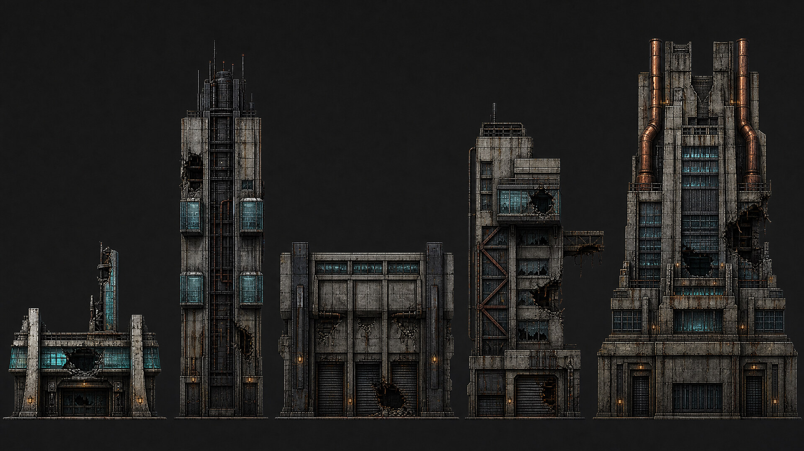
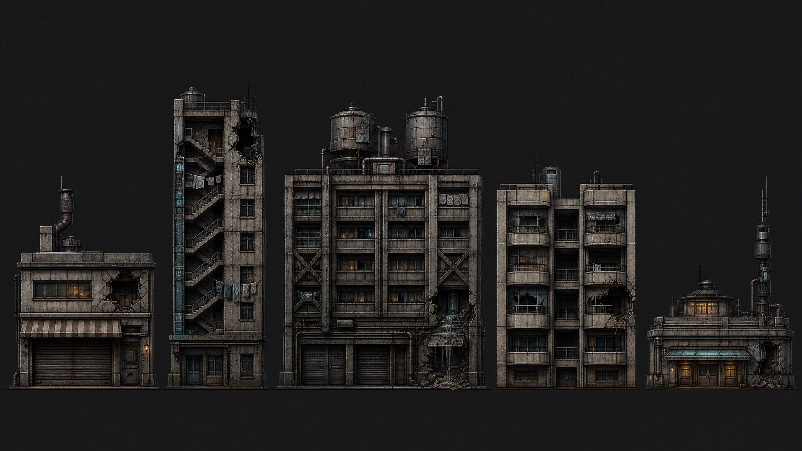
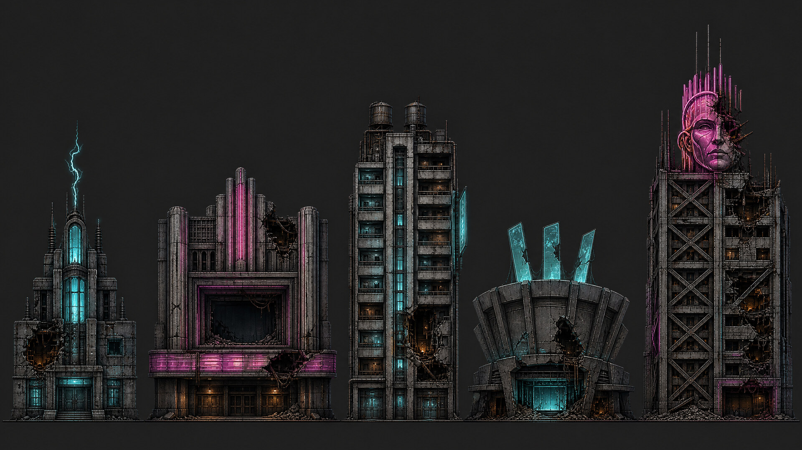
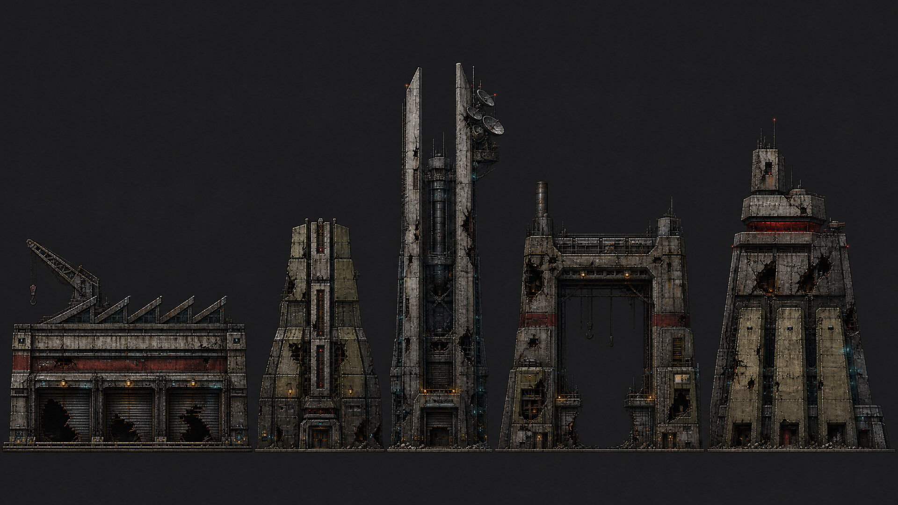
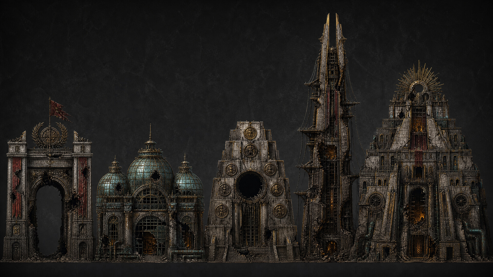

# Proto Scroller District Destruction Concept Design

**Author:** Manus AI  
**Status:** Approved for implementation  
**Engine:** Godot 4.7.2-stable

## Design Objective

Proto Scroller’s endless city becomes a directed campaign through five visually and mechanically distinct spatial districts: **Business**, **Residential**, **Entertainment / Nightlife**, **Military**, and **Royal / Noble**. Each district owns five deterministic destructible-building archetypes, producing a roster of **25 buildings** while preserving the game’s current six-cell hollowing model, staged cracks, exposed interiors, leaking pipes, dangling electrical cables, nonblocking rubble, material-specific debris, support transfer, and chain-collapse behavior.[1] [2]

The district model is deliberately separate from the existing siege `DistrictDefinition`, whose six acts represent combat cadence rather than geography.[3] Each spatial district now presents ten forward facade encounters—two deterministic, independently shuffled passes through its five authored facade types—before two road-only transition chunks. Boss readiness requires all ten encounters, while the unique catalog remains exactly twenty-five building types. The existing encounter arc remains intact.

## Campaign Progression

| District | Forward chunks | Combat purpose | Visual identity |
|---|---:|---|---|
| **The Ledger Spine — Business** | 0–11 | Teaches material reading, selective support failure, and safe chain reactions | Disciplined corporate verticality, cyan finance glass, oxidized service trunks |
| **Ashwater Commons — Residential** | 12–23 | Adds lived-in cover geometry and domestic utility hazards | Prefab housing, cisterns, laundry gantries, warm windows, municipal teal |
| **The Afterglow Strip — Entertainment / Nightlife** | 24–35 | Escalates environmental crossfire and delayed utility reactions | Failing neon, theaters, hotels, arenas, show-control machinery |
| **The Iron Corridor — Military** | 36–47 | Introduces steel-heavy targets and hardened logistics architecture | Blast shells, armories, repair gantries, command relays, field olive armor |
| **The Crownward — Royal / Noble** | 48+ | Culminating monumental destruction and elite combined-arms arenas | Palace-bunkers, tribunals, ceremonial brass, gargantuan stepped silhouettes |

## Shared Destruction Language

Every building retains a **3×2 logical structural grid** so the player can read targets at speed. Each damaged cell progressively erodes its own authored sprite from the center outward: a small initial void grows through a stable jagged boundary while all surviving facade pixels darken with cumulative damage. A damaged section owns exactly one deterministic accent—video-derived interior fire, one broken pipe, or one dangling cable—plus its cracks. Terminal failure removes most of the center and lower middle, leaves dark irregular side rails and a top lintel around the opening, and culls every fire/wire/pipe accent before placing a shallow nonblocking rubble bed. Transparent source pixels remain transparent, and no destroyed cross-section sprite replaces the building. Lower-cell failure transfers damage upward; complete floors start staggered collapse; loss of all authored steel supports triggers the faster steel-support chain.[1]

Variation is delivered through GPT Image 2 facade art, silhouette, display dimensions, six-cell material layout, district palette, deterministic crack seed, and a named destruction signature. The live runtime continues to use only six pooled building instances—one per resident chunk—so 25 catalog entries do not multiply the active node or physics budget.[4] [5]

## Business District — The Ledger Spine

A wounded corporate canyon where financial infrastructure has become physical machinery: settlement pipes, data trunks, clearing spines, armored archives, and austere public halls. Cold cyan glazing and tired amber indicators puncture rain-black concrete.

| Building | Size and silhouette | Architecture | Destruction signature | Gameplay role |
|---|---|---|---|---|
| **Mercy Exchange Annex** | Small-wide; twin shoulders and ticker fin | Public trading annex beneath concrete buttresses with glass entry hall | Ticker glazing unzips horizontally before the final steel support cascades | First-breach lesson and fast walk-through opening |
| **Helix Clearinghouse Spine** | Tall-narrow; continuous central mast | Steel service spine with cantilevered audit chambers and transfer vaults | Paired steel-core failure peels side chambers into a tight downward beam fan | Precision support-chain and anti-air debris setup |
| **Orison Custody Vault** | Large-low armored slab | Coffer concrete bunker, blast piers, clerestory and intake machinery | Two outer steel piers produce a center-sag collapse and broad heavy rubble | Durability check and tank-trap arena |
| **Vanta Compliance Tribunal** | Medium asymmetric; projecting hearing box | Cantilevered tribunal, diagonal transfer frame, records tower | Oblique support peel follows the last-impact column | Directional approach choice and overhead threat zone |
| **Crown Reserve Data Treasury** | Large-tall stepped landmark | Treasury plinth, archive crown, pipe chimneys and paired foundation rails | Vertical power-loss bands precede a fast foundation cascade | District mastery landmark combining soft crown and durable supports |

## Residential District — Ashwater Commons

A dense second-ring neighborhood made from obsolete colony habitat modules around a failing heat-and-water loop. Laundry, shrines, cisterns, clinic lights, repair paint, and evacuation markings make each breach feel like the loss of a lived-in place rather than generic urban mass.

| Building | Size and silhouette | Architecture | Destruction signature | Gameplay role |
|---|---|---|---|---|
| **Emberpot Canteen House** | Small squat; crooked kitchen flue | Two-level habitat, food shutter, awning and gas cage | Kitchen-service breach reveals pipes and cable-fed ignition cues | Early glass-entry and utility-target tutorial |
| **Bluewire Laundry Walk-Up** | Tall narrow; sawtooth external stair | Worker tenement with wash decks and braided service spine | Center-spine failure snaps stair lights upward and exposes long cable loops | Vertical targeting and infantry-control arena |
| **Rainvault Cooperative** | Large broad; twin rooftop cisterns | Housing block wrapped around an atmospheric-water plant | Valve-core breach drives pressure, runoff, and heavy support collapse | Combined-arms set piece with broad cover denial |
| **Sixfold Balcony Court** | Medium-wide; stepped balcony capsules | Six balcony-fronted dwellings tied by a stressed cantilever | Completed floor failure visually zips balcony fronts into layered rubble | Precision cover removal and floor-chain lesson |
| **Nightglass Mutual Clinic** | Small-medium low civic wedge | Bathhouse converted into clinic and shelter with lantern and battery mast | Battery and pipe bays create a readable launch-and-shock sequence | Low-profile combo tutorial beneath clear air lanes |

## Entertainment / Nightlife District — The Afterglow Strip

A pleasure corridor kept luminous after evacuation by failing show-control grids, generator taps, hotel cisterns, pyrotechnics, and weaponized advertising. Neon acts as scar tissue rather than decoration: missing letters, mismatched tubes, cable lashings, and rain halos expose improvised survival.

| Building | Size and silhouette | Architecture | Destruction signature | Gameplay role |
|---|---|---|---|---|
| **Voltage Chapel** | Small narrow; lightning spire | Traction substation converted into a two-level club | Switchgear breach flashes cyan before a compact support cascade | Early nightlife transformer-target lesson |
| **Orpheum Vanta** | Medium-wide; long broken marquee | Armored neo-deco picture palace and projection block | Steel anchor failure dresses the normal chain as a marquee peel | Lateral set piece and timed lane clear |
| **Halcyon Stack Hotel** | Tall-medium; pods around an elevator stripe | Capsule hotel with cisterns, balcony ladders and pump room | Pump-core damage reveals wet utilities beneath the vertical collapse | Pincer arena with narrow air-readable crown |
| **Prism Crown Revue** | Large-low fan | Brutalist holographic arena with stage mouth and gas rails | Utility-dock breach announces a delayed spectacle-chain failure | Crowd-control building for mixed enemy waves |
| **House of Static Casino Hotel** | Large landmark; broken neon queen crown | Concrete hotel slab inside a diagonal steel exoskeleton | Paired crown supports trigger a fast steel cascade and falling-sign accent | Late-district mastery landmark |

## Military District — The Iron Corridor

A hardened logistics belt built over an older worker city. Ammunition depots, magazines, signal citadels, repair gantries, and command keeps turn the street into a continuous kill corridor. The architecture is visibly grafted rather than pristine: field armor, weld patches, requisition paint, exposed service organs, and blackout shutters.

| Building | Size and silhouette | Architecture | Destruction signature | Gameplay role |
|---|---|---|---|---|
| **Ordnance Transload Bastion** | Extra-wide low; sawtooth roof and crane boom | Rail-fed ammunition cross-dock with three armored portals | Lower-bay destruction travels as a horizontal cook-off rhythm | Converts clustered defenders into delayed demolition targets |
| **Revetment Armory Stack** | Compact stepped trapezoid | Vertical magazine of vault cassettes around a locking spine | Steel-spine failure unzips cassettes outward | Precision choice between safe floor breach and fast collapse |
| **Aegis Signal Citadel** | Tall tuning fork | Concrete exchange core, Faraday ribs and dish crown | Upper pylon loss cants the crown before top-down blackout collapse | Command target with readable vertical weak points |
| **Manticore Siege Repair Gantry** | Large open-span inverted U | Portal-frame hangar, shoulder shops, rails and service umbilicals | Upper cells release suspended visual weight before rail buckle | Heavy-vehicle arena with open enemy sightlines |
| **Prefect War Keep** | Monumental sloped wedge | Brutalist command keep with buttresses and recessed red visor | Last-impact axis guides either a methodical kneel or fast lockdown tear | District capstone and elite durability check |

## Royal / Noble District — The Crownward

A ceremonial capital quarter engineered to make imperial power appear permanent. Processional gates, sealed pleasure houses, tribunals, ministries, and the throne-palace fuse neo-baroque symbolism with bunker concrete, command steel, cooling organs, surveillance apertures, and military service routes.

| Building | Size and silhouette | Architecture | Destruction signature | Gameplay role |
|---|---|---|---|---|
| **Laureate Processional Gate** | Medium-wide arch | Armored triumphal gate with turbine laurels and torn standard | Keystone-support failure unzips the entablature across the opening | Arrival landmark and movement lesson |
| **Aurelian Menagerie Conservatory** | Large-low triple dome | Aristocratic greenhouse converted into bio-surveillance house | Upper glass floor peels in a cyan crystal-rain sequence | Fast momentum target and crossfire breaker |
| **Tribunal of the Nine Seals** | Massive broad wedge and oculus | Stepped judgement basilica with broadcast oculus | Thick concrete cracks converge before ordered gallery collapse | Deliberate siege arena with broad firing lanes |
| **Ministry of Privilege Spire** | Tall narrow forked crown | Armored archive stacks around a steel spine | Spine failure races upward and leaves a persistent black cleft | Compact vertical landmark for precise structural attacks |
| **Palace of the Last Sovereign** | Gargantuan stepped citadel | Throne-palace fused with command bunker and radial crown | Lower-row kneel or aggressive crownfall route converges on one monumental hollow | Final demolition arena and score climax |

## Runtime Asset Strategy

Each of the 25 buildings receives a standalone GPT Image 2 transparent facade sprite. One per-cell shader operates directly on that facade, preserving pristine alpha at zero damage and expanding a seed-stable jagged alpha void as normalized damage rises. Cracks, accent choice, and hollow cutouts remain runtime-generated and deterministic rather than requiring 75 bespoke stage images. The fire choice uses one shared 24-frame transparent WebP atlas generated through video-to-sprites; cables and pipes retain their compact generated sprites. The shared shallow-rubble atlas remains material-tinted and never replaces the failed facade section.

Sprites are imported without mipmaps and resized to a compact gameplay resolution. The package gate increases from 8 MiB to **16 MiB**, with the implementation required to report actual HTML, JavaScript, WASM, and PCK sizes and preserve the non-threaded Web export contract.[6]

## Acceptance Criteria

The implementation is complete when all five districts are selected deterministically by forward chunk progress; all 25 stable building IDs are addressable; six live building slots are reused with no post-warm allocation; every variant retains six destructible cells, staged cracks, pipe/cable details, alpha-safe procedural hollows, support transfer, chain collapse, state persistence, and nonblocking shallow rubble; district and variant identity survive stream-out and restore; landscape and portrait galleries are visually inspected; and the release Web bundle passes browser/network/runtime checks.

## References

[1]: ../game/scripts/destruction/structural_building_2d.gd "StructuralBuilding2D"
[2]: ../game/scripts/destruction/building_damage_pattern_2d.gd "BuildingDamagePattern2D"
[3]: ../game/scripts/siege/district_definition.gd "DistrictDefinition"
[4]: ../game/scripts/world/city_world_stream.gd "CityWorldStream"
[5]: ../game/scripts/world/streamed_destructible_runtime.gd "StreamedDestructibleRuntime"
[6]: ../game/export_presets.cfg "Godot Web export preset"
