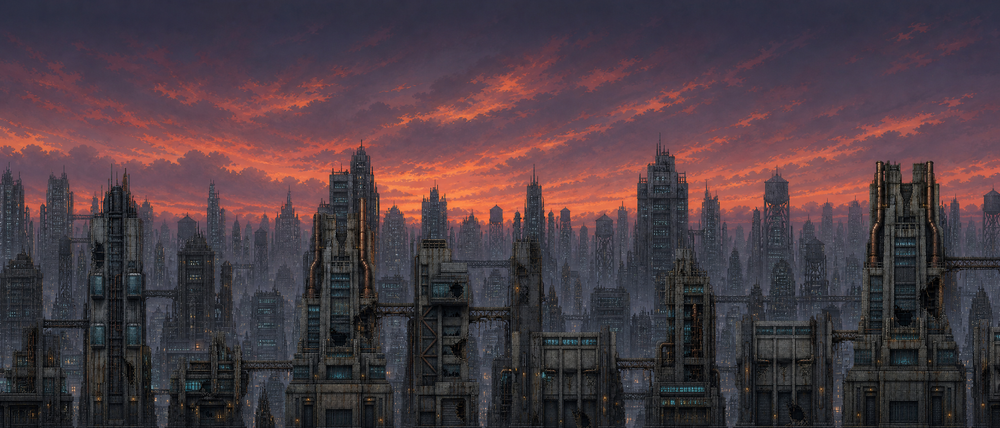
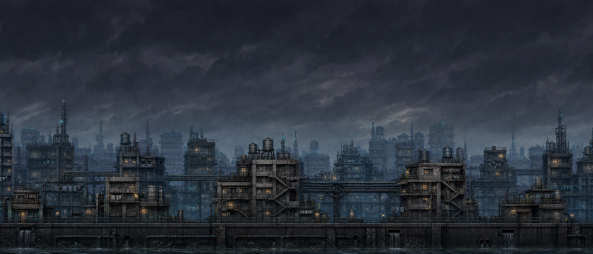
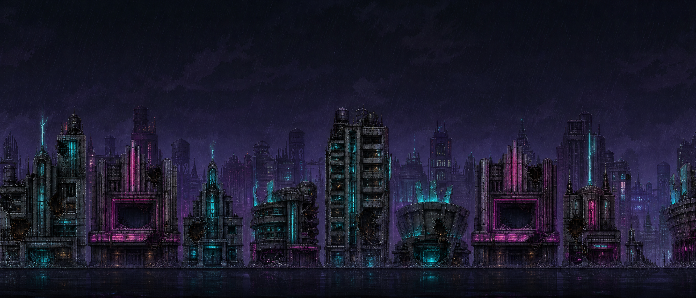
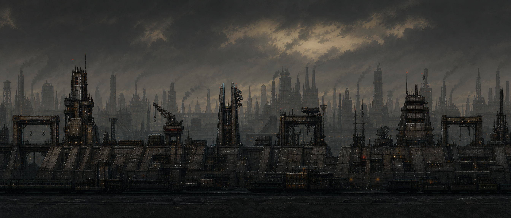
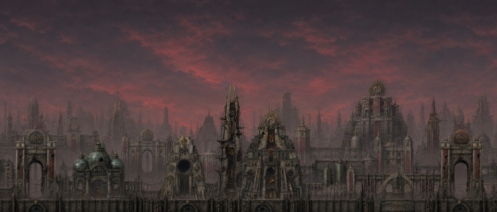

# District Parallax Background Concept Proposal

**Author:** Manus AI  
**Status:** Implemented
**Engine:** Godot 4.7.2-stable

## Objective

Proto Scroller’s five spatial districts already communicate progression through **unique destructible facades, asphalt colors, accent colors, transition banners, and district enemies**. The parallax system does not participate: `CityWorldBuilder` constructs one fixed sky, skyline, infrastructure, and near-building stack at startup, while `CitySlice._on_spatial_district_changed()` only presents the transition banner.[1] [2] This proposal makes the horizon evolve with the street without changing collision, combat, streaming, or the fixed six-chunk world pool.

> Each district receives one authored panoramic identity. The existing four-speed parallax stack remains allocation-bounded; transitions crossfade a prewarmed second sky sprite and retint the shared depth silhouettes rather than constructing nodes during play.

## Visual System

Each GPT Image 2 concept is a **21:9 side-view panorama** designed to become the slowest parallax layer directly. It preserves the established dusk campaign continuity, leaves the lower foreground dark enough for gameplay silhouettes, avoids text and characters, and places signature architecture below the HUD-safe upper band. The existing transparent skyline, infrastructure, and near-building layers remain as faster depth bands, but their modulation changes with the active district so the complete stack reads as one environment.

| District | Horizon concept | Palette and atmosphere | Signature silhouettes | Gameplay-readability rule |
|---|---|---|---|---|
| **The Ledger Spine — Business** | A corporate settlement canyon disappearing into rain haze | Slate violet sky, cold cyan glass, oxidized copper, restrained amber | Clearing towers, audit bridges, data masts, armored archive slabs | Keep finance lights sparse and horizontal; no high-energy color behind telegraphs |
| **Ashwater Commons — Residential** | A dense habitat basin built around heat and water infrastructure | Storm blue-gray, municipal teal, warm window amber, wet concrete | Rooftop cisterns, external stairs, laundry gantries, clinic lanterns | Warm windows remain tiny and low-contrast so enemy eyes and projectiles dominate |
| **The Afterglow Strip — Entertainment** | A broken pleasure corridor still glowing after evacuation | Indigo rain, bruised magenta, cyan neon, smoky violet | Theater crowns, hotel stacks, arena fins, failed hologram frames | Neon is fragmented and dimmed; the upper HUD region stays nearly black |
| **The Iron Corridor — Military** | A fortified logistics horizon under blackout discipline | Charcoal olive, gunmetal, sodium amber, warning red | Revetments, rail cranes, antenna forks, blast towers, command bunkers | Strongest values remain on the horizon; no red-white pulse that could mimic attack warnings |
| **The Crownward — Royal** | A monumental imperial capital receding into ceremonial haze | Deep wine-gray, pale stone, oxidized brass, dead crimson | Processional arches, conservatory domes, radial seals, forked spires, palace tiers | Brass highlights are narrow and distant; foreground targets retain the brightest edges |

## Concept Designs

### Business — The Ledger Spine

### Residential — Ashwater Commons

### Entertainment — The Afterglow Strip

### Military — The Iron Corridor

### Royal — The Crownward

## Runtime Proposal

The slow `Sky` band becomes a district panorama bank containing **two prewarmed sprites**. One displays the current district while the other receives the next texture and crossfades over a short, nonblocking interval. `FarSkyline`, `Infrastructure`, and `NearBuildings` remain one sprite each at their established scroll scales of 0.18, 0.35, and 0.60, but interpolate toward a district-specific low-saturation modulation color. This preserves floating-origin compensation and repeat behavior while making every depth plane participate in the transition.

The initial Business panorama is applied before first gameplay. `CityWorldStream.district_changed` drives Residential through Royal transitions using the same canonical spatial signal already consumed by the banner and narrative systems. New Game+ resets the active panorama to Business and clears scroll offsets. Repeated or backward events are idempotent; an in-flight transition is replaced by the latest district request without creating new nodes.

## Asset Strategy

The five 21:9 GPT Image 2 concepts are retained under `docs/concepts/parallax/` as the durable art-direction masters. Deterministic production derivatives are resized to the existing **1344×576** parallax envelope and encoded as compact WebP textures under `game/art/city/parallax/districts/`. Godot imports them without mipmaps. The concepts therefore serve both as reviewable proposals and as the direct provenance source for the shipped slow layer; no procedurally drawn substitute is introduced.

## Acceptance Criteria

The implementation is accepted when the initial Business background is correct; crossing logical chunks 5, 10, 15, and 20 changes to the corresponding district panorama; exactly two sky sprites and four `Parallax2D` bands exist for the entire run; transition calls allocate no scene nodes; floating-origin scroll compensation remains correct; New Game+ returns to Business; each texture is 1344×576 and loadable; and the Web export contains the complete background set.

## Implementation Result

The approved proposal shipped as `DistrictParallaxRuntime`. It owns four fixed depth bands, two prewarmed sky sprites, five stable panorama mappings, district-specific depth modulation, an 850 ms smoothstep crossfade, reset-to-Business behavior, and floating-origin compensation. `CitySlice` forwards the canonical spatial district signal to the runtime while preserving the existing banner and narrative subscribers. The focused implementation suite passed **3/3 tests with 49 assertions** across all five assets, fixed node counts, crossfade completion, invalid-ID rejection, reset, and origin compensation.

## References

[1]: ../game/scripts/gameplay/city_world_builder.gd "Current fixed parallax construction"
[2]: ../game/scripts/gameplay/city_slice.gd "Spatial district transition handler"
[3]: ../game/scripts/world/city_world_stream.gd "Canonical spatial district signal"
[4]: DISTRICT_DESTRUCTION_DESIGN.md "District art direction"
