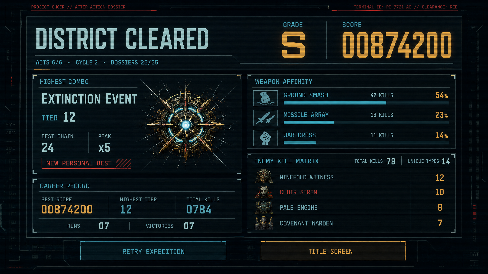
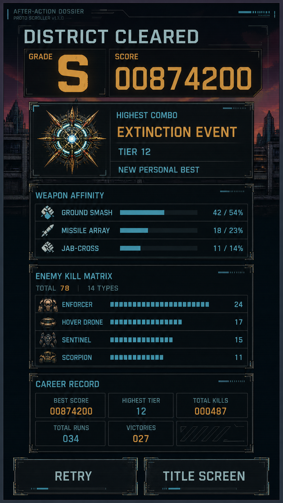
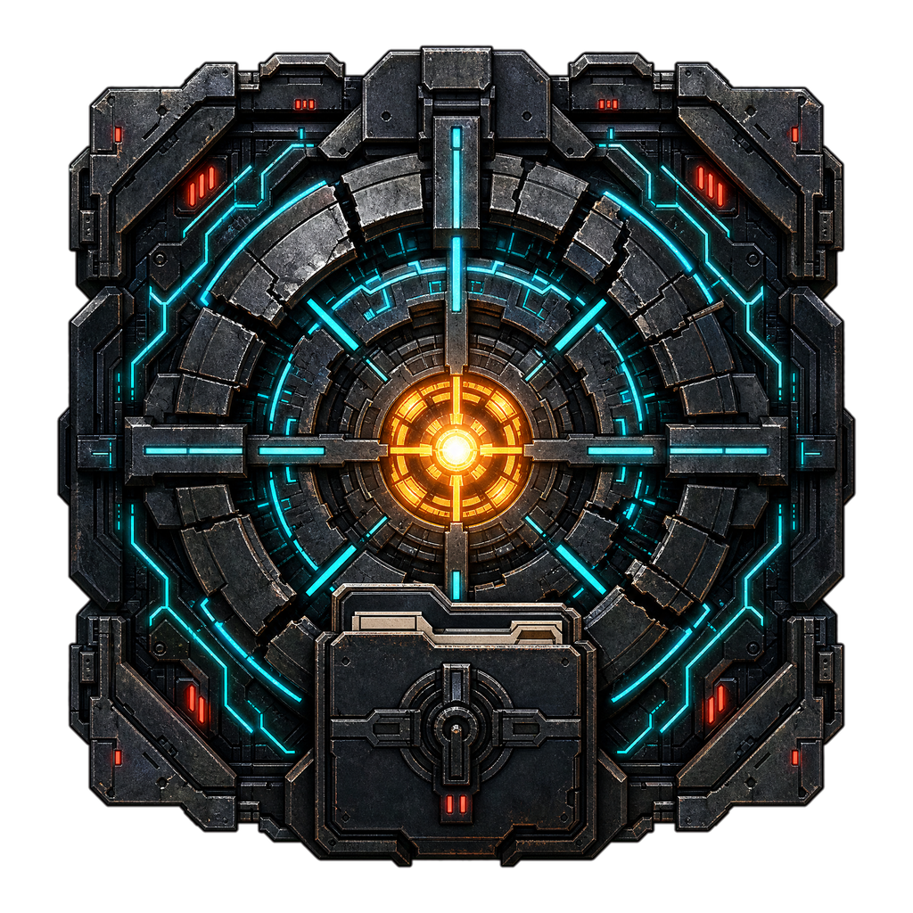

# Proto Scroller After-Action Dossier Proposal

**Author:** Manus AI
**Date:** 2026-08-27
**Status:** Approved for implementation by user request
**Canonical baseline:** `21a15680c231646c0a7b2853205be1a2ba19887d`

## 1. Executive Summary

The current end-of-match screen is a compact terminal card built around grade, score, acts, heavy hits, action variety, causal depth, and a retry objective. It answers whether the run ended well, but not **how the player fights**. The proposed revamp converts that card into an **After-Action Dossier**: a responsive mission debrief that preserves the existing grade and narrative outcome while adding run-scoped combat identity, enemy defeat composition, weapon kill attribution, and persistent career records.

The feature deliberately separates **run telemetry** from **career progression**. A run snapshot is immutable after extraction or defeat. A local player profile then merges only the frozen public statistics into a versioned JSON record. The screen compares the run with the career record, marks new personal bests, and presents compact top lists rather than dumping raw dictionaries onto the operator.

> The debrief should answer four questions in under five seconds: **What did I achieve? What did I fight? How did I fight? Did I set a record?**

## 2. Product Goals

| Goal | Product outcome |
|---|---|
| Make the result screen rewarding | Score, grade, outcome, highest combo title, and personal-best state form an immediate visual hierarchy. |
| Reveal player identity | The screen names the preferred kill-attribution weapon and shows the top three weapon shares. |
| Make enemy variety legible | The run tracks every concrete enemy archetype defeated and presents the four most common types, total kills, and unique-type count. |
| Preserve narrative continuity | Existing Project CHOIR ending copy, dossiers, continuity generation, New Game+, extraction, retry, and title actions remain available. |
| Persist local career records | Highest authored combo tier, best score, lifetime enemy kills, completed runs, and victories survive retries and relaunches. |
| Prepare for an online leaderboard | A versioned, privacy-minimal public payload can be produced later without coupling the current game to a network service. |
| Remain bounded | Event tracking uses dictionaries keyed by stable IDs, allocates no per-kill scene nodes, and freezes defensive copies at run completion. |

## 3. Non-Goals

This implementation does not create an online account system, submit scores, expose public names, rank users, or claim anti-cheat authority. It does not record raw input history, exact movement traces, IP addresses, hardware identifiers, or narrative save contents. It does not change score values, combo timing, encounter balance, weapon behavior, enemy pools, or New Game+ scaling.

## 4. Information Architecture

### 4.1 Immediate result hierarchy

The first layer remains the mission result: **District Cleared**, **Game Over**, or the selected Project CHOIR ending. The score and grade remain prominent. A concise subtitle retains acts completed, cycle, run objective, dossiers, and continuity generation.

### 4.2 Combat identity

The second layer is a two-card hero row:

| Card | Contents |
|---|---|
| **Highest Combo** | Highest authored combo tier reached, named herald state, best physical chain, peak score multiplier, and `NEW PERSONAL BEST` when applicable. |
| **Career Record** | Career-best combo tier, best score, total recorded kills, total runs, and victories. |

The highest authored tier may exceed the capped score multiplier. Tier 10 and above retains the **Extinction Event** identity while preserving the exact numeric tier.

### 4.3 Kill matrix

The kill matrix records every `ENEMY_DEFEATED` event by its concrete archetype ID and family. The screen displays total enemies defeated, unique types, and the top four concrete types sorted by descending count and then stable ID. District variants remain distinct from their canonical base archetypes so the dossier can truthfully report targets such as **Covenant Warden** or **Ninefold Witness**.

### 4.4 Weapon affinity

Weapon affinity is explicitly defined as **enemy-kill attribution**, not time equipped or shots fired. Each fatal damage event maps to one of:

| Stable weapon ID | Display identity |
|---|---|
| `GROUND_SMASH` | Ground Smash |
| `JAB_CROSS` | Jab-Cross |
| `MACHINE_GUN` | Machine Gun |
| `MISSILE` | Missile Array |
| `LASER` | Anti-Air Laser |
| `FLAMETHROWER` | Flamethrower |
| `ENVIRONMENT` | Environmental Cascade |
| `UNKNOWN` | Unattributed |

The screen displays the preferred weapon, its attributed kills, its percentage of enemy defeats, and two supporting rows. Percentages are derived from integer counts and are never used for scoring.

## 5. Proposed Visual Design

The visual language is a **black-lab forensic terminal crossed with a military after-action report**. It preserves Proto Scroller’s near-black navy, cyan telemetry, warm amber score accents, and Project CHOIR red warning language. The layout uses hard rectangular panels, hairline circuitry, restrained glow, and one generated dossier crest. It avoids rounded consumer-dashboard styling.

### 5.1 Landscape composition

The 16:9 layout uses a broad 1120×620 dossier centered inside the gameplay viewport. The header contains result, grade, score, and run metadata. The body forms a two-column grid: combat identity and career record on the left; kill matrix and weapon affinity on the right. Retry/Extract and Title/New Game+ actions remain in a dedicated footer row.

### 5.2 Portrait composition

The 9:16 layout stacks the same hierarchy without shrinking desktop typography into dust. Result and score lead, followed by highest combo, weapon affinity, kill matrix, and career record. Buttons remain above the touch safe area. The panel uses the full central width while leaving the top compact HUD and bottom mobile-control region visually distinct.

### 5.3 Generated runtime crest

A transparent **After-Action Dossier crest** combines a fractured robot reactor ring, crosshair ticks, and a sealed evidence-file motif. It is decorative and never carries data or required text. The runtime derivative is bounded to 256×256 and reused in both orientations.

## 6. Data Contract

### 6.1 Run telemetry

A `CombatRunTelemetry` object receives only accepted `GameplayEvent` instances. For every qualifying combo event it updates the highest authored tier. For every enemy defeat it increments total kills plus exact archetype, family, and fatal weapon dictionaries. It exposes snapshots through defensive copies.

### 6.2 Immutable run summary

`RunSummarySnapshot` gains read-only fields for completion state, highest combo tier, total enemies defeated, unique enemy types, exact enemy kills, enemy-family kills, weapon kills, preferred weapon, and preferred-weapon count. Existing fields and constructor compatibility remain intact through optional metrics.

### 6.3 Local career profile

`PlayerCombatProfileStore` is owned by `Main`, not by transient city scenes. Production city instances receive it through dependency injection; direct scene tests remain isolated unless they explicitly provide a temporary store. The profile persists:

| Field | Persistence rule |
|---|---|
| Schema version | Fixed integer, migrated explicitly when changed. |
| Anonymous profile ID | Generated once locally; no display name or hardware identifier is stored. |
| Total runs / victories | Increment once per frozen summary presentation. |
| Best score | Maximum finalized score. |
| Highest combo tier | Maximum authored tier. |
| Lifetime enemy kills | Merged exact-archetype counts. |
| Lifetime weapon kills | Merged stable weapon-attribution counts. |
| Last updated time | Operational metadata only. |

The save uses a temporary JSON file and atomic replacement. Malformed or unsupported data falls back to a clean profile rather than blocking launch.

## 7. Future Online Leaderboard Boundary

The local store will expose a **public leaderboard candidate payload** with a schema version, anonymous profile ID, build revision, finalized run facts, and aggregate career facts. Narrative dossiers, settings, input bindings, and raw save files are excluded.

A future online leaderboard should treat browser-produced payloads as untrusted. The recommended Manus-centric design is a small authenticated service that issues a run nonce, validates build and schema versions, enforces bounded values, stores submissions, and derives leaderboard views server-side. Stronger integrity would require a compact event digest or replay verification rather than trusting a client-provided score. This boundary is designed now; networking is intentionally deferred.

## 8. Accessibility and Localization

All required text is localized in English and Simplified Chinese. Canonical enemy callsigns remain proper names. Counts, percentages, and score use locale-neutral digits for telemetry consistency. Every information category uses both text and color; personal bests never rely on glow alone. Landscape and portrait font sizes remain independently authored.

## 9. Acceptance Criteria

| Area | Acceptance criterion |
|---|---|
| Highest combo | Exact authored tier survives multiplier caps and is frozen at run completion. |
| Enemy types | Concrete archetype IDs, including district variants, are counted once per accepted enemy defeat. |
| Weapon affinity | Fatal damage types map deterministically to stable weapon IDs; ties use stable ordering. |
| Persistence | Career records survive a new store instance and malformed saves fail safely. |
| Immutability | Late gameplay events cannot mutate the frozen summary or displayed debrief. |
| Responsive UI | Landscape and portrait show all required cards, labels, rows, and actions without clipping. |
| Compatibility | Existing retry, title, extraction, New Game+, finale choice, and ending flows remain functional. |
| Future readiness | A privacy-minimal, versioned candidate payload can be serialized without a network dependency. |

## 10. References

[1]: ../game/scripts/rampage/run_summary_snapshot.gd "Current immutable run summary"
[2]: ../game/scripts/rampage/rampage_session.gd "Current rampage session aggregation"
[3]: ../game/scripts/ui/gameplay_hud.gd "Current end-of-match HUD overlay"
[4]: ../game/scripts/rampage/rampage_event_adapter.gd "Current accepted event provenance adapter"
