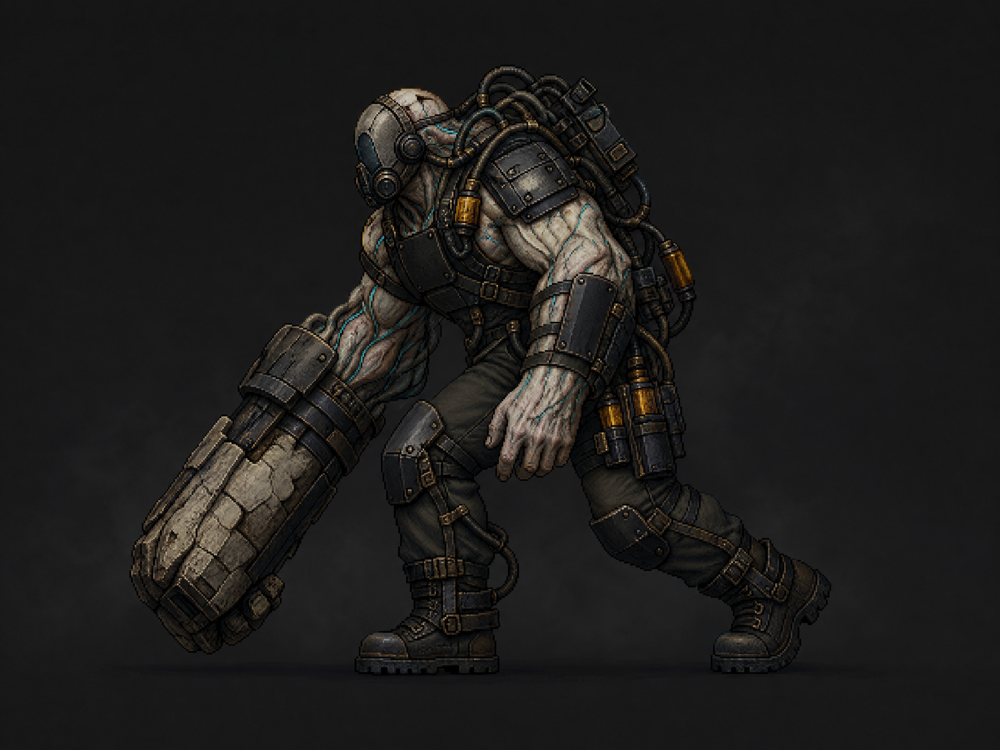
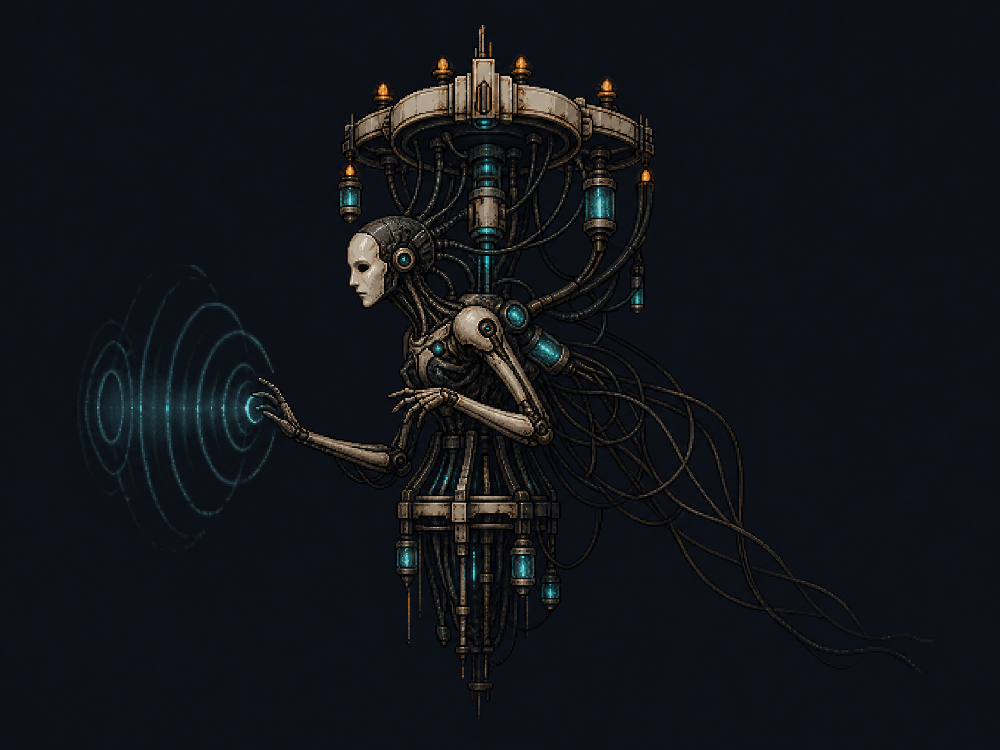
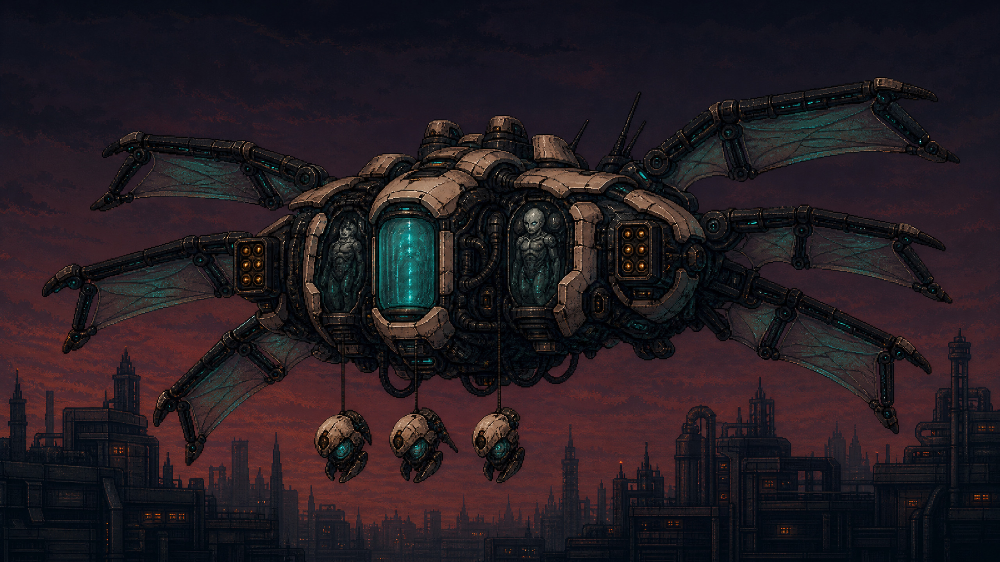
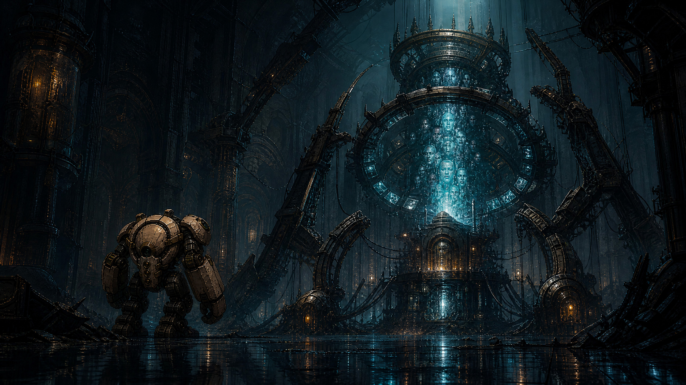

# Proto Scroller: **Project CHOIR**

**Narrative and campaign proposal** | **Author:** Manus AI | **Status:** Concept proposal for creative approval

## Executive recommendation

Proto Scroller should remain a fast, destructive power fantasy, but **destruction needs to expose a mystery and advance a purpose**. The strongest direction is to reveal that the city is not merely defended by an evil organization: it is a distributed experimental weapons laboratory. Its ordinary towers conceal human test facilities, its defense force is buying time for an evacuation, and the protagonist’s murdered loved ones were converted into neural training data for a bio-computational weapon called **Project CHOIR**.

The campaign begins as revenge and gradually becomes a rescue mission. The player is not asked to stop smashing buildings; instead, authored breaches transmit evidence and may trigger containment consequences without adding scenery behind the ruined facade. Mid- and late-game enemy variety evolves from conventional security forces into engineered human warforms and bio-mechanical carriers. The final revelation is personal: **the human pilot also died in the original attack. The player is an experimental neural echo running inside PROTOS.** The organization gave the machine one stable emotional anchor—revenge—because grief made the copy obedient.

> **Core promise:** *Tear through the city that murdered your family, discover what it made from their memories, and decide whether vengeance is worth destroying the last traces of them.*

This direction preserves the existing title hook, five spatial districts, twenty conventional enemy archetypes, six-stage response escalation, twenty-five unique facades, run upgrades, and one-button combat foundation.[1] [2] [3]

## Proposed title-screen extension

The existing synopsis can remain exactly as written. If a sharper story hook is desired later, the briefing could expand to:

> **An evil organisation killed everyone you love.**
>
> They put what was left inside the weapons beneath this city.
>
> **You are the prototype they failed to bury.**

The current title screen already describes the city defense grid failing at **04:17** and identifies PROTOS as the only active prototype.[2] Project CHOIR turns those fragments into deliberate foreshadowing rather than decorative military language.

## The premise

**The Crown Directorate** is a public-private authority that owns the city’s defense grid, health infrastructure, media networks, and military industry. Its secret program, **Project CHOIR**, began as a disaster-response system: neural maps from many citizens would be combined into a predictive intelligence capable of coordinating evacuations. When the model demonstrated extraordinary tactical adaptation, the Directorate converted it into a weapon.

The protagonist discovered the program. At 04:17, the Directorate staged a citywide blackout, killed the protagonist and everyone close to them, and seized their neural archives. The family’s unusually coherent emotional bonds made their memories valuable: together, they could stabilize CHOIR’s competing minds.

The protagonist’s original body is dead. What awakens inside the air-gapped civil-defense prototype is **PILOT ECHO P-01**, a reconstructed personality built from the same stolen technology. PROTOS—**Prototype Rescue, Overwatch, Triage, Ordnance System**—was designed to open disaster corridors, lift rubble, and rescue civilians. The city turns that rescue chassis into a weapon because the protagonist believes there is still someone left to avenge.

The twist does not invalidate the player’s emotions. It makes the central question sharper: **if copied memories can grieve, choose, and sacrifice, are they less real than the people from whom they were taken?**

## Narrative pillars

| Pillar | Design rule | Gameplay consequence |
|---|---|---|
| **Revenge becomes investigation** | Every district answers one question and creates a worse one. | Forward progress transmits short messages and dossiers. |
| **Destruction reveals truth** | Breaching structures should release evidence without pausing the action. | Selected facade cells award case files or trigger containment events while the ruin remains visually unbacked. |
| **Collateral has consequences** | The player remains powerful, but some targets matter more than others. | Optional surgical objectives protect evidence or captives while the required ground-level route remains destructible. |
| **Horror escalates gradually** | Early enemies remain human and mechanical; the biological program emerges in stages. | Existing units teach combat first; hybrid enemies enter in Residential and dominate Military/Royal. |
| **The player’s identity matters** | PROTOS and CHOIR share the same neural-copy technology. | Enemy dialogue, UI corruption, retries, and the ending all recontextualize the run loop. |
| **No momentum-killing exposition** | Story arrives in seconds, not minutes. | Three-second district cards, one-line radio fragments, dossier notifications, and brief boss transitions replace long cutscenes. |

## Five-district campaign arc

The current districts already form a natural journey from corporate power through civilian exploitation, mass persuasion, military production, and ruling authority.[1] Their authored buildings become **specific organs of the conspiracy** rather than interchangeable scenery.

| District | Story function | Environmental reveal | New opposition | District truth |
|---|---|---|---|---|
| **Business — The Ledger Spine** | Follow the money and establish that the rampage has a target. | Recovered ledgers identify sealed biomedical procurement and refrigerated transfer routes. | Existing security roster, with elite Bulwarks and Sappers protecting evidence nodes. | The victims were not buried. Their neural maps were invoiced, classified, and transported east. |
| **Residential — Ashwater Commons** | Turn revenge into rescue. | Recovered clinic and housing records document intake wards, failed escape routes, and living test subjects. | **Reclaimed Breacher**, **Graft Runner**, contaminated versions of existing infantry. | The blackout was staged to harvest a controlled population. Some captives are still alive. |
| **Entertainment — The Afterglow Strip** | Attack certainty and reveal the protagonist’s copied nature. | Broadcast archives show resonators replaying private memories as crowd-control stimuli. | **CHOIR Siren**, hallucination decoys, modified HIVE support formations. | The voice guiding PROTOS is not a surviving pilot. It is a neural reconstruction using the same substrate as CHOIR. |
| **Military — The Iron Corridor** | Show the industrial scale of the program. | Arsenal manifests document surgical fusion of human tissue, vehicle armor, and combat telemetry. | **Seraph Carrier**, Graft Runner packs, **Pale Engine**, hybridized Goliath/Nemesis escorts. | The Directorate plans to export CHOIR-guided organisms as an adaptive army. The city is the demonstration range. |
| **Royal — The Crownward** | Resolve revenge, identity, and the fate of the victims. | Crown records identify the cathedral-sized memory core later confronted as **CHOIR Prime**. | Mature hybrids, memory projections, the Crown’s command landship, and the final core. | The family’s biological lives are gone, but coherent memory-echoes remain trapped inside the weapon. Saving them and destroying CHOIR are not the same action. |

## The destruction loop gains meaning

The proposal does **not** replace the destruction loop with escort missions or dialogue trees. It adds a narrative layer to actions the player already performs.

### 1. Ground route versus protected payload

The player still destroys lower facade cells to advance. Upper cells can contain optional **life-sign pods, memory glass, or evidence servers**. This creates a simple visual question: *Do I demolish everything for speed and EXP, or preserve the marked payload long enough to extract it?* There is no campaign soft-lock; lost evidence can reappear as an elite drop later in the run.

### 2. Twenty-five facades become twenty-five case files

Each authored facade can contain one persistent **CHOIR Dossier**. A dossier is one image, one title, and two sentences—enough to reward exploring all five buildings in each district without asking the player to read during combat. Completing a district’s five dossiers unlocks its cleanest version of the truth. This gives the existing twenty-five-building roster a second purpose beyond visual variety.[1] [4]

### 3. Containment breaches generate enemy variety

Destroying marked containment infrastructure can immediately release a horror into the street. That turns destruction into cause and effect: the player creates some of the combat problems they must solve. The event is legible, dramatic, and compatible with the existing pooled encounter architecture.

### 4. Current directives become mission verbs

Existing directives can be narratively relabeled while preserving their mechanics. **Asset Liquidation** cracks laundering infrastructure; **Block Clearance** opens evacuation corridors; **Neon Blackout** silences conditioning transmitters; **Ordnance Rupture** destroys production stockpiles; **Steel Abdication** severs CHOIR pylons. The code remains familiar while the fiction becomes purposeful.[2]

### 5. Retry becomes canonical

When PROTOS is destroyed, a hidden Continuity Cradle reloads the last stable pilot echo into a replacement chassis. Run upgrades reset because they are temporary field adaptations; dossiers persist because they are transmitted before chassis loss. Later, CHOIR addresses the player as **“the sibling process”**, revealing that both systems survive by copying memories rather than preserving bodies.

## Enemy escalation proposal

The existing roster already covers infantry, light vehicles, heavy armor, air units, and siege machines with twenty silhouettes.[3] New enemies should not merely add health bars. Each should introduce a clear movement or targeting problem that remains solvable with **move, smash, dash, and autonomous weapons**.

### New core archetypes

| Enemy | First appearance | Combat role and telegraph | Player answer | Production strategy |
|---|---|---|---|---|
| **Reclaimed Breacher** | Residential | A human warform with one oversized impact arm. It sprints, plants itself at the robot’s feet, and braces before an upward shock strike. Cyan veins brighten during the telegraph. | Dash through the brace, then punish from behind; a charged ground smash breaks its planted armor. | New ground-close behavior; reuse infantry pooling, hit reactions, and remains budget. |
| **Graft Runner** | Residential | Low quadruped built from surgical frames and synthetic muscle. Packs circle and leap only when a Siren or Carrier marks the player. | Radial smash clears the pack; destroying the controller makes remaining Runners panic. | Corrupted visual/ground variant of the existing Hound concept; reuse carrier spawn logic. |
| **CHOIR Siren** | Entertainment | Hovering control unit that projects a visible expanding ring, briefly disrupting one autonomous weapon and generating harmless memory decoys. | Move inside the ring before it closes or destroy the fragile Siren at range. | New support action on an air-family pool; no hard input inversion or unreadable stun. |
| **Ossuary Crawler** | Entertainment | A containment organism released when its authored facade cell is destroyed. | Keep moving or intercept it with automatic fire; smashing its source cell early trades evidence for safety. | Event-spawned light-family variant tied directly to destruction callbacks. |
| **Seraph Carrier** | Military | Six-winged bio-mechanical VTOL that exposes an incubation bay, then drops three Graft Runners behind the player. | Anti-air laser and missiles punish the open bay; a charged jab can destroy the drop payload before release. | Advanced HIVE carrier profile with a new silhouette and one timed weak-point state. |
| **Pale Engine** | Military/Royal | Siege organism mounted around an artillery spine. It consumes nearby wrecks to rebuild ablative armor and fires only after a long spinal charge. | Scatter or destroy wrecks, dash through the firing lane, then attack the exposed spine. | New siege presentation using existing wreck tracking, Goliath scale, and Longbow-style anticipation. |
| **CHOIR Prime** | Royal finale | Environmental boss with five memory pylons, weapon echoes from prior districts, and a final exposed core. | Break pylons, survive replayed enemy combinations, then choose destruction or disentanglement. | Purpose-built boss scene; reuse command-state UI, pooled projectiles, and existing finale summary flow. |

## Concept designs

### Reclaimed Breacher

The enlarged breaking arm mirrors PROTOS at human scale, while the responder equipment suggests this was once someone trained to save people. It is not a generic zombie; it is a rescue worker repurposed into a breaching tool.

### CHOIR Siren

The Siren transforms the Entertainment district’s broadcast infrastructure into a combatant. Its porcelain mask, resonator halo, and cyan waveform establish a control/support silhouette that is visually distinct from existing drones and VTOLs.

### Seraph Carrier

The Carrier marks the point at which the defense force stops hiding the program. Its incubation bay and integrated operators make the military-industrial relationship explicit, while its hanging payload gives players a readable attack countdown.

### CHOIR Prime

The finale frames PROTOS against a memory engine rather than a larger conventional tank. The suspended faces should remain fragmented and ambiguous: the core contains authentic memories, but the story never claims that a perfect archive is resurrection.

## Character and voice plan

The protagonist should remain **second-person and unnamed** so the current title hook continues to address the player directly. PROTOS communicates through short system text and a processed internal voice reconstructed from the player’s own neural map.

The recurring antagonist is **Director Cael Veyr**, the Crown Directorate architect who approved the 04:17 purge. Veyr does not rant about evil. They argue that copied minds are instruments, that one city is a rational price for ending future wars, and that the player proves CHOIR works every time PROTOS predicts an enemy and returns from destruction.

A second recurring voice, **ECHO-7**, initially sounds like one of the protagonist’s loved ones. It provides fragmentary warnings from inside CHOIR. Whether ECHO-7 is a surviving personality, a composite, or a manipulation remains uncertain until the dossier threshold is met.

All spoken content should be brief. Districts need approximately three introduction lines, two reveal lines, and one boss line. The emotional load comes from context and repetition, not monologues over combat.

## Finale and endings

### Final boss: five organs of CHOIR

CHOIR Prime is defended by five pylons corresponding to the campaign’s systems: **Ledger**, **Nursery**, **Stage**, **Arsenal**, and **Crown**. Each pylon replays one district mechanic and one enemy composition. Destroying a pylon removes an ability from the core, making the whole campaign mechanically legible in the final battle.

### Ending A — **PURGE**

Available on every clear. PROTOS destroys the memory core, ends the weapon program, and transmits the evidence. The city is free, but the last coherent echoes of the victims vanish. The final system line is: **“NO HOSTILES DETECTED. NO VOICES DETECTED.”**

### Ending B — **DISENTANGLE**

Available after recovering at least twenty dossiers and preserving the five district evidence nodes. The player performs a harder timed severance sequence while CHOIR continues attacking. The military model is destroyed; the victims’ memories are preserved as a silent archive that cannot command weapons. The story does not call them resurrected. The final line is: **“ARCHIVE STABLE. CONSENT UNKNOWN. AWAITING YOUR DECISION.”**

### Ending C — **ASCENSION FAILURE**

If the player attempts disentanglement without sufficient evidence, CHOIR uses PROTOS as an exit path. The final image shows the prototype leaving the city while multiple voices speak in unison. This is the bad ending and a clean setup for a second campaign or endless mode.

## Recommended narrative delivery

| Delivery surface | Duration | Purpose |
|---|---:|---|
| Title hook | Existing screen | Establish revenge and the 04:17 blackout. |
| District arrival card | 2–3 seconds | Name the location and immediate target. |
| Authored facade breach | No pause | Transmit the matching dossier without adding a cross-section background behind the ruin. |
| Radio fragment | 2–5 seconds | Deliver one fact during movement or recovery. |
| Dossier summary | Post-run or optional pause | Reward exploration without interrupting combat. |
| Midpoint identity reveal | 6–8 seconds | Let the Siren replay the pilot-death record. |
| Boss transition | 5–8 seconds | Establish the current organ and mechanic. |
| Ending choice | Player-controlled | Convert collected evidence into consequence. |

## Implementation proposal

### Phase 1 — Narrative vertical slice

Implement Business and Residential as the proof of concept. Add a lightweight `NarrativeDirector`, five Business dossier definitions, five Residential dossier definitions, the Reclaimed Breacher, and one ECHO-7 transmission chain that establishes the victims were moved rather than buried. Dossier collection must not add any visual background behind a damaged facade.

### Phase 2 — Horror escalation

Add the CHOIR Siren, Graft Runner, and Seraph Carrier; wire containment releases to selected facade cells; add district-specific briefings for Entertainment and Military; and convert existing district directives into story-specific descriptions without changing their counting logic.

### Phase 3 — Royal finale

Build CHOIR Prime, its five pylons, the dossier threshold, and the Purge/Disentangle endings. Add the pilot-copy revelation and formalize Continuity Cradles as the explanation for retry persistence.

### Phase 4 — Content depth

Complete all twenty-five dossiers, add optional environmental vignettes to each facade, create corrupted variants for selected existing enemies, localize the narrative in English and Simplified Chinese, and add a codex accessible from the title briefing.

## Architecture notes

The narrative layer should observe existing signals rather than own combat. A `NarrativeDirector` can subscribe to district changes, act changes, facade-cell destruction, enemy defeat, boss state, and run completion. Persistent dossier state should live in a small versioned campaign save separate from run-local upgrade state. Facade-cell callbacks may award dossiers and trigger bounded enemies, but they must never instantiate, persist, or display a cross-section background. New standard enemies should extend existing family pools before any new global runtime budget is introduced.

Every narrative event needs a deterministic test override. Verification should assert that no transmission blocks input, no protected payload can prevent route progression, all dialogue keys exist in both localization catalogs, new enemies respect family caps, and the Web export remains below its enforced package budget.

## Scope guardrails

The proposal deliberately avoids branching conversations, named civilian NPC escorts, inventory puzzles, or long cinematics. Those systems would fight the current game rather than enrich it. The goal is **story through targets, dossiers, enemy evolution, and consequence**.

Biological horror should remain tragic and engineered. Avoid comedy zombies, exposed organs for spectacle, or fantasy mutation. The visual vocabulary is containment glass, surgical harnesses, synthetic membrane, rescue equipment, memory light, and human silhouettes that are still recognizable enough to feel wrong.

## Decision requested

The recommended next production step is **Phase 1: Business + Residential vertical slice**. It offers the highest narrative gain with the lowest architectural risk: ten dossiers, one new enemy, and a short transmission chain can answer whether players feel they are pursuing a conspiracy rather than merely deleting a skyline.

## References

[1]: ../README.md "Proto Scroller README and verified gameplay baseline"
[2]: ../game/localization/en.json "Current English title, district, encounter, and directive copy"
[3]: ../game/scripts/encounter/enemy_archetype_catalog.gd "Current twenty-archetype enemy catalog"
[4]: DISTRICT_DESTRUCTION_DESIGN.md "Existing five-district facade design"
