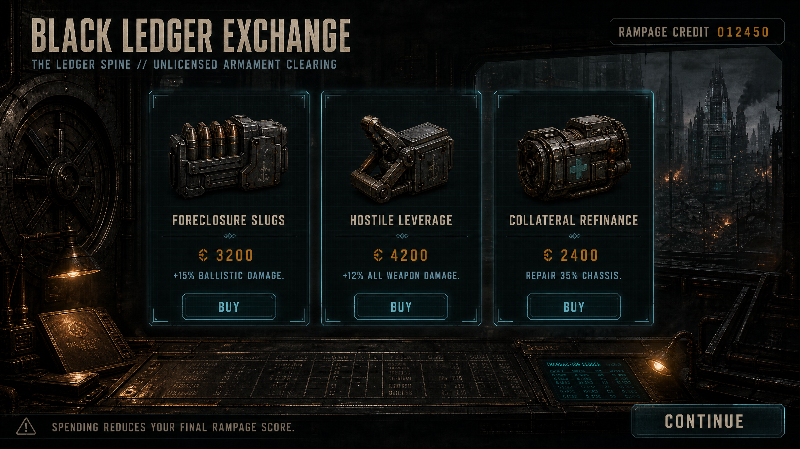
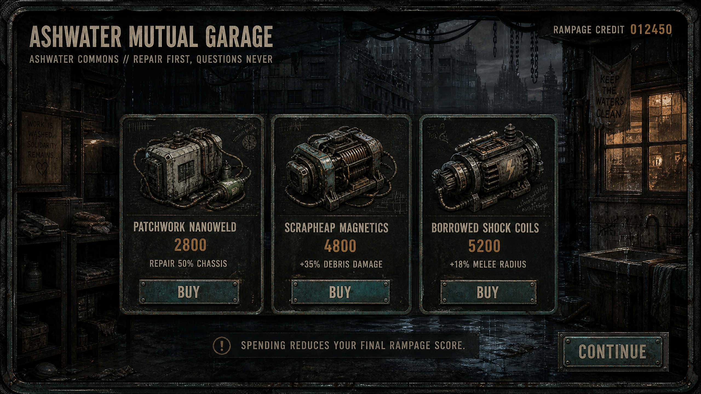
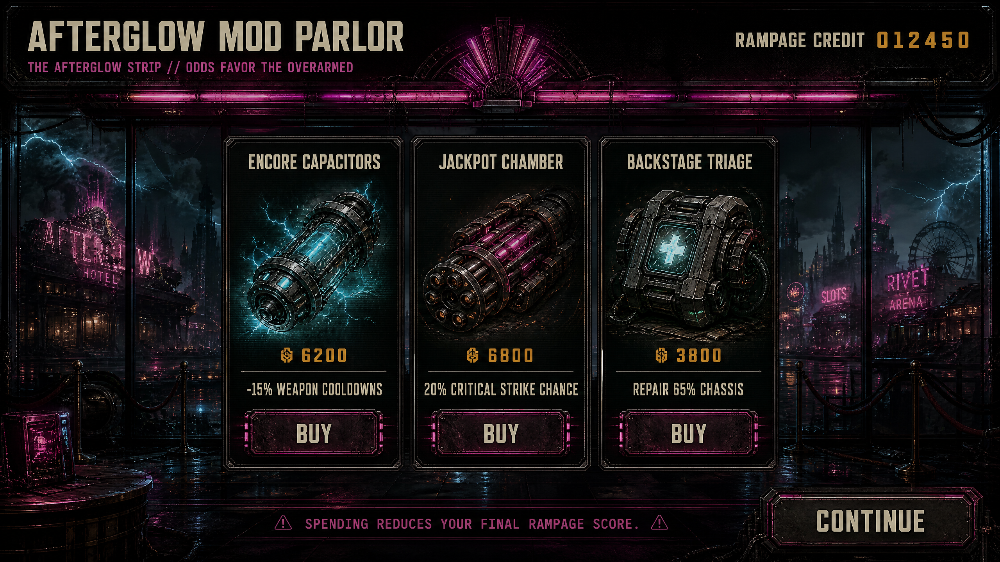
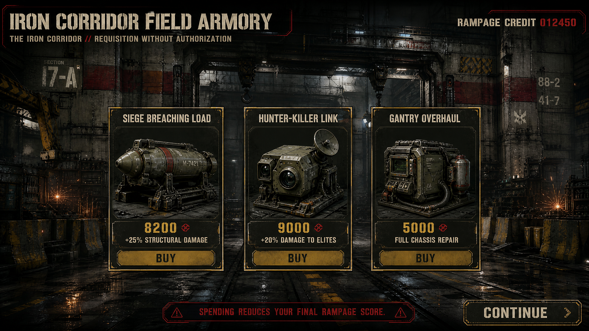
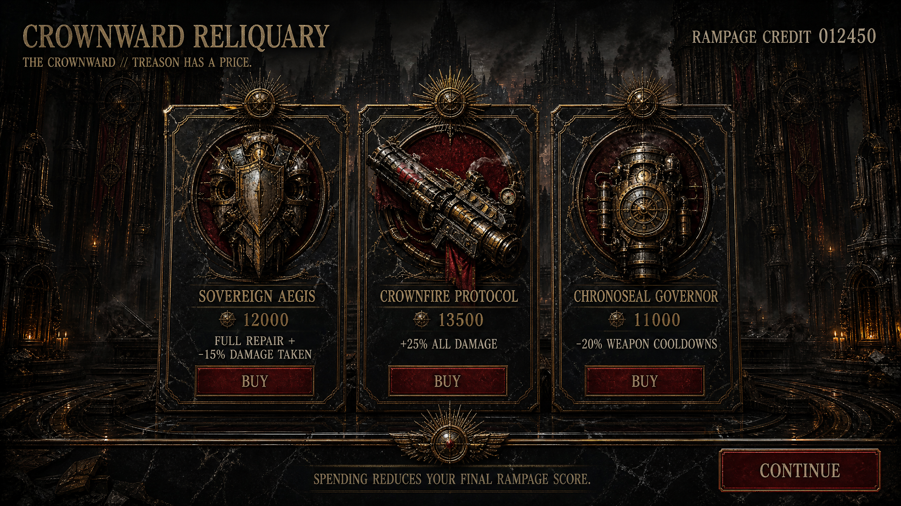

# Proto Scroller Weapon Shop System

## Design intent

The weapon shop converts **Rampage Score from a passive high-score metric into an active run economy**. At each forward district boundary, the game freezes the combat simulation, banks all currently pending score, and presents three district-specific offers. Every purchase deducts directly from the score displayed on the HUD and used by the run summary. The player is therefore not spending a separate currency; they are choosing how much of the run’s prestige to sacrifice for survival and power.

This creates a clean strategic tension. A strong player can preserve a spectacular score and enter later districts underpowered, or cash out part of that score for a safer and more destructive build. Repair services make the choice especially sharp because the value is immediate but leaves no permanent offensive benefit. The shop never appears in the level-up pool, and its product identifiers are kept in a separate catalog, so shop modules remain unique.

## Runtime flow

A shop is queued only when the player crosses a previously unseen forward district boundary. The existing district banner is deferred until the shop closes. The shop acquires the same run-pause lease used by other interstitial systems, disables combat input and enemy simulation, ducks the music, and blocks queued level-up presentation until the transaction is complete. Existing directive selection waits behind the shop and resumes afterward, preventing stacked modal overlays.

Pending combo score is banked when the shop opens so that the displayed buying power is deterministic. A purchase is atomic: the session validates that the product belongs to the active district, verifies it has not already been acquired, checks repair eligibility and available score, deducts the exact price, applies the effect, updates the HUD, and marks the product acquired. Closing the shop releases the pause lease and presents the destination district banner.

## Shared interface language

All district shops use the same information hierarchy: district shop identity at upper left, current **Rampage Credit** at upper right, exactly three product cards in the center, an explicit score-risk warning along the bottom, and a focused **Continue** action. Landscape uses three horizontal cards. Portrait stacks the same cards vertically with deterministic keyboard, controller, touch, and focus navigation.

The visual system stays within the existing game’s command-deck language: cream condensed headings, dark smoked panels, thin industrial borders, amber prices, and district-color focus states. The runtime implementation uses compact Godot UI primitives rather than embedding the concept paintings, preserving responsive behavior and the Web PCK budget.

## District offers

| District shop | Product | Price | Run effect | Strategic role |
|---|---:|---:|---|---|
| **Black Ledger Exchange** | Foreclosure Slugs | 3,200 | +15% machine-gun damage | Early ballistic specialization |
|  | Hostile Leverage | 4,200 | +12% autonomous weapon damage | Broad early scaling |
|  | Collateral Refinance | 2,400 | Repair 35% maximum chassis integrity | Cheap first-transition recovery |
| **Ashwater Mutual Garage** | Patchwork Nanoweld | 2,800 | Repair 50% maximum chassis integrity | Efficient mid-run stabilization |
|  | Scrapheap Magnetics | 4,800 | +35% launched-debris impact damage | Destruction-chain specialization |
|  | Borrowed Shock Coils | 5,200 | +18% Ground Smash and Jab-Cross hit area | Crowd-control and structure coverage |
| **Afterglow Mod Parlor** | Encore Capacitors | 6,200 | -15% autonomous weapon cooldowns | Fire-rate scaling |
|  | Jackpot Chamber | 6,800 | 20% deterministic critical chance for 2× weapon damage | High-variance spectacle with replay-safe rolls |
|  | Backstage Triage | 3,800 | Repair 65% maximum chassis integrity | Deep-run recovery |
| **Iron Corridor Field Armory** | Siege Breaching Load | 8,200 | +25% structural damage | Accelerated district demolition |
|  | Hunter-Killer Link | 9,000 | +20% autonomous damage to elites and bosses | Late-game retaliation countermeasure |
|  | Gantry Overhaul | 5,000 | Full chassis repair | Expensive pre-Crownward reset |
| **Crownward Reliquary** | Sovereign Aegis | 12,000 | Full repair and 15% less incoming damage | Premium survivability capstone |
|  | Crownfire Protocol | 13,500 | +25% melee and autonomous weapon damage | Maximum offensive capstone |
|  | Chronoseal Governor | 11,000 | -20% autonomous weapon cooldowns | Maximum cadence capstone |

Prices deliberately escalate faster than ordinary repair value. Early purchases are accessible after a productive first district, while Royal modules require the player to surrender a visibly meaningful share of a successful run. Prices and percentages are data-driven and can be tuned without changing the overlay or transaction architecture.

## District look and feel

### Business — Black Ledger Exchange

The Business shop is a clandestine clearinghouse inside a repossessed Art-Deco bank vault. Charcoal concrete, black transaction glass, thin cyan ledger lines, oxidized copper service pipes, and isolated amber lamps make every purchase feel like signing away part of the player’s legacy. The cards resemble secured financial instruments rather than retail shelves.

### Residential — Ashwater Mutual Garage

The Residential shop is a mutual-aid garage and illegal robot clinic assembled from a flooded laundry workshop. Patched teal equipment, hanging cables, cistern plumbing, warm windows, and handwritten service marks soften the interface without making it safe. Repair is foregrounded, while the offensive products look improvised from neighborhood infrastructure.

### Entertainment — Afterglow Mod Parlor

The Entertainment shop is a dangerous aftermarket showroom: casino prize counter, backstage pyrotechnics cage, and weapons laboratory in one room. Magenta marquees, cyan energized glass, black glossy frames, and scorched velvet make the purchases feel seductive and reckless. The deterministic critical product preserves replay integrity while delivering the district’s gambling fantasy.

### Military — Iron Corridor Field Armory

The Military shop is a commandeered field armory beneath a siege-repair gantry. Olive-gray blast concrete, red identification bands, yellow hazard marks, crane rails, and hard white work lights remove all retail theater. Products are presented as stamped requisitions, with the full overhaul positioned as a brutally practical pre-Crownward choice.

### Royal — Crownward Reliquary

The Royal shop is a looted sovereign reliquary where forbidden prototype modules are displayed like crown jewels. Black marble, tarnished gold, crimson velvet, sunburst seals, and cathedral machinery turn the final purchases into acts of treason. The three capstones are intentionally expensive enough to define the ending of a run rather than merely optimize it.

## Implementation boundaries

The system is run-local. Purchases reset with the run, matching the existing upgrade contract. Shop products never enter the level-up catalog, do not consume level-up ranks, and are applied through a dedicated modifier runtime. Automatic weapon damage and cooldowns pass through a shared arsenal scaling seam. Melee damage, structural damage, hit area, and launched-debris bonuses are composed into immutable attack specifications. Incoming damage reduction is applied only to hostile accepted damage, preserving dodge, duplicate-hit, friendly-fire, and defeat behavior.

The first released transition sequence uses the destination district’s shop. This means the normal forward run exposes Residential, Entertainment, Military, and Royal stores. The Business catalog and concept are implemented for cycle restarts, future opening-sector interstitials, and tool-driven balancing; it is intentionally not forced onto the initial deployment screen.

## Verification plan

The release gate covers catalog cardinality and exclusivity, score banking and atomic deduction, repair eligibility, insufficient-funds rejection, one-time acquisition, pause-lease ownership, banner deferral, level-up presentation blocking, deterministic combat modifiers, responsive card layout, localization parity, direct Godot import and boot, full unit and scenario tests, Xvfb landscape and portrait screenshots, Web export, and browser runtime smoke. The authoritative full gate generates dedicated `weapon-shop-landscape.png` and `weapon-shop-portrait.png` artifacts for visual review.
